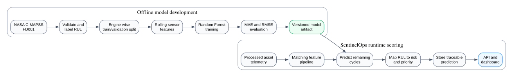

# SentinelOps Significant Algorithmic Component

**Course:** SWENG 894 - Software Engineering Capstone Experience | **Project:** SentinelOps | **Student:** Eli Vazquez | **Date:** 2026-07-11 | **Repository:** <https://github.com/swevazquez/SentinelOpsProject>

**Related artifacts:** [Architecture documentation](README.md), [algorithm flow source](diagrams/algorithmic-component-flow.dot)

## 1. Product Overview

SentinelOps is a predictive-maintenance platform for reliability engineers, maintenance managers, and operations analysts. It addresses the operational problem of identifying degradation early enough to plan maintenance before an asset failure disrupts operations. The MVP generates telemetry, engineers features, scores asset risk, stores results, exposes operational APIs, and presents asset health and workflow status in a dashboard.

The significant algorithmic component is a remaining useful life (RUL) model. Rather than only classifying assets with a rule-based risk score, SentinelOps estimates the number of operating cycles an asset is expected to continue before failure. This learned maintenance horizon adds a data-driven planning capability that can be evaluated with model metrics, traced to its inputs, and displayed through the existing API and dashboard.

## 2. Algorithmic Solution Specification

The solution uses NASA's public C-MAPSS FD001 turbofan degradation dataset, which provides run-to-failure engine histories suitable for a feasible solo-capstone implementation. The target is the number of cycles remaining after each observed engine trajectory. NASA dataset reference: <https://data.nasa.gov/dataset/cmapss-jet-engine-simulated-data>.

The implemented training component uses a seeded Random Forest regressor. It captures nonlinear sensor relationships, tolerates noisy features, and provides inspectable feature importance without requiring a complex deep-learning platform.

The diagram separates offline model development from runtime scoring: historical run-to-failure data produces a versioned model, while current asset telemetry uses the matching feature pipeline to generate traceable API and dashboard outputs.

### Processing and Runtime Behavior

| Step | Behavior |
|---|---|
| 1 | Parse engine, cycle, operating-setting, and sensor fields; reject malformed records. |
| 2 | Label each row with `RUL = final cycle - current cycle` and cap early-life labels. |
| 3 | Remove constant or non-informative sensors using training-engine variance and create causal rolling-window statistics and trends. Validation engines never participate in fitted feature selection. |
| 4 | Split by engine identifier, never by row, so an engine cannot appear in both training and validation. |
| 5 | Train the seeded Random Forest and evaluate predictions overall and by engine with MAE and RMSE against a median-training-RUL baseline. |
| 6 | Persist the model, preprocessing metadata, selected features, dataset identifier, seed, metrics, and semantic model version. |
| 7 | Apply the same feature contract at runtime, predict RUL, derive bounded risk and maintenance bands, and store workflow/model traceability before API exposure. |

### Verified Model Evaluation

The default implementation uses 80 trees, maximum depth 14, rolling window 5,
and seed 42. The approved FD001 engine split produced 16,342 training rows from
80 engines and 4,289 validation rows from 20 engines.

| Evaluation | MAE | RMSE |
|---|---:|---:|
| Random Forest, all validation rows | 12.13 | 17.47 |
| Random Forest, macro average across validation engines | 12.46 | 16.46 |
| Median-training-RUL baseline, all validation rows | 35.27 | 43.73 |
| Median-training-RUL baseline, macro average across validation engines | 35.84 | 44.33 |

The comparison demonstrates that the learned model materially improves on the
naive baseline for the approved split. Per-engine metrics, feature importance,
input checksums, selected sensors, library version, and the model checksum are
retained in the generated artifact metadata.

## 3. Rationale and Implementation Strategy

| What | How | Why |
|---|---|---|
| Add a learned maintenance horizon. | Train on FD001 and map RUL back to SentinelOps risk and priority terms. | RUL supports maintenance planning and demonstrates substantial algorithmic behavior beyond static pages or thresholds. |
| Keep the work maintainable. | Put training/evaluation in `services/ml`, feature preparation in Spark, coordination in Airflow, and results behind FastAPI and the dashboard. | Existing boundaries remain modular and understandable for a solo capstone. |
| Make results defensible. | Retain dataset, model, preprocessing, feature, seed, and metric metadata. | Reviewers can reproduce the input, evaluate performance, and trace each result. |

### Implementation Sequence

1. **Dataset and contract:** implemented by SCRUM-30 through verified acquisition, labeling, and engine-isolated partitions.
2. **Features and training:** implemented by SCRUM-31 through training-only sensor selection, causal temporal features, seeded Random Forest evaluation, baseline comparison, and versioned artifact metadata.
3. **Runtime integration:** implemented by SCRUM-32 through strict artifact loading, reuse of the serialized temporal feature contract, latest-cycle RUL inference, bounded maintenance mapping, atomic persistence, workflow failure reporting, and API retrieval.
4. **Operational presentation:** implemented by SCRUM-33 through RUL-only API
   lookups, shortest-horizon dashboard comparison, detailed result explanation,
   grounded read-only assistant tools, and explicit unavailable states. Spark
   execution remains a later Sprint 4 story.

### Feasibility and Limitations

FD001 is a controlled benchmark rather than a complete representation of SentinelOps operations. The implementation will therefore treat the model as an evaluated capstone component, validate the feature contract between FD001 and SentinelOps telemetry, compare results with the existing rule-based baseline, and document domain-shift limitations rather than presenting the output as production-ready certainty.

### Acceptance Criteria

- A fixed seed produces repeatable predictions, metrics, and feature importance for identical training data.
- Training and validation are split by engine identifier before fitted feature selection.
- MAE and RMSE are recorded overall and by engine against a median-RUL baseline.
- Dataset, model input, selected features, feature importance, library version, seed, metrics, and model checksum are retained for traceability.
- Missing or incompatible training fields and partition overlap fail before a valid model artifact is created.
- Runtime inference produces one nonnegative, capped latest-cycle RUL result per engine with workflow, model, dataset, feature-contract, input, and timestamp traceability.
- Risk and health are bounded to `[0, 1]`, and their thresholds map deterministically to documented maintenance status, priority, and recommendations.
- Missing, corrupt, or incompatible runtime artifacts record a clear failed workflow step without replacing existing prediction results.
- RUL inference is the operational default; the rule-based scorer remains an
  explicit local development and testing mode.
- The repeatable demonstration replays four held-out engines at four lifecycle
  checkpoints, excludes labels from inference inputs, and retains each
  run-specific trajectory and prediction as reviewable evidence.
- Dashboard and assistant views expose stored RUL separately from risk and include
  model, health, maintenance guidance, and timestamp context.
- Missing compatible RUL is reported as unavailable; no placeholder or inferred
  estimate is presented.

## 4. Proposal Summary

This component expands SentinelOps from a rule-based MVP into a system that
learns a maintenance horizon from degradation data. The training and evaluation
stage is implemented as a reproducible, versioned Random Forest pipeline. The
runtime validates and applies that artifact through the existing predictive
workflow. RUL is the operational default, while the deterministic scorer remains
available explicitly for development and testing. The dashboard and assistant
expose stored RUL with model and maintenance context. The repeatable lifecycle
scenario makes model behavior observable across successive degradation
checkpoints without changing the trained model contract.
