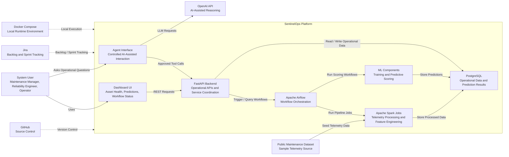
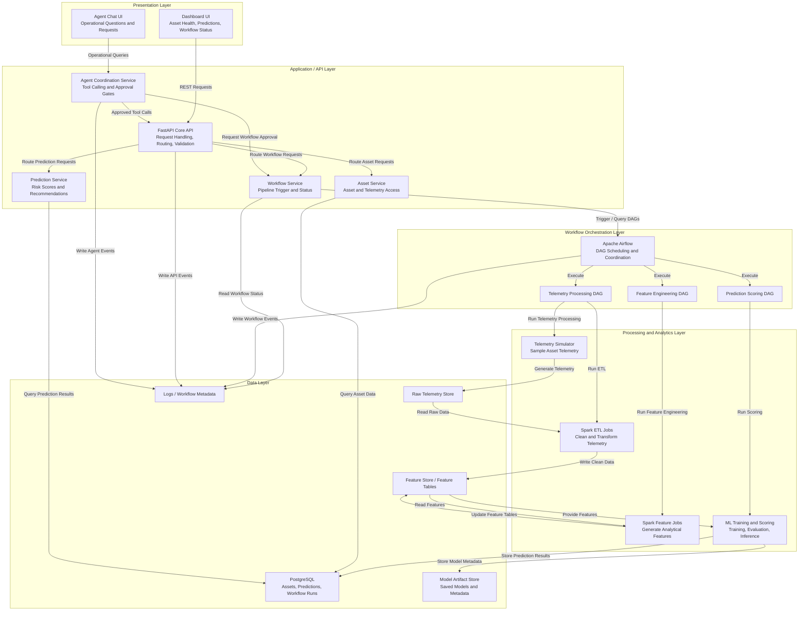
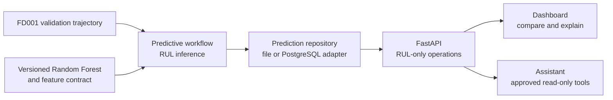

## Architecture Design

The proposed architecture follows a layered modular design. The client and presentation layers provide access through a dashboard and AI-assisted chat interface. The application layer exposes system behavior through FastAPI services. The workflow layer uses Airflow to coordinate repeatable pipeline execution. The processing and analytics layers use Spark and machine learning components to transform telemetry and generate predictive maintenance outputs. The data layer stores raw telemetry, engineered features, predictions, workflow metadata, and model artifacts. Cross-cutting concerns such as logging, configuration, testing, security controls, and observability apply across the system.

## System Context Diagram

The system context diagram provides a high-level view of SentinelOps and its external interactions. This view focuses on who uses the system, what external tools or data sources support it, and how the major runtime components relate to one another. The purpose of this diagram is to communicate the overall architecture without exposing lower-level implementation details.

The SentinelOps platform is designed as a workflow-oriented predictive maintenance system. Users interact with the system through a dashboard and optional AI-assisted interface. The dashboard retrieves operational data through FastAPI, while the AI interface uses controlled tool access through the same application boundary. Airflow coordinates data processing and scoring workflows, Spark performs telemetry transformation and feature engineering, and machine learning components generate prediction results. PostgreSQL stores operational data, workflow outputs, and predictions. External tools such as GitHub, Jira, Docker Compose, public datasets, and the OpenAI API support development, project tracking, local execution, data input, and AI-assisted interaction.

## Internal Layered Architecture Diagram

The internal layered architecture diagram expands the SentinelOps platform boundary and identifies the major responsibilities inside the system. This view separates user interaction, application services, workflow coordination, data processing, analytics, and persistence into logical layers. The goal is to show how responsibilities are allocated across components while keeping the architecture understandable and maintainable.

This layered architecture supports separation of concerns across the major parts of SentinelOps. The presentation layer focuses on user visibility and interaction. The application layer provides a stable service boundary through FastAPI and separates asset, prediction, workflow, and agent coordination responsibilities. The workflow orchestration layer uses Airflow to coordinate repeatable pipeline execution. The processing and analytics layer contains the simulator, Spark jobs, and machine learning capabilities needed to transform telemetry and generate predictive maintenance outputs. The data layer stores raw telemetry, engineered features, prediction results, workflow metadata, model artifacts, and logs. This structure supports reliability, observability, and maintainability by keeping responsibilities clear and limiting unnecessary coupling between components.

## Predictive Maintenance Workflow Diagram

The predictive maintenance workflow diagram shows the runtime behavior of the core SentinelOps data pipeline. This view focuses on how telemetry moves through the system, how it is transformed into features, how predictions are generated, and how results become available to users and AI-assisted interactions.

```mermaid
flowchart LR

    START["Workflow Trigger<br/>Scheduled, Manual, or Agent-Approved"]

    SIM["Telemetry Simulator<br/>Generate Sample Asset Data"]
    RAW["Raw Telemetry Store"]
    ETL["Spark ETL<br/>Clean and Normalize Telemetry"]
    FEAT["Feature Engineering<br/>Create Analytical Features"]
    MODEL["Predictive Model<br/>Score Asset Risk"]
    RESULTS["Prediction Results<br/>Risk Score, Status, Priority"]
    DB["PostgreSQL<br/>Store Results and Metadata"]
    DASH["Dashboard<br/>Display Asset Health"]
    AGENT["Agent Interface<br/>Explain Results and Query Status"]

    START -->|Starts Pipeline| SIM
    SIM -->|Writes Telemetry| RAW
    RAW -->|Input Data| ETL
    ETL -->|Clean Data| FEAT
    FEAT -->|Model Features| MODEL
    MODEL -->|Generate Outputs| RESULTS
    RESULTS -->|Persist Results| DB
    DB -->|Read Predictions| DASH
    DB -->|Read Context| AGENT
```

The predictive maintenance workflow begins when a pipeline is triggered by a schedule, a manual request, or an approved agent action. The telemetry simulator generates representative asset telemetry, which is stored as raw data. Spark-based ETL jobs clean and normalize the telemetry before feature engineering jobs produce analytical features for scoring. The predictive model uses those features to generate maintenance indicators such as risk score, asset status, or maintenance priority. Prediction results and related metadata are stored in PostgreSQL so they can be retrieved by the dashboard and queried through the agent interface. This workflow supports the core SentinelOps objective of turning telemetry into operational maintenance insight through a repeatable and observable process.

## Implemented RUL Result Flow

SCRUM-33 extends the implemented local MVP without changing its responsibility
boundaries. The versioned Random Forest and its serialized feature contract
remain in the ML service. The predictive workflow persists an atomic CSV result
set through the prediction repository. FastAPI provides RUL-only retrieval, and
the dashboard and assistant consume those application-level operations rather
than reading files directly.

SCRUM-36 preserves this result flow while adding a PostgreSQL adapter behind the
same prediction repository contract. Workflow status uses a matching repository
boundary. File-backed CSV and JSON storage remain the default lightweight mode;
PostgreSQL stores predictions and workflow state transactionally when selected
through configuration. FastAPI and workflow code use repository factories and
therefore do not select a storage implementation directly.

The dashboard sorts compatible results by their RUL maintenance horizon while
displaying risk as a separate indicator. Asset details allocate responsibility
for model context, health, priority, recommendation, and prediction time to a
single reusable detail dialog. The assistant may retrieve the same stored
results through two closed-schema read-only tools. When no compatible RUL is
stored, both interfaces show an unavailable state instead of deriving RUL from
the baseline risk score.

Final Airflow coordination and Spark runtime processing shown in the broader
target architecture remain separate Sprint 4 integration work. PostgreSQL now
provides the implemented operational persistence path required by those stories.

## Component Responsibilities

The concise table below summarizes the planned system. The implemented ownership
boundaries, dependency direction, prohibited responsibilities, and automated
architecture check are defined in
[`component-responsibilities.md`](component-responsibilities.md).

| Component | Responsibility |
|---|---|
| Dashboard UI | Presents asset health, workflow status, and prediction summaries |
| Agent Chat UI | Provides controlled AI-assisted interaction with system data |
| FastAPI Core API | Routes requests, validates inputs, and coordinates application services |
| Asset Service | Provides access to asset and telemetry information |
| Prediction Service | Provides access to risk scores, prediction outputs, and recommendations |
| Workflow Service | Triggers Airflow workflows and retrieves workflow execution status |
| Agent Coordination Service | Manages approved agent tool calls and approval-gated actions |
| Apache Airflow | Coordinates repeatable telemetry, feature engineering, and scoring workflows |
| Spark ETL Jobs | Clean, transform, and prepare telemetry data |
| Feature Engineering Jobs | Generate analytical features for predictive scoring |
| ML Scoring Engine | Executes predictive maintenance scoring |
| PostgreSQL | Stores assets, workflow runs, predictions, and operational metadata |
| Model Artifact Store | Stores trained model files and model metadata |
| Logging / Observability | Supports troubleshooting, workflow visibility, and reliability analysis |

## Architecture Rationale

A layered architecture was selected because SentinelOps combines several different responsibilities that should remain loosely coupled: user interaction, API coordination, workflow orchestration, data processing, predictive analytics, and persistence. Separating these concerns makes the system easier to understand, test, and evolve during the capstone lifecycle.

Airflow is used as the orchestration layer because the core predictive maintenance workflow is pipeline-oriented. Telemetry processing, feature engineering, scoring, and reporting must run in a predictable sequence and provide visible execution status. Spark is used for batch-oriented telemetry processing and feature engineering because predictive maintenance data is naturally time-series and transformation-heavy. FastAPI provides a lightweight API boundary for dashboard access, workflow control, and system status queries.

The AI-assisted component is intentionally separated from the core API and workflow execution paths. This supports controlled tool access and approval-gated operational actions while still allowing the agent to query system status and explain prediction outputs. This design supports the security and reliability goals of the system without requiring a complex multi-agent architecture.

Overall, the architecture prioritizes reliability, observability, and maintainability. It provides enough structure to demonstrate a realistic predictive maintenance platform while remaining practical for incremental solo development.
