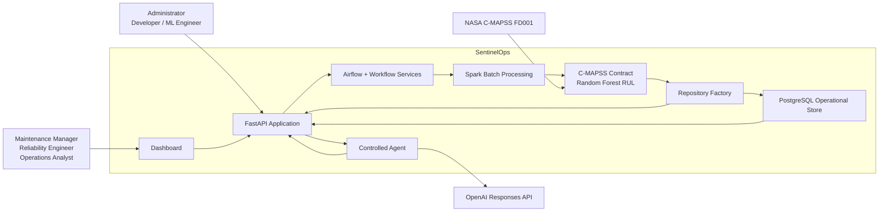
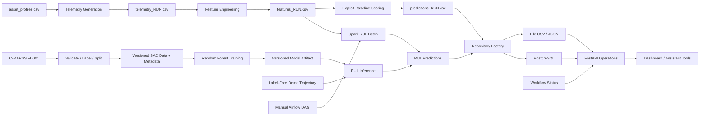
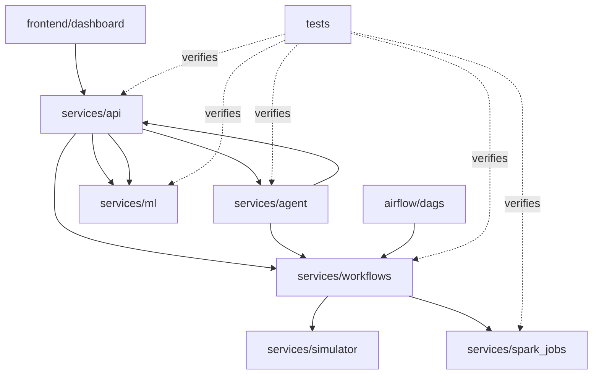
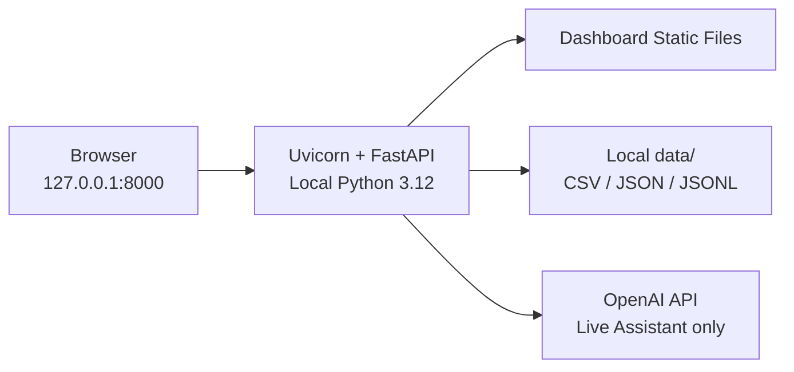
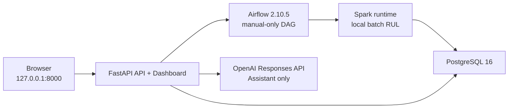
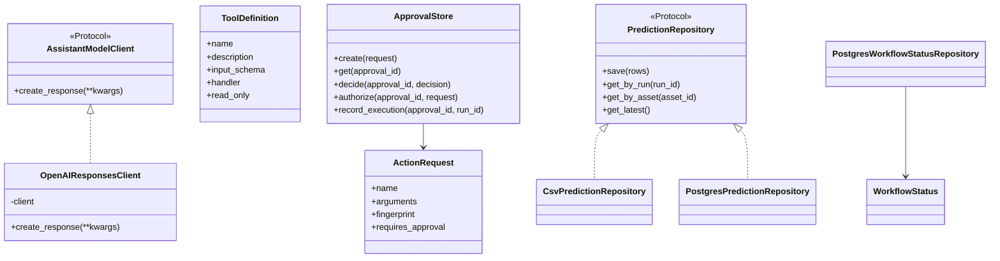
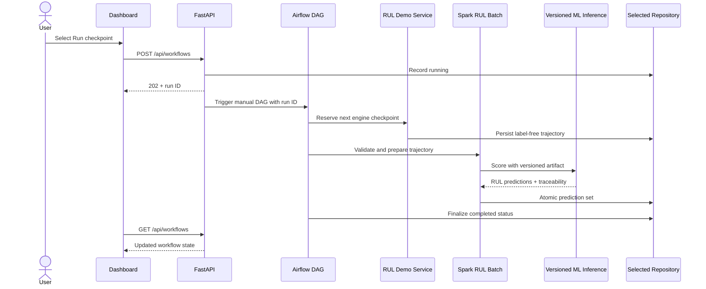
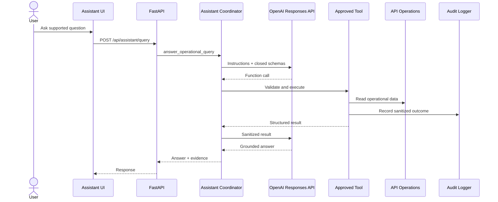
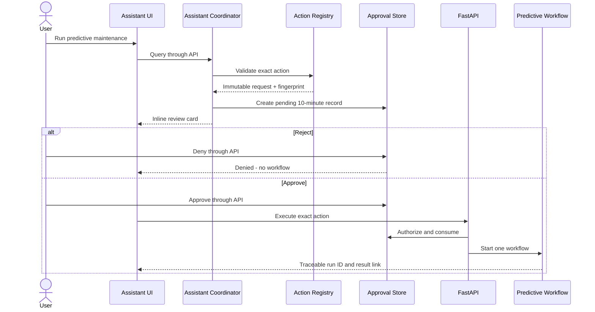

# SentinelOps Software Architecture and Design Documentation

| Field | Value |
|---|---|
| Course | SWENG 894 - Software Engineering Capstone Experience |
| Project | SentinelOps |
| Author | Eli Vazquez |
| Document | Software Architecture and Design Documentation |
| Version | 1.0 |
| Date | August 8, 2026 |
| Repository | <https://github.com/swevazquez/SentinelOpsProject> |

## 1. Document Overview

### 1.1 Purpose

This document explains the architecture and low-level design of SentinelOps. It identifies the business and quality goals that shaped the system, describes the operational context, presents complementary architecture views, allocates responsibilities to modules and structures, and records the rationale and trade-offs behind major design decisions.

### 1.2 Scope

The architecture covers the current academic MVP:

- representative telemetry generation;
- raw and processed data persistence;
- batch feature engineering;
- predictive risk scoring and maintenance indicators;
- workflow coordination and status;
- operational APIs;
- the dashboard;
- controlled Assistant queries;
- restricted and approval-gated operational actions;
- audit evidence;
- the implemented C-MAPSS FD001 data contract;
- seeded Random Forest RUL training and evaluation;
- versioned RUL inference, repeatable demonstration, API retrieval, dashboard comparison, and Assistant explanation;
- PostgreSQL operational persistence, local Spark batch scoring, manual-only Airflow orchestration, and the integrated Docker Compose runtime;
- automated validation.

Enterprise deployment, physical-equipment control, distributed streaming, high availability, multitenancy, and production authorization are outside the architecture scope.

### 1.3 Audience

The primary audience is the capstone professor and technical reviewers. The document also supports future developers or maintainers who need to understand component boundaries, runtime interactions, data structures, and design rationale.

### 1.4 References

- [Repository README](../../../README.md)
- [Software Requirements Specification](../srs/software-requirements-specification-draft.md)
- [Architecture baseline](../../architecture/architecture.md)
- [Component responsibilities](../../architecture/component-responsibilities.md)
- [Algorithmic component](../../algorithmic-component.md)
- [Dashboard design system](../../../frontend/dashboard/DESIGN_SYSTEM.md)

## 2. System Overview

### 2.1 Mission and Business Goals

SentinelOps demonstrates how telemetry processing, workflow orchestration, predictive maintenance analytics, operational visibility, and controlled AI interaction can be combined into a maintainable software system.

| ID | Business Goal | Architectural Implication |
|---|---|---|
| BG-01 | Improve visibility into asset condition and workflow state. | Persist traceable status and predictions and expose them through stable APIs and dashboard views. |
| BG-02 | Reduce the effort needed to interpret telemetry and maintenance priority. | Separate feature preparation from scoring and provide understandable maintenance indicators and grounded Assistant responses. |
| BG-03 | Coordinate predictive-maintenance processing. | Use explicit workflow stages, run identifiers, status records, and a stable Airflow orchestration boundary. |
| BG-04 | Demonstrate practical integration of data, ML, workflow, API, UI, and AI technologies. | Maintain clear integration boundaries and provide reviewer-visible end-to-end behavior. |
| BG-05 | Keep the capstone maintainable and testable. | Use a modular monorepo, explicit dependency rules, repository interfaces, and local-first validation. |

### 2.2 Operational Context

Maintenance managers and reliability engineers review asset risk and recommendations. Operations analysts run and monitor predictive workflows. Administrators review failures, audit evidence, and approval behavior. Developers and ML engineers maintain processing, scoring, model, and validation logic.

The primary review runtime is the Docker Compose stack: FastAPI serves the API and static dashboard, PostgreSQL stores operational predictions and workflow state, Airflow provides manual-only task orchestration, and the Spark runtime performs the batch RUL boundary. The API submits each checkpoint to Airflow, Airflow invokes Spark, and the shared repository records traceable results. Host-only FastAPI with file-backed persistence remains available for focused development and tests.

### 2.3 Broad Functional Flow

1. Asset profiles seed representative telemetry.
2. Telemetry is stored as a run-specific raw CSV.
3. Feature processing creates one run-specific feature row per asset.
4. Versioned Random Forest inference produces RUL and bounded risk, health, priority, and recommendation fields.
5. Predictions and workflow status are stored with traceability.
6. FastAPI exposes assets, predictions, workflows, Assistant queries, approvals, and action execution.
7. The dashboard presents live operational state and user controls.
8. The Assistant uses approved tools for reads and requires an exact approval for the one supported write action.

## 3. Architectural Background and Drivers

### 3.1 Prioritized Drivers

| Priority | Driver | Source | Design Response |
|---:|---|---|---|
| 1 | Reliability and traceability | NFR-01, NFR-02 | Run-specific artifacts, workflow state, input fingerprint, model metadata, validation, and failure records |
| 2 | Security of AI-assisted actions | NFR-06, NFR-07 | Closed tool/action registries, immutable fingerprints, ten-minute approval, single-use execution, and sanitized audit events |
| 3 | Maintainability | NFR-03, NFR-10 | Component-oriented monorepo, explicit interfaces, dependency tests, and reviewer-facing documentation |
| 4 | Testability | NFR-04, NFR-05, NFR-09 | Dependency injection, pure functions, temporary repositories, fake OpenAI client, local CI, and architecture checks |
| 5 | Observability | NFR-01, NFR-02, NFR-07 | Workflow status files, audit JSONL, API response states, dashboard timelines, and correlation identifiers |
| 6 | Demonstration performance | NFR-08 | Small deterministic data set, batch execution, bounded workflow, and five-second system threshold |

### 3.2 Quality-Attribute Scenarios

| Attribute | Source | Stimulus | Environment | Artifact | Response and Measure |
|---|---|---|---|---|---|
| Reliability | Workflow stage | Feature or scoring step fails | Local or CI workflow execution | Workflow status repository | Record `failed`, the current step, UTC update time, and sanitized error; do not report completion. |
| Security | Assistant/model | Unknown, changed, expired, denied, or replayed action is submitted | Assistant action flow | Action registry and approval store | Reject before workflow creation; only one current exact approval may execute once. |
| Testability | Developer/reviewer | Complete validation is requested | Clean Python 3.12 checkout | Repository and test suite | Execute unit, integration, system, architecture, smoke, syntax, data, and Markdown checks through one command. |
| Performance | Reviewer | Three demonstration workflows are run | Documented local environment | Predictive workflow | Each 24-hour, four-asset run completes with all artifacts in no more than five seconds. |
| Maintainability | Developer | A component dependency changes | Development/CI | Python modules | Architecture rules fail if forbidden imports cross API, agent, workflow, ML, simulator, or processing boundaries. |
| Observability | Administrator | Agent tool or action is attempted | Normal, missing, rejected, or failed operation | Audit logger | Record time, correlation, operation type/name, outcome, duration, and safe error category without secrets or raw arguments. |

### 3.3 Constraints and Assumptions

- One student develops the product within a 14-week course.
- Python 3.12 is the supported application runtime.
- FastAPI is the API boundary.
- Direct local workflow services remain available for focused development; the manual-only predictive-maintenance Airflow DAG is the integrated review path.
- Processing is batch-oriented; local Spark provides the tested RUL batch boundary rather than a distributed production cluster.
- PostgreSQL persists predictions and workflow state in the Compose path; file-backed repositories remain the explicit lightweight mode.
- The OpenAI API is required only for live Assistant behavior; automated tests inject a fake client.
- The application is not a physical control or safety-certification system.

## 4. Architecture Views

### 4.1 System Context View



The system boundary includes all application behavior and validation. OpenAI may select approved functions but cannot access data or execute writes directly. NASA provides the public SAC data source. Users access the application through the dashboard and its API-backed interactions.

### 4.2 High-Level Component View

```mermaid
flowchart TB
    subgraph Presentation
        DASH["Static Dashboard<br/>HTML / CSS / JavaScript"]
    end

    subgraph Application
        FASTAPI["FastAPI Routes"]
        OPS["API Operations"]
        EXEC["Workflow Execution Adapter"]
    end

    subgraph Agent
        ASSIST["Assistant Coordinator"]
        TOOLS["Read-Only Tool Registry"]
        ACTIONS["Approved Action Registry"]
        APPROVALS["Approval Store"]
        AUDIT["Audit Logger"]
    end

    subgraph Workflow
        LOCAL["Local Workflow Service"]
        STATUS["Workflow Status Repository"]
        AIRFLOW["Manual Airflow DAG"]
        COMPOSE["Docker Compose Runtime"]
    end

    subgraph Processing
        SIM["Telemetry Simulator"]
        FEATURES["Feature Engineering"]
        SPARK["Spark RUL Batch"]
        SCORE["Baseline Scoring"]
        CMAPSS["C-MAPSS Data Contract"]
        TRAIN["RUL Training"]
        INFER["RUL Inference"]
        DEMO["RUL Demo State"]
    end

    subgraph Persistence
        CSV["Raw / Features / Predictions CSV"]
        JSON["Workflow / Approval JSON"]
        JSONL["Agent Audit JSONL"]
        POSTGRES["PostgreSQL Predictions + Workflow State"]
        PREDSTORE["Prediction Repository Factory"]
    end

    DASH --> FASTAPI
    FASTAPI --> OPS
    FASTAPI --> EXEC
    FASTAPI --> ASSIST
    ASSIST --> TOOLS
    ASSIST --> ACTIONS
    ACTIONS --> APPROVALS
    ASSIST --> AUDIT
    TOOLS --> OPS
    EXEC --> LOCAL
    EXEC --> AIRFLOW
    LOCAL --> SIM
    LOCAL --> FEATURES
    LOCAL --> SCORE
    LOCAL --> INFER
    LOCAL --> DEMO
    LOCAL --> STATUS
    AIRFLOW --> SPARK
    SPARK --> INFER
    SIM --> CSV
    FEATURES --> CSV
    SCORE --> CSV
    STATUS --> JSON
    STATUS --> POSTGRES
    PREDSTORE --> CSV
    PREDSTORE --> POSTGRES
    APPROVALS --> JSON
    AUDIT --> JSONL
    CMAPSS --> CSV
    CMAPSS --> TRAIN
    TRAIN --> INFER
    COMPOSE --> FASTAPI
    COMPOSE --> AIRFLOW
    COMPOSE --> POSTGRES
```



### 4.3 Responsibility Allocation

| Component | Primary Responsibility | Key Interfaces |
|---|---|---|
| Dashboard | Present data and collect user interactions. | HTTP JSON routes and static assets |
| FastAPI routes | Validate HTTP payloads, map exceptions to status codes, and coordinate background work. | Pydantic request models and API response envelopes |
| API operations | Read repositories and return consistent success/error states. | `ApiResponse` with status code and body |
| Assistant coordinator | Send scoped instructions to OpenAI, execute approved calls, sanitize results, and prepare actions. | `AssistantModelClient`, tool schemas, action schemas |
| Tool registry | Restrict reads to eight approved operational queries. | Closed JSON schemas and API operations |
| Action registry | Restrict writes to `start_workflow` for `predictive-maintenance`. | Immutable `ActionRequest` and SHA-256 fingerprint |
| Approval store | Persist pending decisions and enforce expiry, exact match, and single use. | `ApprovalRecord` JSON |
| Audit logger | Write sanitized operation evidence. | `AgentAuditEvent` JSON Lines |
| Workflow execution adapter | Select the configured local or Airflow backend and synchronize API-visible terminal state. | Workflow backend interface and run ID |
| Workflow service | Generate telemetry, engineer features, and support the file-backed development path. | Run ID and file artifacts |
| Airflow DAG | Select the next RUL checkpoint or configured input, invoke Spark, and finalize shared workflow status. | DAG `sentinelops_predictive_maintenance` |
| Telemetry simulator | Validate profiles and generate deterministic readings. | Asset profiles and telemetry rows |
| Feature processing | Validate raw telemetry and aggregate per-asset features. | Raw CSV to feature CSV |
| Risk scorer | Validate features and calculate bounded risk and maintenance fields. | Feature rows to prediction rows |
| RUL trainer | Build causal temporal features, train and evaluate the seeded Random Forest, and save its versioned artifact. | FD001 partitions to model and metadata |
| RUL inference | Validate the artifact and trajectory, recreate the feature contract, score latest cycles, and derive maintenance indicators. | Trajectory plus model artifact to RUL prediction rows |
| Spark RUL batch | Validate and type C-MAPSS input, call versioned ML inference, and persist traceable results. | `run_spark_rul_batch` and CLI wrapper |
| RUL demo service | Advance four engines through four lifecycle checkpoints and manage active-session reset behavior. | Scenario configuration, stored inputs, predictions, and session state |
| Prediction repository | Persist and retrieve predictions by run, asset, or latest. | `PredictionRepository` protocol |
| PostgreSQL repository | Persist predictions and workflow status transactionally when selected by configuration. | `PostgresPredictionRepository`, `PostgresWorkflowStatusRepository` |
| C-MAPSS contract | Acquire/validate FD001, label capped RUL, and split by engine. | Versioned metadata and processed files |

### 4.4 Data-Flow View



Solid arrows show implemented behavior. The default predictive workflow uses the RUL path. In the integrated deployment, Airflow invokes Spark and the repository factory selects PostgreSQL; file-backed persistence remains available only through explicit development or test configuration. The deterministic baseline remains available only through an explicit development or test request.

### 4.5 Package and Module View



The API-to-agent and agent-to-API relationship is controlled: HTTP routes invoke the Assistant coordinator, while agent tools delegate only to the API operation module rather than re-entering HTTP routes. Architecture tests enforce allowed source dependencies.

### 4.6 Deployment View

#### Host Development Deployment



The host development path runs `uv run uvicorn services.api.app:app --reload` from the repository root. FastAPI mounts the static dashboard and uses file-backed repositories by default. This path is useful for focused development and unit/API review.

#### Integrated Compose Deployment



`docker compose up --build --wait` starts the API/dashboard, PostgreSQL, Airflow, and Spark runtime. The API waits for PostgreSQL and Airflow health before serving, and `/api/health` provides readiness evidence. The dashboard submits each checkpoint to Airflow; the predictive-maintenance DAG calls Spark and persists through PostgreSQL. `docker compose down` stops services while preserving the named database volume unless `--volumes` is explicitly requested.

## 5. Low-Level Architectural Specification

### 5.1 API Contracts

| Method and Route | Responsibility | Success | Important Errors |
|---|---|---|---|
| `GET /api/health` | Report non-secret API readiness for the Compose health check. | 200 | 503 dependency unavailable |
| `GET /api/assets` | Return configured asset profiles. | 200 | 400 invalid source; 503 source unavailable |
| `GET /api/predictions/latest` | Return latest prediction for each asset. | 200 | 400 invalid stored schema |
| `GET /api/predictions/rul/latest` | Return latest compatible RUL result for each current asset. | 200 | Clear unavailable result when none exists |
| `GET /api/predictions/rul/assets/{asset_id}` | Return stored RUL history for one asset. | 200 | 400 unsafe ID; 404 unavailable |
| `GET /api/workflows` | Return workflow history. | 200 | 400 invalid stored status |
| `GET /api/workflows/{run_id}` | Return one workflow. | 200 | 400 unsafe ID; 404 missing |
| `POST /api/workflows` | Start `predictive-maintenance`. | 202 | 400 unsupported; 422 malformed |
| `GET /api/workflows/rul-demo/status` | Return the active demonstration checkpoint and completion state. | 200 | 400 invalid scenario or state |
| `POST /api/workflows/rul-demo/reset` | Start a new active demonstration session while retaining historical evidence. | 200 | 409 when a run is active |
| `POST /api/assistant/query` | Run supported query or prepare action. | 200 | 400 validation; 404 missing result; 503 provider unavailable |
| `POST /api/assistant/approvals/{id}` | Approve or deny exact action. | 200 | 400 invalid; 404 missing; 403/409/410 approval state |
| `POST /api/assistant/actions/execute` | Execute one approved exact action. | 202 | 400, 403, 404, 409, or 410 |

All normal operation responses use a consistent envelope containing `status`, `message`, `request_state`, and optional `data`.

### 5.2 Workflow Status Structure

```json
{
  "run_id": "manual-20260724T120000Z-a1b2c3d4",
  "status": "running | completed | failed",
  "updated_at": "2026-07-24T12:00:00Z",
  "step": "airflow_input_selection | spark_input_preparation | spark_rul_inference | airflow_workflow_complete | null",
  "error": "sanitized failure text or null",
  "approval_id": "32-character identifier or null"
}
```

When PostgreSQL is selected, the same logical record is stored in
`sentinelops_workflow_status` with an upsert keyed by `run_id`. In file mode it
is written as `data/workflow-status/workflow_<run_id>.json` using temporary-file
replacement. The application-level structure is intentionally the same in both
modes.

### 5.3 Prediction Structure

```json
{
  "run_id": "manual-20260724T120000Z-a1b2c3d4",
  "asset_id": "FD001-ENGINE-002",
  "model_name": "sentinelops-rul-random-forest",
  "model_version": "1.0.0",
  "scored_at": "2026-07-24T12:00:01Z",
  "source_feature_path": "data/raw/rul-demo/trajectory_RUN.txt",
  "source_feature_sha256": "64-character SHA-256",
  "risk_score": "0.7421",
  "remaining_useful_life_cycles": "32.4187",
  "health_score": "0.2593",
  "dataset_id": "NASA-CMAPSS-FD001",
  "feature_contract_version": "1.0.0",
  "asset_status": "warning",
  "maintenance_priority": "high",
  "recommended_action": "Schedule maintenance within 24 hours."
}
```

PostgreSQL stores the prediction payload as JSON in
`sentinelops_predictions` together with indexed `run_id`, asset/engine, result
type, and scoring-time fields. Replacement of one prediction set occurs in one
transaction, preserving the last committed set if a write fails.

### 5.4 Approval Structure

```json
{
  "approval_id": "32-character identifier",
  "action_name": "start_workflow",
  "arguments": {"workflow": "predictive-maintenance"},
  "fingerprint": "64-character SHA-256",
  "status": "pending | approved | denied | expired | consumed",
  "created_at": "UTC timestamp",
  "expires_at": "UTC timestamp",
  "decided_at": "UTC timestamp or null",
  "consumed_at": "UTC timestamp or null",
  "execution_reference": "workflow run ID or null"
}
```

### 5.5 Audit Event Structure

```json
{
  "timestamp": "UTC timestamp",
  "correlation_id": "safe system-generated identifier",
  "operation_type": "tool | action",
  "operation_name": "approved safe name",
  "outcome": "succeeded | not_found | rejected | failed | denied",
  "duration_ms": 1.234,
  "error_category": "fixed safe category or null"
}
```

Audit records intentionally omit prompts, arguments, exception messages, API keys, and secrets.

### 5.6 Important Classes and Protocols



The protocols support test injection and replacement without coupling callers to one external client or persistence implementation.

## 6. Interaction Views

### 6.1 Integrated Predictive Workflow



This is the integrated Compose path. In explicit host development mode,
the workflow execution adapter reserves the same demonstration checkpoint and
calls the same versioned inference and repository contracts directly, without
Airflow or the Spark boundary.

### 6.2 Grounded Operational Query



### 6.3 Approval-Gated Action



## 7. View Mapping and Requirement Allocation

| Function | Context Element | High-Level Component | Low-Level Structure | Requirements |
|---|---|---|---|---|
| Acquire telemetry | SentinelOps / input data | Simulator | Asset profile and telemetry rows | FR-01, FR-02 |
| Prepare features | Processing | Feature engineering | Feature CSV schema | FR-03 |
| Coordinate workflow | Workflow services | Local workflow / Airflow | `WorkflowStatus` | FR-04, FR-05, FR-11 |
| Train and score RUL | C-MAPSS / workflow | ML training and inference | Model artifact, feature contract, and prediction repository | FR-06 through FR-08, FR-RUL-01 through FR-RUL-06 |
| Expose operations | API | FastAPI and operations | Request models and response envelope | FR-09 |
| Present operations | Dashboard | Static frontend | View state and dialogs | FR-10 |
| Answer questions | OpenAI / SentinelOps | Assistant and tools | Tool definitions and sanitized result | FR-12, FR-13 |
| Control actions | User / SentinelOps | Actions and approvals | `ActionRequest`, `ApprovalRecord` | FR-14, NFR-06 |
| Record evidence | SentinelOps | Status and audit | JSON and JSONL structures | FR-15, NFR-01, NFR-02, NFR-07 |
| Validate product | Developer / CI | Test and CI components | Unit, integration, system, architecture cases | FR-16, NFR-09 |

## 8. Design Decisions and Trade-offs

| Decision | Drivers and Rationale | Alternatives | Trade-offs |
|---|---|---|---|
| Modular monorepo | Keeps a solo capstone understandable while preserving component boundaries. | Separate repositories; one undifferentiated application | Easier atomic change and review, but deployment independence is limited. |
| FastAPI application boundary | Provides typed validation, clear HTTP behavior, background tasks, and static UI serving with little framework overhead. | Flask; Django; separate frontend server | Simple MVP integration, but one process combines API and static delivery. |
| Manual-only Airflow with a reusable Spark boundary | Makes task order and failure evidence visible while keeping ML and persistence logic in reusable services. | Airflow-only business logic; custom scheduler | Requires service configuration and a running Airflow stack, but avoids duplicated rules in the DAG. |
| Repository factory with file and PostgreSQL adapters | Supports fast local tests while providing durable Compose persistence without changing API contracts. | PostgreSQL-only; embedded database | File mode remains easier to inspect; PostgreSQL adds service configuration and a migration boundary. |
| Static dashboard | Avoids frontend build tooling while providing a responsive API-integrated interface. | React/Vue build; server templates | Small deployment footprint, but automated interaction tooling and module structure are limited. |
| Closed agent tools and separate actions | Prevents model-selected writes from sharing the read registry. | General-purpose tool executor; direct API access | Strong security boundary, but limits feature flexibility. |
| Exact single-use approval | Binds human review to the canonical action request and blocks replay. | Session-wide approval; confirmation text; role-only control | Strong traceability, but adds persistence and several failure states. |
| Sanitized JSONL audit | Provides append-only review evidence without raw sensitive content. | Full prompt logging; database audit table | Easy inspection and safer content, but file concurrency and querying are limited. |
| RUL default with explicit deterministic fallback | Makes the learned model the product path while retaining a stable development and test option. | Remove the baseline; silently fall back on artifact failure | Clear demonstration intent and safe failure, but two modes must remain explicitly separated. |
| Seeded Random Forest SAC | Provides nonlinear learned RUL behavior with repeatable metrics and feature importance. | Linear regression; neural network; gradient boosting | Feasible and explainable, but temporal behavior is represented through engineered features rather than a sequence model. |

## 9. Architecture Evaluation and Limitations

### 9.1 Architecture Evaluation

The implemented architecture provides an end-to-end, traceable RUL workflow: FastAPI submits a run to Airflow, Airflow selects a repeatable checkpoint and invokes Spark, Spark calls the versioned ML service, and PostgreSQL stores predictions and workflow state. The dashboard, Assistant, APIs, and local file mode use the same application contracts. The validation suite reports 170 collected tests, 166 passed, and four environment-gated skips.

### 9.2 Known Limitations

- File-backed approval, status, prediction, and audit storage is designed for local MVP execution rather than concurrent production workers.
- The Compose path is intentionally a local academic deployment rather than a production HA platform.
- The predictive-maintenance Airflow DAG is manual-only; it does not schedule runs or provide distributed worker scaling.
- The public health route reports application readiness, not comprehensive infrastructure observability.
- Frontend JavaScript uses one main file and does not yet have a browser-native automated test runner.
- The live Assistant depends on an external model provider and API key.
- Raw telemetry, processed features, model artifacts, demo scenario state, approvals, and audit logs remain file-backed even when PostgreSQL is selected; PostgreSQL covers operational predictions and workflow state.

### 9.3 Consistency Assessment

The context, component, data-flow, module, deployment, class, and sequence views
were reconciled against the delivered source tree and live Compose stack on
August 8, 2026. Their element names and flows match the FastAPI routes, eight
approved Assistant tools, manual-only Airflow DAG, Spark batch boundary,
repository adapters, and dashboard behavior. Architectural drivers map to the
SRS requirements and STR evidence in Sections 3 and 7. Production-scale ideas
remain outside the implemented MVP and appear only as limitations or trade-offs.
