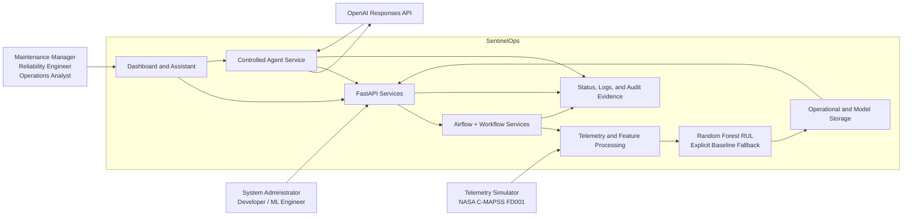

# SentinelOps Software Requirements Specification

| Field | Value |
|---|---|
| Course | SWENG 894 - Software Engineering Capstone Experience |
| Project | SentinelOps |
| Author | Eli Vazquez |
| Document | Software Requirements Specification |
| Version | 2.0 |
| Date | August 8, 2026 |
| Repository | <https://github.com/swevazquez/SentinelOpsProject> |

## 1. Document Overview

### 1.1 Purpose

This Software Requirements Specification (SRS) defines the required behavior and quality expectations for SentinelOps. It describes the system mission, operational concept, scope, users, features, functional requirements, non-functional requirements, and significant algorithmic component. It also maps each functional requirement to a use case and user story with observable acceptance criteria.

This document is the requirements baseline for final implementation, verification, demonstration, and capstone evaluation. Architecture and test documents may explain how a requirement is implemented or verified, but this SRS remains the source for what the system is expected to do.

### 1.2 Intended Audience

The primary audience is the capstone professor and other reviewers evaluating the completeness, traceability, and quality of the SentinelOps requirements. The document also supports developers, testers, reliability engineers, maintenance managers, operations analysts, and system administrators who need to understand the expected system behavior.

### 1.3 Document Organization

| Section | Content |
|---|---|
| 1. Document Overview | Purpose, audience, organization, conventions, and references |
| 2. Introduction and Concept of Operations | Mission, problem, operational concept, scope, and success objectives |
| 3. System Overview | Context, users, features, use cases, assumptions, constraints, and dependencies |
| 4. Functional Requirements | Complete functional requirements mapped to user stories, use cases, and acceptance criteria |
| 5. Non-Functional Requirements | Quality requirements, business rationale, and verification approach |
| 6. Significant Algorithmic Component | RUL problem, Random Forest solution, logic, evaluation, limitations, and requirements mapping |
| 7. Requirements Traceability Summary | End-to-end mapping between business goals, features, requirements, and verification |

### 1.4 Requirement Conventions

- **Shall** identifies a mandatory requirement.
- **Should** identifies a desired quality or design objective that is not mandatory.
- **May** identifies permitted optional behavior.
- Functional requirements use the identifier `FR-XX`.
- Non-functional requirements use the identifier `NFR-XX`.
- Use cases and user stories use `UC-XX` and `US-XX`.
- Acceptance criteria are written as observable Given/When/Then outcomes.

### 1.5 References

- [SentinelOps repository README](../../../README.md)
- [Requirements and architecture baseline](../../requirements/project-requirements-and-architecture.md)
- [RUL requirements](../../requirements/rul-requirements.md)
- [Architecture documentation](../../architecture/architecture.md)
- [Significant algorithmic component](../../algorithmic-component.md)
- [NASA C-MAPSS dataset](https://data.nasa.gov/dataset/groups/cmapss-jet-engine-simulated-data)

## 2. Introduction and Concept of Operations

### 2.1 Mission Statement

The mission of SentinelOps is to demonstrate how telemetry processing, workflow orchestration, predictive maintenance analytics, operational visibility, and controlled AI-assisted interactions can be integrated into a maintainable software engineering solution.

### 2.2 Background and Problem

Industrial assets produce telemetry that can reveal degradation before failure. In practice, collecting that telemetry, transforming it into useful features, running predictive analysis, and presenting maintenance guidance often requires several disconnected tools. This separation makes it harder to understand asset condition, reproduce processing results, monitor failures, and act on predictions safely.

SentinelOps addresses this problem through a focused predictive-maintenance platform. It coordinates batch data processing, predictive scoring, workflow status, APIs, a dashboard, and a controlled AI assistant. The capstone is an academic minimum viable product (MVP), not a production industrial control system. Its value is the demonstrable and traceable integration of software engineering, data engineering, machine learning, orchestration, testing, and human approval.

### 2.3 Concept of Operations

SentinelOps operates through the following end-to-end flow:

1. A simulator or approved dataset supplies telemetry for representative assets.
2. The system stores raw telemetry and transforms it into validated analytical features.
3. The dashboard submits a run to FastAPI. In the integrated Compose path, FastAPI submits the run to the manual-only Airflow DAG, which selects the next held-out checkpoint, invokes the Spark RUL batch boundary, persists results in PostgreSQL, and returns terminal status. File-backed mode remains available for focused development and tests.
4. The versioned Random Forest component estimates RUL and derives bounded risk, health, maintenance priority, and recommended actions.
5. The system stores predictions with workflow, input, and model traceability.
6. FastAPI exposes asset, prediction, and workflow information.
7. The dashboard presents asset condition, maintenance guidance, and workflow execution state.
8. The AI assistant answers supported operational questions through approved tools.
9. Any supported AI-assisted workflow action requires an explicit, exact, time-limited, single-use approval.
10. Logs, workflow records, automated tests, and model metadata provide evidence for review and troubleshooting.

### 2.4 Business Goals

| ID | Business Goal |
|---|---|
| BG-01 | Improve visibility into asset health, maintenance risk, predictions, and workflow status. |
| BG-02 | Reduce the effort needed to interpret telemetry and identify maintenance priorities. |
| BG-03 | Coordinate predictive-maintenance processing within a unified and repeatable workflow. |
| BG-04 | Demonstrate practical integration of orchestration, data engineering, machine learning, and controlled AI interaction. |
| BG-05 | Maintain a modular, testable, and understandable architecture suitable for incremental development. |

### 2.5 Product Scope

#### In Scope

- Representative asset and telemetry simulation
- Raw telemetry persistence
- Batch telemetry validation, transformation, and feature engineering
- Manual-only Airflow orchestration with a direct local workflow mode for development and tests
- Predictive risk scoring and maintenance recommendations
- Random Forest RUL training, evaluation, inference, and repeatable four-checkpoint demonstration
- Prediction and workflow traceability
- REST APIs for operational information, readiness, and supported workflow actions
- PostgreSQL persistence for predictions and workflow state, selected explicitly through configuration
- Local Spark batch validation, feature preparation, RUL inference, and shared persistence
- Docker Compose deployment for FastAPI, PostgreSQL, Airflow, and the Spark runtime
- Responsive dashboard views for assets, workflows, predictions, and Assistant interaction
- Controlled AI-assisted queries and one approval-gated workflow action
- Operational logging, local validation, and reviewer-facing documentation

#### Out of Scope

- Direct control of physical industrial equipment
- Real-time streaming and sub-second control decisions
- Enterprise identity management, multitenancy, or production authorization
- High-availability, distributed, or Kubernetes deployment
- Autonomous AI execution without explicit controls
- Claims that C-MAPSS model results are production-certified for real equipment
- Enterprise-scale data volume, disaster recovery, or regulatory certification

### 2.6 Success Objectives

SentinelOps is successful when a reviewer can execute a repeatable RUL workflow, trace predictions to their input trajectories, model artifact, and workflow runs, compare maintenance horizons in the dashboard, ask grounded Assistant questions, verify approval enforcement for operational actions, and reproduce the automated validation evidence.

## 3. System Overview

### 3.1 System Context

SentinelOps is bounded as one predictive-maintenance platform. Users interact through the dashboard and Assistant, while developers and administrators use documented APIs, workflows, logs, and validation commands. External dependencies provide telemetry data and language-model reasoning, but operational data access and workflow execution remain behind SentinelOps validation and approval boundaries.

### 3.2 Users and Actions

| User | Primary Actions |
|---|---|
| Maintenance Manager | Review RUL, risk, health, maintenance priority, recommendations, and workflow findings. |
| Reliability Engineer | Inspect telemetry-derived features, predictions, model evidence, and asset trends. |
| Operations Analyst | Start supported workflows, monitor execution, and investigate failed or incomplete runs. |
| System Administrator | Review logs, audit events, workflow controls, and approval enforcement. |
| Developer | Maintain APIs, workflows, processing logic, tests, and documentation. |
| AI/ML Engineer | Prepare data, train and evaluate models, review feature importance, and version model artifacts. |
| Capstone Reviewer | Evaluate scope, traceability, implementation behavior, test evidence, and documentation quality. |

### 3.3 Features, Use Cases, and User Stories

| Feature | Use Case | Primary User | User Action and Outcome | Requirements |
|---|---|---|---|---|
| Telemetry acquisition | UC-01 - Acquire telemetry | Reliability Engineer | Generate or ingest representative asset readings and retain the raw data. | FR-01, FR-02 |
| Feature preparation | UC-02 - Prepare analytical features | Reliability Engineer / ML Engineer | Transform validated telemetry into reproducible model-ready features. | FR-03 |
| Workflow orchestration | UC-03 - Run the predictive pipeline | Operations Analyst | Execute processing and scoring in the required order. | FR-04 |
| Workflow visibility | UC-04 - Monitor a workflow | Operations Analyst / Administrator | View running, completed, and failed workflow states. | FR-05 |
| Predictive analysis | UC-05 - Assess maintenance horizon | Maintenance Manager / Reliability Engineer | Generate and compare RUL, health, risk, priority, and recommendations. | FR-06, FR-07, FR-RUL-01 through FR-RUL-06 |
| Prediction persistence | UC-06 - Retrieve a prediction | Operations Analyst | Store and retrieve predictions with traceability. | FR-08 |
| Operational API | UC-07 - Access operational data | Developer / System User | Request asset, prediction, and workflow information. | FR-09 |
| Dashboard | UC-08 - Review operations | Maintenance Manager / Analyst | Review operational summaries and detailed records. | FR-10 |
| Manual workflow action | UC-09 - Start supported processing | Operations Analyst | Start predictive maintenance on demand and receive a run identifier. | FR-11 |
| AI-assisted query | UC-10 - Ask an operational question | System User | Ask a supported question and receive a grounded answer. | FR-12, FR-13 |
| Approval-gated action | UC-11 - Review and approve an action | System Administrator / Operator | Inspect an exact action and approve or reject it before execution. | FR-14 |
| Operational evidence | UC-12 - Investigate system behavior | Administrator / Developer | Review meaningful workflow, API, processing, prediction, and agent events. | FR-15 |
| System validation | UC-13 - Validate the product | Developer / Reviewer | Run repeatable automated checks and inspect pass/fail results. | FR-16 |

### 3.4 Assumptions

- Representative telemetry and C-MAPSS FD001 are sufficient to demonstrate the capstone workflows.
- Users understand that predictions support maintenance planning but do not replace qualified engineering judgment.
- The local environment provides Python 3.12 and the documented project dependencies.
- Docker Compose is the supported integrated review path; host-only FastAPI with the direct local workflow remains available for focused development and tests.
- The OpenAI API is optional for automated tests; model-client behavior can be injected or simulated.
- A single authorized user is sufficient for the academic MVP.

### 3.5 Constraints

- The project is developed by one student within a 14-week capstone schedule.
- The implementation supports two deliberate runtime modes: the integrated Compose path uses FastAPI, PostgreSQL, Airflow, and Spark; host-only development and test runs use FastAPI, the direct local workflow, and file-backed persistence unless another backend is explicitly configured.
- PostgreSQL mode persists operational predictions and workflow status; raw telemetry, processed features, model artifacts, repeatable-demo state, approvals, and audit files remain filesystem-backed and are shared with the Compose containers through the project volume.
- Airflow orchestration is manual-only, and Spark runs as a local batch boundary in this MVP. The system does not require a scheduler, distributed Spark workers, streaming infrastructure, or high-availability services.
- The Compose deployment is a local academic runtime with documented development credentials and published service ports; it is not a production security or availability boundary.
- C-MAPSS FD001 represents simulated turbofan degradation and may not match the telemetry distribution of other assets.
- The system is batch-oriented and is not a safety-critical real-time control platform.
- AI-assisted actions are limited to predefined operations and require approval.
- The implementation must remain demonstrable, maintainable, and testable without enterprise infrastructure.

### 3.6 External Dependencies

| Dependency | Purpose | Failure Expectation |
|---|---|---|
| NASA C-MAPSS FD001 | RUL training and evaluation data | Missing or invalid data fails validation with a clear error. |
| OpenAI Responses API | Natural-language interpretation and tool selection | Unavailable service produces an explicit error; core operational APIs remain usable. |
| Airflow | Manual-only orchestration for the final RUL workflow | DAG load, task order, success, and failure callbacks are validated; scheduling is intentionally disabled for the demo. |
| Spark | Local batch validation, feature preparation, RUL inference, and persistence | Invalid trajectories or model artifacts fail before replacing committed results. |
| PostgreSQL | Durable prediction and workflow persistence in the Compose path | Misconfiguration returns an explicit unavailable response; the application does not silently fall back to files. |
| Docker Compose | Local integrated runtime | Health checks and clean startup/shutdown are validated by system tests. |
| FastAPI | Operational API boundary and dashboard service | Invalid requests return clear HTTP error responses. |

## 4. Functional Requirements

### 4.1 Telemetry Acquisition and Feature Preparation

| ID | Requirement Specification | User Story / Use Case | Acceptance Criteria |
|---|---|---|---|
| FR-01 | The system shall generate or ingest telemetry data for representative assets. | **US-01:** As a reliability engineer, I want representative telemetry so that predictive workflows can be evaluated. **UC-01** | Given valid asset profiles or an approved dataset, when acquisition runs, then telemetry records contain asset identity, time/cycle, and required measurements and are available for storage. Invalid source records are rejected with a clear error. |
| FR-02 | The system shall persist raw telemetry for later processing and analysis. | **US-02:** As a data engineer, I want raw telemetry retained so that processing is reproducible. **UC-01** | Given acquired telemetry, when ingestion completes, then an identifiable raw artifact is stored without silently overwriting unrelated runs and can be retrieved by the processing workflow. |
| FR-03 | The system shall transform telemetry into validated feature sets suitable for predictive analysis. | **US-03:** As a reliability engineer, I want consistent analytical features so that scoring uses comparable inputs. **UC-02** | Given valid raw telemetry, when feature processing runs, then one or more model-ready feature records are produced with source-run identity. Missing, malformed, or inconsistent telemetry fails before scoring. |

### 4.2 Workflow Orchestration and Status

| ID | Requirement Specification | User Story / Use Case | Acceptance Criteria |
|---|---|---|---|
| FR-04 | The system shall orchestrate telemetry processing, feature engineering, predictive scoring, and result persistence in the defined sequence through the supported local workflow or manual-only Airflow path. | **US-04:** As an operations analyst, I want a coordinated pipeline so that processing is repeatable. **UC-03** | Given a valid workflow request, when the pipeline runs, then the selected backend executes the required stages in order and downstream stages use artifacts from the same run. A failed stage prevents misleading completion status. |
| FR-05 | The system shall provide workflow status for running, completed, and failed executions. | **US-05:** As an administrator, I want execution visibility so that incomplete or failed workflows can be identified. **UC-04** | Given a workflow run, when status is requested, then the response includes a run identifier, workflow name, state, timestamps, and failure information when applicable. |
| FR-11 | The system shall allow a user to start the supported predictive-maintenance workflow manually. | **US-11:** As an operations analyst, I want on-demand execution so that current asset status can be refreshed. **UC-09** | Given the supported workflow, when a valid manual request is submitted, then the API accepts it, returns a run identifier, and exposes subsequent state. Unsupported names or malformed requests do not start a workflow. |

### 4.3 Predictive Maintenance Analysis

| ID | Requirement Specification | User Story / Use Case | Acceptance Criteria |
|---|---|---|---|
| FR-06 | The system shall execute predictive maintenance scoring against processed asset data. | **US-06:** As a reliability engineer, I want predictive scoring so that degradation can be identified. **UC-05** | Given valid features and an available scoring component, when scoring runs, then a prediction is generated for each eligible asset. Missing required inputs or model artifacts fail clearly. |
| FR-07 | The system shall produce understandable maintenance outputs, including risk, status, priority, and recommendation. | **US-07:** As a maintenance manager, I want actionable indicators so that work can be prioritized. **UC-05** | Given a successful prediction, when results are retrieved, then the response includes bounded and interpretable risk, status, priority, and recommended action fields. |
| FR-08 | The system shall store prediction results and make them retrievable by supported interfaces. | **US-08:** As an operations analyst, I want prediction history retained so that dashboards and APIs can use it. **UC-06** | Given generated predictions, when persistence completes, then results can be retrieved and include asset, workflow, feature-input, timestamp, and model or scoring-version traceability. |

#### Implemented RUL Requirements

| ID | Requirement Specification | User Story / Use Case | Acceptance Criteria |
|---|---|---|---|
| FR-RUL-01 | The system shall prepare reproducible C-MAPSS FD001 model data with capped RUL labels and engine-isolated partitions. | SCRUM-30 / UC-02 | Valid source data produces repeatable labeled partitions and metadata; malformed data is rejected. |
| FR-RUL-02 | The system shall train and evaluate a seeded Random Forest RUL model using training-only preprocessing and causal temporal features. | SCRUM-31 / UC-05 | Training reports MAE and RMSE against a median baseline and stores the model, feature contract, importance, seed, versions, and checksums. |
| FR-RUL-03 | The default predictive workflow shall run traceable RUL inference and persist each result atomically. | SCRUM-32 / UC-03, UC-05 | Compatible trajectories produce nonnegative RUL and maintenance indicators; missing or incompatible artifacts fail without replacing valid results. The active four-checkpoint demonstration can be reset so checkpoint one can be repeated without deleting direct historical evidence. |
| FR-RUL-04 | The API shall return only compatible stored RUL results through latest and asset-history interfaces. | SCRUM-33 / UC-06, UC-07 | RUL routes return traceable RUL records or a clear unavailable response without substituting deterministic risk results. |
| FR-RUL-05 | The dashboard shall compare and explain RUL separately from risk. | SCRUM-33 / UC-08 | Asset details show cycles, health, priority, recommendation, model, dataset, and time; workflows summarize findings; notifications accumulate until acknowledged or cleared. |
| FR-RUL-06 | The Assistant shall answer RUL questions only from approved read-only tools and stored results. | SCRUM-33 / UC-10 | Responses expose grounded evidence and report unavailable RUL without calculating or fabricating an estimate. |

### 4.4 Operational Interfaces

| ID | Requirement Specification | User Story / Use Case | Acceptance Criteria |
|---|---|---|---|
| FR-09 | The system shall expose REST endpoints for assets, predictions, workflow requests, and workflow status. | **US-09:** As a developer, I want stable APIs so that operational data is accessible programmatically. **UC-07** | Given the API is running, when a valid request is submitted, then the endpoint returns the documented data and HTTP status. Invalid, missing, and unavailable states return explicit non-success responses. |
| FR-10 | The system shall provide a responsive dashboard for asset health, predictions, workflows, and Assistant interactions. | **US-10:** As a maintenance manager, I want one operational view so that conditions and actions are easy to understand. **UC-08** | Given available operational data, when a user opens the dashboard, then Overview, Assets, Workflows, and Assistant display current information with readable loading, empty, success, and error states at desktop and tablet widths. |

### 4.5 Controlled AI-Assisted Interaction

| ID | Requirement Specification | User Story / Use Case | Acceptance Criteria |
|---|---|---|---|
| FR-12 | The system shall provide an AI-assisted interface for supported asset, prediction, and workflow questions. | **US-12:** As a system user, I want to ask operational questions so that information can be found efficiently. **UC-10** | Given the Assistant and operational data are available, when a supported question is submitted, then the response is grounded in an approved tool result. Unsupported or unavailable information is stated without fabricated evidence. |
| FR-13 | The AI assistant shall retrieve operational data only through registered tools with closed schemas and validated arguments. | **US-13:** As an administrator, I want controlled tool access so that AI interaction remains bounded and auditable. **UC-10** | Given a proposed tool call, when it is resolved, then only a registered operation with exact valid arguments can execute. Unknown tools and missing or extra arguments are rejected before data access or writes. |
| FR-14 | The AI assistant shall require explicit approval before executing a supported operational action. | **US-14:** As an administrator, I want to review actions so that unintended workflows cannot run. **UC-11** | Given an action proposal, when approval is absent, denied, expired, modified, or already consumed, then no workflow starts. One current approval authorizes only the exact reviewed request once and its identifier is retained on the workflow. |

### 4.6 Integrated Workflow Infrastructure

| ID | Requirement Specification | User Story / Use Case | Acceptance Criteria |
|---|---|---|---|
| FR-17 | The system shall persist prediction results and workflow state through a PostgreSQL repository when `SENTINELOPS_PERSISTENCE_BACKEND=postgres` is selected. | **US-17:** As an operations analyst, I want durable workflow evidence so that results survive an application restart. **UC-06** | Given a healthy configured PostgreSQL service, when a workflow completes, then predictions and status can be retrieved after a new API instance starts. An unavailable database returns an explicit unavailable response and does not silently switch back to files. |
| FR-18 | The system shall provide a local Spark batch boundary for validating C-MAPSS-compatible input, preparing temporal features, invoking versioned RUL inference, and persisting results through the selected repository. | **US-18:** As a data engineer, I want one reusable batch boundary so that Airflow can orchestrate the same tested processing logic. **UC-03** | Given valid input and a versioned model, when the Spark job runs, then it produces traceable predictions and status. Missing columns, duplicate cycles, invalid trajectories, or missing model artifacts fail before replacing the last committed result set. |
| FR-19 | The system shall provide a manual-only Airflow DAG that selects a repeatable RUL checkpoint or configured C-MAPSS input, invokes the Spark batch boundary, and finalizes workflow status. | **US-19:** As an operations analyst, I want visible orchestration so that each demonstration run is reviewable. **UC-03, UC-04** | Given a valid Airflow run request, when the DAG executes, then `select_predictive_input`, `run_spark_rul_batch`, and `finalize_predictive_workflow` run in order. Success stores results; failure releases a reserved checkpoint and records a sanitized failed status. |
| FR-20 | The system shall provide a documented Docker Compose deployment for the FastAPI dashboard/API, PostgreSQL, Airflow, and Spark runtime with readiness checks. | **US-20:** As a reviewer, I want one reproducible startup path so that I can evaluate the integrated MVP. **UC-13** | Given Docker and the documented `.env`, when `docker compose up --build --wait` runs, then all required services reach healthy state, `/api/health` responds, and the dashboard can complete a checkpoint. Configuration errors fail clearly. |

### 4.7 Operational Evidence and Validation

| ID | Requirement Specification | User Story / Use Case | Acceptance Criteria |
|---|---|---|---|
| FR-15 | The system shall record meaningful events for API requests, workflows, processing, predictions, and agent operations. | **US-15:** As a developer, I want operational evidence so that failures and behavior can be investigated. **UC-12** | Given an important operation, when it succeeds, fails, is rejected, or requires approval, then a timestamped and correlated event is available without storing prompts, secrets, or unnecessary raw arguments. |
| FR-16 | The system shall provide automated tests for major API, workflow, data-processing, prediction, agent, infrastructure, and architecture behavior. | **US-16:** As a developer and reviewer, I want repeatable validation so that product behavior can be trusted. **UC-13** | Given the documented development environment, when `uv run --extra spark ./scripts/check-ci.sh` runs, then it reports pass/fail results for unit, integration, system, architecture, Spark, Airflow syntax, workflow smoke, generated-data, Compose, and documentation checks. |

## 5. Non-Functional Requirements

The following quality requirements support the SentinelOps business goals. Reliability and observability protect trust in maintenance information; maintainability and testability keep a multi-component capstone manageable; security prevents uncontrolled AI-assisted actions; and performance keeps the product demonstrable.

| ID | Quality Requirement | Business Rationale | Verification |
|---|---|---|---|
| NFR-01 | The system shall detect and report failed workflow executions through status data and logs. | Failure visibility supports BG-01 and BG-03 by preventing incomplete processing from appearing successful. | Force a workflow-stage failure and verify failed state, stage, time, and sanitized error evidence. |
| NFR-02 | Prediction results shall be traceable to the workflow run and processed input that generated them. | Traceability supports BG-01 and BG-02 by making maintenance results reviewable and reproducible. | Retrieve a prediction and follow its workflow and feature identifiers to the matching artifacts. |
| NFR-03 | API, orchestration, processing, analytics, dashboard, agent, and persistence responsibilities shall remain separated by explicit component boundaries. | Separation supports BG-05 by limiting coupling and simplifying maintenance. | Run architecture dependency tests and review component documentation. |
| NFR-04 | The system shall support repeatable local setup and execution from a clean checkout. | Repeatability supports BG-04 and BG-05 by allowing reviewers and developers to reproduce the product. | Execute the documented prerequisite, setup, dependency, and smoke-test commands from a clean workspace. |
| NFR-05 | APIs shall return clear responses for normal, validation, missing, conflict, and unavailable states. | Clear contracts support BG-01 and BG-05 by making integrations predictable and diagnosable. | Run API contract tests and verify documented HTTP status and response bodies. |
| NFR-06 | AI-assisted workflow actions shall be restricted to predefined approved operations. | Restriction supports BG-04 by demonstrating useful AI interaction without uncontrolled writes. | Attempt unknown, malformed, modified, and replayed operations and verify rejection before workflow creation. |
| NFR-07 | Agent operation attempts shall produce sanitized and correlated audit evidence. | Auditing supports BG-01 and BG-04 by making AI behavior reviewable without exposing sensitive content. | Verify success and failure events include name, time, correlation, outcome, and duration but exclude prompts, secrets, and raw arguments. |
| NFR-08 | Three repeated 24-hour demonstration-scale workflows shall each complete within five seconds and produce complete raw, feature, prediction, and workflow-status outputs in the documented local environment. | A measurable threshold supports BG-03 and BG-04 by keeping the capstone demonstration responsive and repeatable. | Run `scripts/check-demo-performance.sh` and inspect its generated timing and completeness report. |
| NFR-09 | Major behavior shall be verifiable by locally executable automated tests. | Local testing supports BG-05 by reducing regression risk across components. | Run the complete CI validation command and confirm all required test groups execute. |
| NFR-10 | Setup, usage, architecture, requirements, testing, and demonstration documentation shall remain readable and current. | Documentation supports BG-04 and BG-05 by making the product understandable to reviewers and maintainers. | Review referenced Markdown from the repository and run the Markdown validation check. |

## 6. Significant Algorithmic Component

The approved SAC covers data preparation, training, evaluation, inference, persistence, API retrieval, dashboard presentation, Assistant explanation, repeatable demonstration behavior, Spark batch execution, and Airflow orchestration. PostgreSQL, Spark, Airflow, and Compose provide runtime boundaries around the same model contract; they do not duplicate model logic.

### 6.1 Problem

The original SentinelOps scoring component produces rule-based risk and priority indicators. Those indicators are useful for demonstrating the workflow, but they do not estimate how long an asset may continue operating before failure. Maintenance planners need a time-oriented degradation estimate to compare urgency and schedule work.

The significant algorithmic component therefore estimates remaining useful life (RUL): the number of operating cycles expected before failure. The solution must demonstrate learned behavior, prevent training leakage, provide repeatable evaluation, retain model traceability, and integrate with the existing predictive-maintenance workflow.

### 6.2 Proposed Solution

SentinelOps shall use NASA C-MAPSS FD001 run-to-failure turbofan data to train a seeded Random Forest regressor. Random Forest is appropriate for the capstone because it captures nonlinear relationships between sensor features, tolerates noisy data, provides feature importance, and remains feasible to train and explain without deep-learning infrastructure.

### 6.3 Algorithm Logic

| Step | Required Logic |
|---|---|
| 1. Validate input | Parse engine identifier, cycle, operating settings, and sensor measurements. Reject malformed records and preserve dataset identity and checksums. |
| 2. Create target | For each engine row, calculate uncapped `RUL = final engine cycle - current cycle`, then apply the documented early-life cap. |
| 3. Engineer features | Remove constant sensors and calculate selected rolling statistics and degradation trends. Fit preprocessing only on training engines. |
| 4. Prevent leakage | Split by engine identifier so no engine appears in both training and validation data. Use a fixed seed. |
| 5. Train | Fit the Random Forest regressor using the versioned feature contract and training configuration. |
| 6. Evaluate | Calculate MAE and RMSE and compare the model with a median-RUL baseline and the existing rule-based risk baseline. |
| 7. Persist evidence | Store the model, preprocessing metadata, feature list, dataset identity, seed, metrics, and semantic model version. |
| 8. Run inference | Apply the same feature contract to eligible runtime telemetry, predict RUL, derive bounded maintenance bands, and persist workflow/model traceability. |
| 9. Present result | Expose RUL, supporting metadata, and limitation context through APIs, dashboard views, and supported Assistant explanations. |

### 6.4 Inputs and Outputs

| Type | Information |
|---|---|
| Training inputs | FD001 engine/cycle records, operating settings, sensor values, RUL cap, split seed, selected features, and Random Forest configuration |
| Training outputs | Versioned model, preprocessing metadata, feature list, data checksums, MAE, RMSE, baseline results, feature importance, and training metadata |
| Runtime inputs | Validated asset telemetry or derived features that satisfy the model feature contract |
| Runtime outputs | Estimated RUL in cycles, model version, prediction timestamp, workflow/input traceability, risk/priority mapping, and limitation context |

### 6.5 Alignment With System Scope

The RUL component extends the existing telemetry-to-prediction pipeline rather than creating a separate product. Spark validates the batch and calls the ML service, Airflow coordinates the Spark boundary, PostgreSQL or file repositories persist the same application records, FastAPI exposes stored results, and the dashboard and Assistant explain the outputs. Model logic remains outside orchestration code.

### 6.6 Mapping to Requirements and User Stories

| Algorithm Behavior | Requirements | User Stories / Use Cases | Association |
|---|---|---|---|
| Validate FD001 and runtime telemetry | FR-01, FR-03, NFR-01 | US-01, US-03 / UC-01, UC-02 | Ensures the model receives complete and structurally valid data. |
| Create capped RUL labels and engine-level splits | FR-03, FR-06, NFR-02 | US-03, US-06 / UC-02, UC-05 | Defines the prediction target and prevents leakage between training and validation. |
| Train and evaluate the Random Forest | FR-06, FR-16, NFR-09 | US-06, US-16 / UC-05, UC-13 | Produces repeatable learned behavior and measurable evidence. |
| Persist model and prediction metadata | FR-08, NFR-02 | US-08 / UC-06 | Connects each result to the model, data, features, and workflow that produced it. |
| Present RUL and maintenance meaning | FR-07, FR-09, FR-10 | US-07, US-09, US-10 / UC-05, UC-07, UC-08 | Makes the maintenance horizon accessible and understandable. |
| Explain RUL through the Assistant | FR-12, FR-13, NFR-06 | US-12, US-13 / UC-10 | Allows grounded explanation through approved read-only tools. |
| Coordinate runtime inference | FR-04, FR-05, FR-11, FR-18, FR-19 | US-04, US-05, US-11, US-18, US-19 / UC-03, UC-04, UC-09 | Integrates scoring with observable on-demand local and Airflow workflows without duplicating business logic. |

### 6.7 Evaluation and Acceptance Criteria

The algorithmic component shall satisfy the following criteria:

1. Identical training data and configuration with the fixed seed produce repeatable results.
2. Training and validation records are separated by engine identifier.
3. The report documents MAE and RMSE against a median-RUL baseline and the current rule-based baseline.
4. Dataset identity, checksums, RUL rule, selected features, preprocessing, seed, model version, and metrics are retained.
5. Runtime inference uses the same versioned feature contract as training.
6. Missing model artifacts or required features fail clearly and do not corrupt the existing product flow.
7. Stored RUL predictions are traceable to their model, feature input, asset, and workflow run.
8. API, dashboard, and Assistant outputs identify the unit and avoid presenting RUL as production certainty.

### 6.8 Assumptions and Limitations

- FD001 is a controlled benchmark and does not represent every SentinelOps asset or real industrial environment.
- A strong benchmark result does not establish production safety or generalization to physical equipment.
- RUL is expressed in dataset operating cycles, not calendar time.
- Feature compatibility between FD001 and representative SentinelOps telemetry must be explicit.
- Random Forest does not model all temporal dependencies directly; rolling and trend features provide summarized temporal information.
- Model predictions support planning and review but do not autonomously authorize maintenance or equipment control.

## 7. Requirements Traceability Summary

| Business Objective | Supporting Features | Requirements | Primary Verification |
|---|---|---|---|
| BG-01 - Operational visibility | Workflow status, predictions, dashboard, logs | FR-05, FR-07 through FR-10, FR-15; NFR-01, NFR-02, NFR-05, NFR-07 | API, dashboard, workflow, traceability, and audit tests |
| BG-02 - Efficient interpretation | Risk/RUL outputs and Assistant queries | FR-06, FR-07, FR-12, FR-13; NFR-02 | Model evaluation, tool-selection tests, and user acceptance review |
| BG-03 - Coordinated workflows | Telemetry, Spark processing, Airflow orchestration, persistence, manual execution | FR-01 through FR-05, FR-11, FR-17 through FR-19; NFR-01, NFR-08 | Integration, Spark, Airflow, Compose, workflow smoke, failure, and performance tests |
| BG-04 - Integrated technology demonstration | Algorithm, APIs, dashboard, Assistant, approval, Compose deployment | FR-06 through FR-14, FR-17 through FR-20; NFR-04, NFR-06 through NFR-09 | System tests, algorithm metrics, UAT, approval security tests, health checks, and clean setup |
| BG-05 - Maintainable product | Component boundaries, testing, documentation | FR-16; NFR-03, NFR-04, NFR-09, NFR-10 | Architecture rules, complete CI, clean-checkout test, and documentation review |

All functional requirements are associated with a user story, use case, and acceptance criterion. All non-functional requirements include a business rationale and verification method. The algorithmic component is connected to the system scope, functional behavior, quality requirements, and user-facing outcomes.
