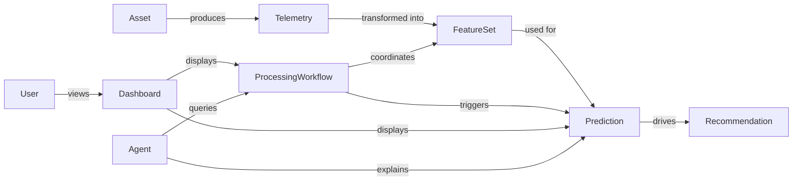
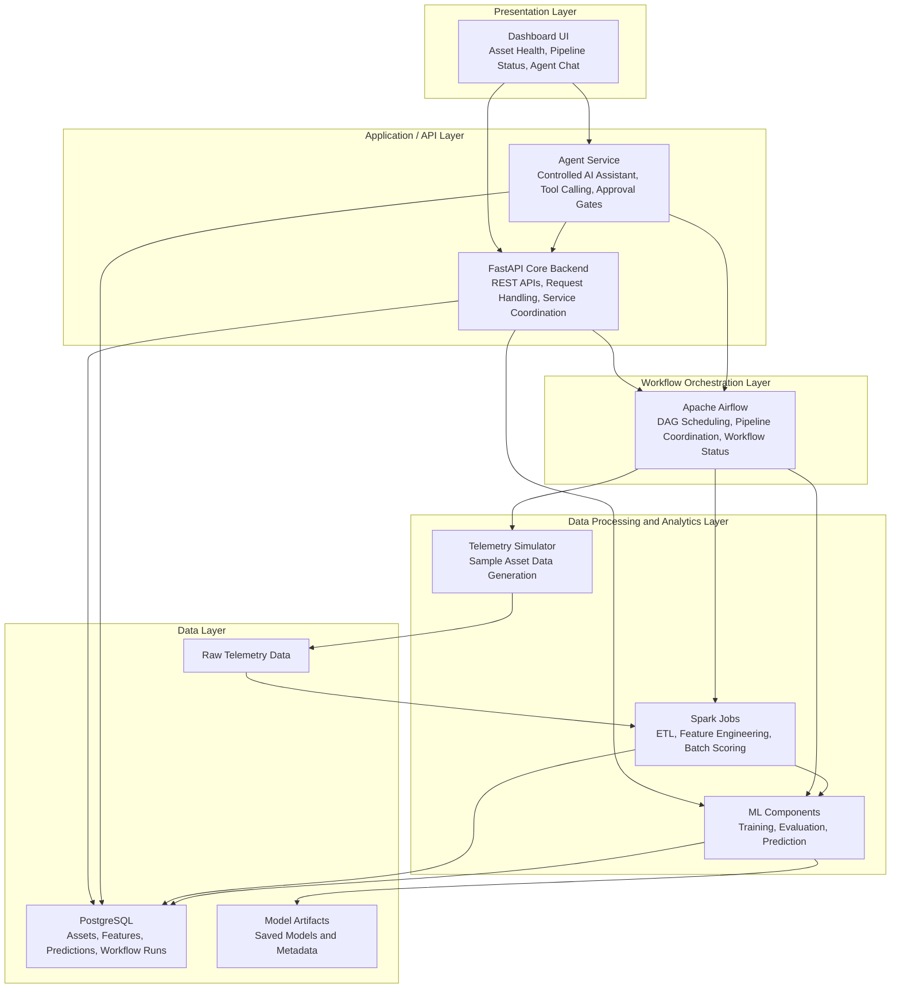

<!-- ========================================================= -->
<!-- STYLING -->
<!-- ========================================================= -->

<!-- ========================================================= -->
<!-- TITLE PAGE -->
<!-- ========================================================= -->

SWENG 894: Software Engineering Capstone Experience

# SentinelOps Project Conception Document

Prepared by:

Eli Vazquez

 

Date:

May 15, 2026

<!-- ========================================================= -->
<!-- TABLE OF CONTENTS -->
<!-- ========================================================= -->

Table of Contents

- Introduction  
- Concept of Operations (CONOPS)  
  - Mission Statement  
  - Background and Problem Statement  
  - Product Scope  
  - Target Audience  
  - Product Features  
  - Problem Domain Overview  
- SentinelOps Layered Component Architecture  
- Programming Languages  
- Toolset  
- Technical Rationale  
- Initial Development Approach  
- Assumptions and Constraints  
- Project Contract and Personal Accountability  
  - Project Ownership and Responsibilities  
  - Participation and Work Expectations
  - Development Procedures  
  - Roadblocks and Risk Management  
  - Personal Accountability Statement  

<!-- ========================================================= -->
<!-- MAIN CONTENT -->
<!-- ========================================================= -->

# Introduction

The purpose of this document is to introduce SentinelOps, a predictive maintenance software platform being developed as part of the SWENG 894 Capstone Experience. The project focuses on combining data engineering, workflow orchestration, machine learning, operational APIs, and controlled AI-assisted interactions into a cohesive software solution.

The intent of this effort is to explore how modern software engineering approaches can support predictive maintenance workflows while maintaining a practical and maintainable architecture suitable for incremental development. The project will emphasize modularity, orchestration, observability, and iterative delivery throughout the capstone lifecycle.

This document defines the initial concept of operations, problem space, proposed capabilities, technical direction, and development approach that will guide the early stages of implementation.

# Concept of Operations (CONOPS)

SentinelOps is intended to simulate and demonstrate a predictive maintenance workflow for industrial-style assets and telemetry systems. The platform will ingest telemetry data, process and transform that data into operational features, execute predictive maintenance analysis, and expose operational insights through APIs, dashboards, and an AI-assisted operational interface.

At a high level, the system workflow is expected to operate as follows:

1. Simulated telemetry data is generated for a set of representative assets.
2. Data processing jobs transform raw telemetry into structured feature sets suitable for analysis.
3. Workflow orchestration coordinates ingestion, processing, scoring, and reporting activities.
4. Machine learning components evaluate telemetry and generate predictive maintenance outputs such as risk indicators or maintenance priority recommendations.
5. Operational APIs expose workflow status, prediction results, and system health information.
6. A dashboard provides visibility into asset conditions, pipeline execution, and operational summaries.
7. An AI-assisted operational interface allows controlled interaction with system data and workflow operations.

The project will prioritize an end-to-end demonstrable workflow over broad platform complexity. The architecture and implementation are expected to evolve incrementally throughout the capstone effort.

## Mission Statement

The mission of SentinelOps is to demonstrate how predictive maintenance workflows can integrate data processing, orchestration, machine learning, operational visibility, and AI-assisted interactions into a maintainable software engineering solution.

## Background and Problem Statement

Modern operational systems increasingly rely on telemetry and sensor-driven analytics to support maintenance planning and reduce operational disruption. However, telemetry processing, workflow execution, and predictive analytics are often distributed across disconnected tools and processes.

As organizations adopt more data-driven maintenance approaches, there is growing interest in platforms capable of coordinating telemetry ingestion, feature engineering, predictive analysis, and operational reporting within a unified workflow.

SentinelOps is intended to explore this problem space through a focused software engineering effort that demonstrates how orchestration systems, data processing pipelines, APIs, dashboards, and AI-assisted operational tools can work together within a predictive maintenance environment.

The project also provides an opportunity to explore technologies and architectural approaches that are increasingly relevant within modern cloud-native and operational analytics environments.

## Product Scope

The initial SentinelOps implementation will focus on building a practical predictive maintenance workflow capable of demonstrating the following capabilities:

- Telemetry simulation for representative assets
- Batch telemetry processing and feature engineering
- Workflow orchestration and pipeline coordination
- Predictive maintenance scoring and analysis
- Operational APIs for system visibility
- Dashboard-based operational monitoring
- Controlled AI-assisted operational interactions
- Testing and documentation supporting the overall workflow

The project will focus on maintainable architecture and incremental delivery rather than attempting to replicate enterprise-scale predictive maintenance infrastructure.

## Target Audience

The primary audience for SentinelOps includes faculty evaluators and technical reviewers assessing the capstone implementation, architecture, engineering process, and supporting documentation.

Additional stakeholders may include:

- Reliability or maintenance engineers interested in predictive workflows
- Software engineers reviewing architecture and implementation decisions
- Technical users evaluating operational dashboards and workflow visibility
- Developers interested in orchestration and AI-assisted operational tooling

## Product Features

The SentinelOps platform is expected to support the following high-level capabilities:

- Asset telemetry simulation and ingestion
- Batch ETL and telemetry transformation workflows
- Workflow orchestration using scheduled and manually triggered jobs
- Predictive maintenance scoring and reporting
- REST APIs for operational data access
- Dashboard visibility into assets, predictions, and workflow status
- AI-assisted operational queries and controlled actions
- Logging, testing, and operational reporting

Feature scope and implementation details may evolve throughout the capstone lifecycle as discoveries are made during development.

## Problem Domain Overview

The conceptual domain relationships above represent the primary operational entities and interactions within SentinelOps. SentinelOps focuses more heavily on telemetry processing, workflow orchestration, and operational analytics than traditional object-oriented business workflows. As a result, the problem domain is represented using operational relationships and data flow interactions rather than a detailed UML class model.

The primary operational concepts within the problem domain include:

- Assets
- Telemetry Readings
- Processing Pipelines
- Feature Engineering Jobs
- Workflow Executions
- Predictions
- Maintenance Recommendations
- Operational Dashboards
- AI-Assisted Operational Actions

The relationships between these concepts are centered on data movement, orchestration, and operational visibility rather than traditional object inheritance or business entity behavior.

# SentinelOps Layered Component Architecture

The SentinelOps architecture is organized using a layered design that separates presentation, application services, orchestration, data processing, and persistence responsibilities across the platform. The Presentation Layer provides operational visibility through the dashboard interface, including asset status, pipeline execution visibility, and AI-assisted interactions. The Application and API Layer exposes REST APIs and coordinates interactions between workflows, predictions, and operational services through FastAPI and the agent service. The Workflow Orchestration Layer uses Apache Airflow to coordinate telemetry ingestion, ETL execution, feature engineering, model scoring, and reporting activities. The Data Processing and Analytics Layer contains the telemetry simulator, Spark processing jobs, and machine learning components responsible for transforming telemetry into predictive maintenance insights. Finally, the Data Layer stores raw telemetry, processed features, workflow metadata, predictions, and model artifacts within PostgreSQL and supporting storage structures. This layered architecture promotes modularity, separation of concerns, maintainability, and incremental development throughout the capstone lifecycle.

# Programming Languages

The initial implementation is expected to use the following programming languages:

| Purpose | Language | Rationale |
|---|---|---|
| Backend APIs | Python | Strong ecosystem support for APIs, orchestration, data engineering, and machine learning |
| Workflow Orchestration | Python | Native support for Airflow and PySpark |
| Data Processing | Python | Consistency across ETL, ML, and orchestration components |
| Frontend Dashboard | TypeScript or JavaScript | Suitable for lightweight operational dashboards |
| Queries and Data Access | SQL | Structured data retrieval and operational reporting |
| Documentation | Markdown | Lightweight and maintainable documentation format |

The selected languages may evolve as implementation progresses.

# Toolset

The following tools are expected to support development, testing, orchestration, and deployment activities.

| Category | Tool | Purpose |
|---|---|---|
| IDE | Visual Studio Code | Primary development environment |
| Source Control | Git + GitHub | Version control and repository management |
| Backend Framework | FastAPI | Operational APIs and service coordination |
| Workflow Orchestration | Apache Airflow | Pipeline scheduling and orchestration |
| Data Processing | Apache Spark / PySpark | ETL and feature engineering |
| Database | PostgreSQL | Operational persistence and reporting |
| Testing | pytest | Unit and integration testing |
| Containerization | Docker Compose | Local service coordination |
| API Testing | Postman | Endpoint validation and testing |
| Diagramming | Mermaid | Workflow and architecture visualization |
| Project Tracking | GitHub Issues / Projects | Sprint and backlog tracking |

# Technical Rationale

The selected technologies align with the operational goals of the project while supporting maintainability and incremental development.

Python was selected as the primary backend language due to its broad ecosystem support across APIs, orchestration, data processing, and machine learning. FastAPI provides a lightweight and testable API framework suitable for operational services. Airflow supports visibility into scheduled and repeatable workflows, while Spark supports telemetry processing and feature engineering responsibilities.

The architecture intentionally favors modularity and separation of concerns. Workflow coordination, processing, prediction, APIs, dashboards, and AI-assisted interactions are treated as separate operational responsibilities to simplify implementation and future evolution.

# Initial Development Approach

Development will proceed incrementally using short implementation cycles aligned with the capstone sprint schedule.

Early development efforts will focus on establishing a working vertical slice capable of demonstrating:

1. Telemetry generation
2. Data processing and feature transformation
3. Workflow orchestration
4. Predictive scoring
5. API visibility
6. Dashboard interaction
7. Documentation and testing

Additional capabilities will be added iteratively as the project evolves.

# Assumptions and Constraints

The following assumptions currently guide the project effort:

* The system will initially operate within a local or lightweight development environment.
* Simulated telemetry is sufficient for demonstrating predictive maintenance workflows.
* Publicly available datasets may be used to support predictive maintenance analysis.
* Architecture and implementation details are expected to evolve throughout development.
* Documentation and testing are considered primary project deliverables alongside source code.

The primary constraints include:

* Limited implementation time within a single academic term
* Solo developer resource limitations
* Need to balance architecture depth with deliverable completion
* Need to maintain a manageable and understandable system architecture

# Project Contract and Personal Accountability

Although SentinelOps is being developed as an individual capstone project, the following agreements, procedures, and accountability expectations will guide project execution throughout the semester.

## Project Ownership and Responsibilities

Eli Vazquez will serve as the sole developer and maintainer for all project activities associated with SentinelOps. Responsibilities include:

- Requirements analysis and backlog management
- Software architecture and design
- Backend API development
- Workflow orchestration and data engineering implementation
- Machine learning integration
- Dashboard development
- Testing and validation
- Documentation and reporting
- Sprint demonstrations and final delivery

## Participation and Work Expectations

The project will follow an iterative development process aligned with the capstone sprint schedule. Consistent weekly participation is expected throughout the semester in order to maintain progress across implementation, testing, and documentation activities.

Project work will include:

- Weekly implementation goals
- Incremental feature delivery
- Continuous backlog refinement
- Documentation updates
- Testing and validation activities
- Sprint demonstrations and milestone preparation

Progress will be tracked through GitHub commits, project notes, weekly reports, and sprint deliverables.

## Development Procedures

Development activities will follow a lightweight agile-style workflow consisting of:

1. Planning implementation tasks for the upcoming sprint cycle
2. Developing and validating incremental functionality
3. Updating documentation and backlog items
4. Reviewing technical risks and blockers
5. Demonstrating working progress through reports and sprint demos

The project will prioritize working vertical slices and observable system behavior before expanding functionality or architectural complexity.

Source control will be used throughout development to maintain traceability of changes and support iterative delivery.

## Roadblocks and Risk Management

Potential roadblocks for the project include:

- Balancing project scope within the academic timeline
- Integration challenges between orchestration, data processing, APIs, and AI-assisted workflows
- Learning curve associated with selected technologies
- Managing implementation, testing, and documentation simultaneously as a solo developer

These risks will be managed through:

- Incremental delivery and milestone-based planning
- Prioritizing core functionality first
- Maintaining a manageable architecture
- Deferring non-essential enhancements when necessary
- Continuous backlog refinement and scope evaluation

## Personal Accountability Statement

As the sole contributor to the project, Eli Vazquez is responsible for maintaining consistent participation, meeting assignment deadlines, and ensuring the quality of project deliverables.

Accountability includes:

- Completing weekly reports and sprint deliverables on time
- Maintaining active development progress throughout the semester
- Producing clear and professional documentation
- Testing meaningful system behavior
- Communicating implementation progress and technical decisions through milestone submissions
- Ensuring that the final product demonstrates the core objectives of the capstone project

The project will emphasize maintainable engineering practices, incremental progress, and practical software delivery throughout the capstone lifecycle.