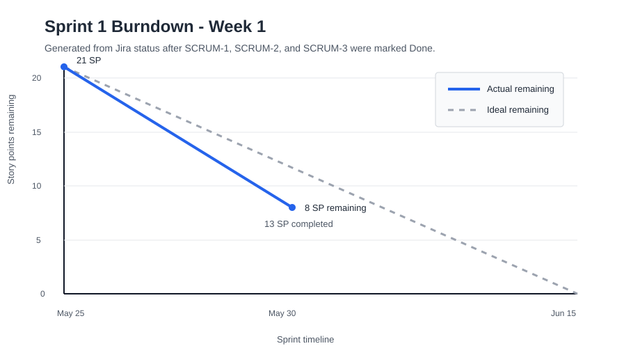

# SentinelOps Weekly Progress Report

| Field | Value |
|---|---|
| Course | SWENG 894 - Software Engineering Capstone Experience |
| Project | SentinelOps |
| Student | Eli Vazquez |
| Sprint | Sprint 1 |
| Reporting Week | Week 1 |
| Reporting Period | 2026-05-25 to 2026-05-31 |
| Report Date | 2026-05-30 |
| Git Repository | <https://github.com/swevazquez/SentinelOpsProject> |
| Jira Board | <https://psu-capstone-sentinelops.atlassian.net/jira/software/projects/SCRUM/boards/1/backlog> |

---

# Sprint Goal

The Sprint 1 goal is to establish the first working SentinelOps foundation for a predictive maintenance workflow. The sprint focuses on representative telemetry generation, raw telemetry persistence, initial feature processing, and repeatable workflow validation.

This week focused on starting the sprint correctly by connecting Jira and GitHub traceability, implementing the first telemetry generation story, and pulling automated CI validation forward so later Sprint 1 work can be integrated safely.

---

# Sprint Planning

## Groomed Product Backlog Summary

The Sprint 1 backlog was reviewed in Jira and confirmed as the starting scope for the first vertical slice.

| ID | Requirement / User Story | Priority | Estimation | Sprint | Current Status |
|---|---|---|---|---|---|
| FR-01 | Telemetry Generation and Ingestion | High | 5 SP | Sprint 1 | Done |
| FR-02 | Raw Telemetry Storage | High | 3 SP | Sprint 1 | Done |
| FR-03 | Feature Engineering Processing | High | 5 SP | Sprint 1 | Done |
| FR-04 | Workflow Orchestration | High | 8 SP | Sprint 1 | To Do |
| NFR-01 | Failed Workflow Detection and Reporting | High | 3 SP | Sprint 1 | To Do |
| NFR-03 | Component Responsibility Separation | High | 2 SP | Sprint 1 | To Do |
| NFR-04 | Repeatable Local Execution | Medium | 2 SP | Sprint 1 | To Do |

## Sprint Backlog

| ID | Requirement / User Story | Priority | Estimation | Status |
|---|---|---|---|---|
| FR-01 | Telemetry Generation and Ingestion | High | 5 SP | Done |
| FR-02 | Raw Telemetry Storage | High | 3 SP | Done |
| FR-03 | Feature Engineering Processing | High | 5 SP | Done |
| FR-04 | Workflow Orchestration | High | 8 SP | To Do |
| NFR-01 | Failed Workflow Detection and Reporting | High | 3 SP | To Do |
| NFR-03 | Component Responsibility Separation | High | 2 SP | To Do |
| NFR-04 | Repeatable Local Execution | Medium | 2 SP | To Do |

## Definition of Done

| Area | Definition of Done Criteria |
|---|---|
| Requirements | Requirement is reviewed and acceptance criteria are documented. |
| Design | Affected architecture, workflow, or interface design is updated. |
| Development | Code is implemented, committed, and aligned with the existing project structure. |
| Testing | Unit, smoke, or manual validation is completed as appropriate. |
| Integration | Changes run through the local CI validation script and GitHub Actions. |
| Documentation | Relevant documentation and weekly reporting evidence are updated. |
| Validation | Implementation is validated against acceptance criteria. |

## Acceptance Criteria for Sprint Backlog Items

| Requirement ID | Acceptance Criteria |
|---|---|
| FR-01 | Given the telemetry simulator is configured, when a telemetry generation workflow is executed, then representative telemetry data shall be produced and made available for processing. |
| FR-02 | Given telemetry data is generated or ingested, when the ingestion workflow completes, then the telemetry data shall be persisted in the configured storage location. |
| FR-03 | Given raw telemetry data exists, when the feature engineering workflow executes, then processed feature sets shall be generated and stored for predictive scoring. |
| FR-04 | Given workflow definitions are configured, when a workflow is triggered, then telemetry ingestion, processing, scoring, and reporting tasks shall execute in the defined sequence. |
| NFR-01 | Given workflow execution fails, when workflow status or logs are reviewed, then the failure shall be detectable and reportable. |
| NFR-03 | Given Sprint 1 implementation work is complete, when the repository structure is reviewed, then API, orchestration, processing, simulator, dashboard, and agent responsibilities shall remain separated. |
| NFR-04 | Given a clean local checkout, when setup and validation commands are run, then the Sprint 1 workflow shall execute repeatably with documented commands. |

---

# Backlog Grooming

## Backlog Changes This Week

| Change Type | Requirement ID | Description | Rationale | Impact |
|---|---|---|---|---|
| Moved earlier | NFR-04 | Automated CI validation was pulled forward into Sprint 1 planning. | Early telemetry, storage, feature, and workflow work needs repeatable verification before additional services are added. | Adds pipeline work to the first sprint foundation and provides testing evidence for weekly reporting. |
| Estimated | NFR-01 / NFR-03 / NFR-04 | Sprint 1 NFR stories were assigned story point estimates in Jira. | The NFRs represent real sprint work and should be visible in sprint capacity and burndown tracking. | Sprint 1 estimated scope increased from 21 SP to 28 SP, with 15 SP remaining after Week 1 progress. |

## Backlog Grooming Rationale

Automated testing and CI validation were pulled forward because the first sprint depends on several connected workflow steps. Establishing branch and pull-request validation now reduces integration risk before additional API, dashboard, prediction, and agent components are added. The Sprint 1 NFRs were also estimated so the burndown reflects the full sprint scope instead of only functional stories.

---

# Source Code Development

## Summary of Contributions

Development this week focused on project traceability, telemetry generation, and automated validation.

Key contributions include:

- Configured GitHub autolinks for Jira keys using the `SCRUM-` prefix.
- Added pull request traceability checks requiring Jira story keys.
- Added representative asset profile configuration for telemetry generation.
- Updated the simulator CLI to load and validate configured asset profiles.
- Added raw telemetry storage validation and persistence to the configured `data/raw/` location.
- Added feature engineering validation and persistence to the configured `data/processed/` location.
- Added CI validation for unit tests, Sprint 1 smoke workflow output counts, Airflow DAG syntax, and documentation readability.

## Repository Information

| Resource | Link |
|---|---|
| Git Repository | <https://github.com/swevazquez/SentinelOpsProject> |
| Jira Board | <https://psu-capstone-sentinelops.atlassian.net/jira/software/projects/SCRUM/boards/1/backlog> |
| Pull Requests | <https://github.com/swevazquez/SentinelOpsProject/pull/1>, <https://github.com/swevazquez/SentinelOpsProject/pull/2>, <https://github.com/swevazquez/SentinelOpsProject/pull/3> |

## Important Commits

| Commit ID | Commit Summary | Related Requirement / User Story | Notes |
|---|---|---|---|
| 3196025 | Add Jira GitHub traceability workflow | NFR-04 | Establishes traceability and reporting support. |
| d2a174c | Configure telemetry asset generation | FR-01 | Adds configured representative telemetry input. |
| 74579b8 | Add CI validation pipeline | NFR-04 | Adds local and GitHub Actions validation. |
| dfeb627 | Run CI on feature branch pushes | NFR-04 | Ensures branch work receives automated feedback before PR merge. |
| 29b44e1 | Persist raw telemetry output | FR-02 | Adds validated raw telemetry persistence and updates workflow callers. |
| cd9085b | Validate and persist engineered features | FR-03 | Adds raw input validation, processed feature persistence, and feature contract expansion. |
| c81a36a | Update Week 1 sprint report burndown | Sprint reporting | Adds the Week 1 burndown chart based on Jira story status. |

## Burndown Summary

Sprint 1 is underway. `FR-01`, `FR-02`, and `FR-03` are complete. The project foundation now includes automated validation, raw telemetry persistence, and processed feature persistence. Remaining estimated work includes `FR-04` workflow orchestration, failed workflow detection and reporting, component responsibility verification, and closure of repeatable local execution evidence.

| Metric | Value |
|---|---|
| Sprint Total Estimated Effort | 28 story points |
| Completed Effort | 13 story points |
| Remaining Effort | 15 story points |
| Sprint Status | On Track |

## Burndown Chart

Jira issue status and story point estimates were available, but a Jira-generated burndown chart was not available through the current integration tools. The chart below was generated from the Sprint 1 Jira status after `SCRUM-1`, `SCRUM-2`, and `SCRUM-3` were marked done and after Sprint 1 NFR stories were estimated.

---

# Software Testing

## Testing Overview

Automated testing was expanded and connected to CI. The project now has unit coverage for telemetry generation and asset profile validation, plus a smoke workflow that generates raw telemetry and processed features.

## Requirement-to-Test Traceability Matrix

| Requirement ID | Test Case ID | Test Type | Test Objective | Status |
|---|---|---|---|---|
| FR-01 | TC-FR01-01 | Unit | Validate telemetry generation creates hourly rows for each representative asset. | Passed |
| FR-01 | TC-FR01-02 | Unit | Validate asset profile configuration is loaded and used by telemetry generation. | Passed |
| FR-01 | TC-FR01-03 | Unit | Validate invalid asset risk configuration is rejected. | Passed |
| FR-02 | TC-FR02-01 | Unit | Validate raw telemetry is persisted to the configured storage location. | Passed |
| FR-02 | TC-FR02-02 | Unit | Validate raw telemetry storage rejects empty or inconsistent run data. | Passed |
| FR-03 | TC-FR03-01 | Unit | Validate raw telemetry is grouped into asset-level feature rows. | Passed |
| FR-03 | TC-FR03-02 | Unit | Validate feature rows are persisted to the configured processed storage location. | Passed |
| FR-03 | TC-FR03-03 | Unit | Validate missing or empty raw telemetry input is rejected. | Passed |
| NFR-04 | TC-NFR04-01 | CI Smoke | Validate the Sprint 1 local workflow generates expected raw and processed outputs. | Passed |
| NFR-04 | TC-NFR04-02 | CI | Validate GitHub Actions runs on feature branch pushes and PRs. | Passed |

## Test Case Specifications

### TC-FR01-01 - Telemetry Generation Produces Representative Rows

| Field | Description |
|---|---|
| Related Requirement | FR-01 |
| Test Type | Unit |
| Preconditions | Telemetry simulator is configured with representative assets. |
| Test Steps | Run `python3 -m unittest discover -s tests`. |
| Expected Result | Telemetry rows are generated for each asset and hour with the expected fields. |
| Actual Result | Passed. |
| Status | Passed |

### TC-NFR04-01 - Sprint 1 CI Smoke Workflow

| Field | Description |
|---|---|
| Related Requirement | NFR-04 |
| Test Type | CI Smoke |
| Preconditions | Repository checkout and Python 3.12 are available. |
| Test Steps | Run `./scripts/check-ci.sh`. |
| Expected Result | Unit tests pass, smoke data is generated, expected output counts match, and DAG syntax is valid. |
| Actual Result | Passed locally and in GitHub Actions. |
| Status | Passed |

### TC-FR02-01 - Raw Telemetry Storage

| Field | Description |
|---|---|
| Related Requirement | FR-02 |
| Test Type | Unit |
| Preconditions | Generated telemetry rows exist for a single run. |
| Test Steps | Persist rows with `persist_raw_telemetry`. |
| Expected Result | The system creates `telemetry_<run_id>.csv` in the configured storage directory and preserves the raw telemetry schema. |
| Actual Result | Passed. |
| Status | Passed |

### TC-FR03-01 - Feature Engineering Processing

| Field | Description |
|---|---|
| Related Requirement | FR-03 |
| Test Type | Unit |
| Preconditions | Raw telemetry CSV contains the required telemetry fields. |
| Test Steps | Run `engineer_features` against raw telemetry input. |
| Expected Result | The system produces one processed feature row per `run_id` and `asset_id`, including timestamp bounds, aggregate sensor values, runtime bounds, and failure observation. |
| Actual Result | Passed. |
| Status | Passed |

## Testing Summary

Local validation passed with `./scripts/check-ci.sh`. GitHub Actions passed on PR #1, PR #2, and PR #3.

---

# Risks, Roadblocks, and Mitigation

| Risk / Roadblock | Impact | Mitigation / Next Step |
|---|---|---|
| Sprint 1 spans several connected workflow steps. | Integration issues may appear when telemetry, storage, features, and orchestration are combined. | Keep CI smoke validation active and extend it as each Sprint 1 story lands. |

---

# Plan for Next Week

Next week’s work will focus on continuing the Sprint 1 vertical slice.

- Proceed to `SCRUM-4` workflow orchestration.
- Add workflow failure visibility as part of `NFR-01`.
- Expand validation evidence as storage and feature processing are refined.
- Keep Jira, GitHub PRs, commits, and weekly reports aligned.

---

# Overall Sprint Assessment

Sprint progress is currently on track. The first three functional stories are complete, the codebase has a CI foundation, and the project now has stronger traceability between Jira, GitHub, tests, and weekly reporting. The main focus remains completing the Sprint 1 vertical slice and closing the supporting NFR work without expanding scope.
