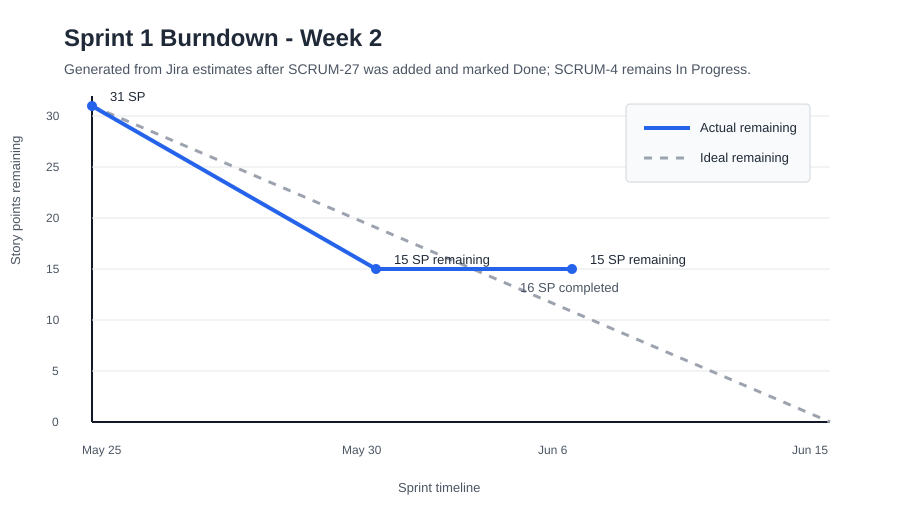

# SentinelOps Weekly Progress Report

| Field | Value |
|---|---|
| Course | SWENG 894 - Software Engineering Capstone Experience |
| Project | SentinelOps |
| Student | Eli Vazquez |
| Sprint | Sprint 1 |
| Reporting Week | Week 2 |
| Reporting Period | 2026-06-01 to 2026-06-07 |
| Report Date | 2026-06-06 |
| Git Repository | <https://github.com/swevazquez/SentinelOpsProject> |
| Jira Board | <https://psu-capstone-sentinelops.atlassian.net/jira/software/projects/SCRUM/boards/1/backlog> |

---

# Sprint Goal

The Sprint 1 goal remains establishing a working and repeatable predictive-maintenance
data workflow. The sprint covers telemetry generation, raw persistence, feature
engineering, workflow orchestration, failure visibility, component separation, and
repeatable local execution.

Week 2 also added a bounded UI design activity. Dashboard wireframes were prepared
before Sprint 2 implementation so operational requirements, user priorities, interface
states, and expected API dependencies are explicit.

---

# Sprint Planning

## Groomed Product Backlog Summary

| ID | Requirement / User Story | Priority | Estimation | Sprint | Current Status |
|---|---|---|---|---|---|
| SCRUM-1 / FR-01 | Telemetry Generation and Ingestion | High | 5 SP | Sprint 1 | Done |
| SCRUM-2 / FR-02 | Raw Telemetry Storage | High | 3 SP | Sprint 1 | Done |
| SCRUM-3 / FR-03 | Feature Engineering Processing | High | 5 SP | Sprint 1 | Done |
| SCRUM-4 / FR-04 | Workflow Orchestration | High | 8 SP | Sprint 1 | Done |
| SCRUM-17 / NFR-01 | Failed Workflow Detection and Reporting | High | 3 SP | Sprint 1 | To Do |
| SCRUM-19 / NFR-03 | Component Responsibility Separation | High | 2 SP | Sprint 1 | To Do |
| SCRUM-20 / NFR-04 | Repeatable Local Execution | Medium | 2 SP | Sprint 1 | To Do |
| SCRUM-27 / UX-01 | Operational Dashboard Wireframe | High | 3 SP | Sprint 1 | Done |

## Sprint Backlog

| ID | Requirement / User Story | Priority | Estimation | Status |
|---|---|---|---|---|
| SCRUM-1 / FR-01 | Telemetry Generation and Ingestion | High | 5 SP | Done |
| SCRUM-2 / FR-02 | Raw Telemetry Storage | High | 3 SP | Done |
| SCRUM-3 / FR-03 | Feature Engineering Processing | High | 5 SP | Done |
| SCRUM-4 / FR-04 | Workflow Orchestration | High | 8 SP | Done |
| SCRUM-17 / NFR-01 | Failed Workflow Detection and Reporting | High | 3 SP | To Do |
| SCRUM-19 / NFR-03 | Component Responsibility Separation | High | 2 SP | To Do |
| SCRUM-20 / NFR-04 | Repeatable Local Execution | Medium | 2 SP | To Do |
| SCRUM-27 / UX-01 | Operational Dashboard Wireframe | High | 3 SP | Done |

## Definition of Done

| Area | Definition of Done Criteria |
|---|---|
| Requirements | Requirement and acceptance criteria are reviewed in Jira. |
| Design | Affected architecture, workflow, or interface design is updated. |
| Development | Changes are committed on a traceable story branch. |
| Testing | Automated or manual validation is documented with reproducible steps. |
| Integration | Local CI and GitHub Actions complete successfully. |
| Documentation | Relevant documentation and weekly-report evidence are updated. |
| Validation | The result is reviewed against every acceptance criterion before Jira closure. |

## Acceptance Criteria for Current Work

| Requirement ID | Acceptance Criteria |
|---|---|
| SCRUM-4 / FR-04 | Given the Sprint 1 Airflow workflow is configured, when triggered, telemetry generation, raw persistence, feature engineering, and processed-feature persistence execute in order. |
| SCRUM-4 / FR-04 | Given the workflow completes successfully, when output artifacts are inspected, validated raw and processed files exist and share the workflow run identifier. |
| SCRUM-4 / FR-04 | Given the workflow definition is validated, when automated tests and the local validation command run, task dependency order and workflow outputs are verified. |
| SCRUM-4 / FR-04 | Given a clean checkout with documented prerequisites, when the documented workflow commands are followed, the Sprint 1 workflow executes repeatably. |
| SCRUM-27 / UX-01 | Given project stakeholders and requirements, when the wireframes are reviewed, asset health, workflow status, maintenance priority, and prediction summaries have a clear hierarchy. |
| SCRUM-27 / UX-01 | Given data may be incomplete, when alternate states are reviewed, loading, empty, failed, unavailable, and permission-required behavior is defined. |
| SCRUM-27 / UX-01 | Given Sprint 2 requires backend integration, when design annotations are reviewed, major panels identify user purpose and expected API or data sources. |
| SCRUM-27 / UX-01 | Given the design is complete, when repository documentation is reviewed, rationale and traceability to SCRUM-10 / FR-10 are available. |

---

# Backlog Grooming

## Backlog Changes This Week

| Change Type | Requirement ID | Description | Rationale | Impact |
|---|---|---|---|---|
| Updated scope | SCRUM-4 / FR-04 | Limited Sprint 1 orchestration to telemetry generation, raw persistence, feature engineering, and processed-feature persistence. | Predictive scoring and prediction reporting are planned under Sprint 2 stories and should not be implicit Sprint 1 dependencies. | Makes acceptance criteria implementable and testable without pulling Sprint 2 functionality forward. |
| Added | SCRUM-27 / UX-01 | Added a 3-point operational dashboard wireframe story. | Early interface design provides visible UI progress and clarifies user needs before dashboard implementation. | Sprint 1 scope increased from 28 to 31 story points. SCRUM-27 now blocks SCRUM-10. |
| Refined quality process | SCRUM-20 / NFR-04 | Expanded the weekly-report template with detailed test execution and direct commit-link expectations. | Professor feedback identified incomplete test execution detail and limited commit traceability. | Future reports require reproducible test procedures and reviewable code evidence. |

## Backlog Grooming Rationale

The grooming changes protect the vertical-slice boundary. SCRUM-4 now coordinates only
the processing capabilities available during Sprint 1, while predictive scoring and
reporting remain in Sprint 2. SCRUM-27 was added as a small design precursor rather
than expanding SCRUM-10 into the current sprint. This produces reviewable UI evidence
without claiming production frontend implementation.

---

# Source Code Development

## Summary of Contributions

Week 2 work focused on reporting quality, dashboard design, requirements traceability,
and executable workflow orchestration.

Key contributions include:

- Updated the weekly-report template to require complete execution procedures and
  direct GitHub commit links.
- Reorganized diagram sources into architecture, workflow, and UI directories.
- Created editable Excalidraw and Mermaid wireframes for the operations overview,
  asset details, workflow details, and operations assistant.
- Exported reviewed 1440 by 1024 PNG images for report and documentation use.
- Documented stakeholder needs, design rationale, alternate states, API/data
  dependencies, and traceability to SCRUM-10 / FR-10.
- Reviewed rendered wireframes and corrected title, button-label, and panel clipping.
- Added a reusable Sprint 1 workflow module shared by Airflow and local execution.
- Added integration tests for task order, artifact persistence, and workflow run-ID
  consistency.
- Executed the DAG through Airflow and reproduced setup and workflow validation from
  a fresh checkout.

## Repository Information

| Resource | Link |
|---|---|
| Git Repository | <https://github.com/swevazquez/SentinelOpsProject> |
| Jira Board | <https://psu-capstone-sentinelops.atlassian.net/jira/software/projects/SCRUM/boards/1/backlog> |
| SCRUM-27 | <https://psu-capstone-sentinelops.atlassian.net/browse/SCRUM-27> |
| SCRUM-10 | <https://psu-capstone-sentinelops.atlassian.net/browse/SCRUM-10> |
| SCRUM-4 | <https://psu-capstone-sentinelops.atlassian.net/browse/SCRUM-4> |
| Pull Requests | <https://github.com/swevazquez/SentinelOpsProject/pull/4>, <https://github.com/swevazquez/SentinelOpsProject/pull/5> |

## Important Commits

| Commit | Commit Summary | Related Requirement / User Story | Notes |
|---|---|---|---|
| [`acf0220`](https://github.com/swevazquez/SentinelOpsProject/commit/acf02208db9c24df9a580423b9c4f9c2d3274802) | Improve weekly report test specifications | SCRUM-20 / NFR-04 | Implements professor feedback for reproducible tests and direct commit traceability. |
| [`c075ea1`](https://github.com/swevazquez/SentinelOpsProject/commit/c075ea1f0080963e174dd999152577dd9ea38db8) | Add operational dashboard wireframes | SCRUM-27 / UX-01 | Adds editable sources, rendered images, design rationale, data dependencies, and requirement traceability. |
| [`f0c9c55`](https://github.com/swevazquez/SentinelOpsProject/commit/f0c9c55dba8850e1c09525de4bca0b1a0d1e3331) | Refine wireframe review instructions | SCRUM-27 / UX-01 | Reframes wireframe validation as a reviewer-facing inspection of committed artifacts. |
| [`b0f25e9`](https://github.com/swevazquez/SentinelOpsProject/commit/b0f25e9e18764d2316104faa58508ad0cb6cebd9) | Implement Sprint 1 workflow orchestration | SCRUM-4 / FR-04 | Adds shared orchestration, Airflow delegation, local execution, integration tests, and workflow documentation. |

## Dashboard Wireframe Evidence

## Burndown Summary

Sprint scope increased by 3 points when SCRUM-27 was added. SCRUM-27 is complete
after PR #4 merged, and SCRUM-4 is complete after PR #5 merged into `main`.

| Metric | Value |
|---|---|
| Sprint Total Estimated Effort | 31 story points |
| Completed Effort | 24 story points |
| Remaining Effort | 7 story points |
| Sprint Status | On Track |

## Burndown Chart

The chart reflects the active 31-point Sprint 1 scope after SCRUM-27 and SCRUM-4
were marked Done. Seven story points remain across SCRUM-17, SCRUM-19, and SCRUM-20.

---

# Software Testing

## Testing Overview

Testing this week included repository regression validation, structural validation of
the Excalidraw scene files, image-dimension checks, and visual review of the exported
PNG wireframes for clipping, overlapping elements, information hierarchy, and clear
operational actions. Workflow testing also verified the shared orchestration sequence,
Airflow task execution, persisted output contracts, and repeatable execution from a
fresh checkout.

## Requirement-to-Test Traceability Matrix

| Requirement ID | Test Case ID | Test Type | Test Objective | Status |
|---|---|---|---|---|
| SCRUM-27 / UX-01 | TC-UX01-01 | Design Review / Structural | Verify each editable wireframe and PNG export is valid, complete, legible, and aligned with the intended operational hierarchy. | Passed |
| SCRUM-4 / FR-04 | TC-FR04-01 | Integration | Verify raw persistence occurs before feature processing and both artifacts share one workflow run ID. | Passed |
| SCRUM-4 / FR-04 | TC-FR04-02 | System | Execute the decorated task graph through Airflow and verify successful task states and persisted artifacts. | Passed |
| SCRUM-4 / FR-04 | TC-FR04-03 | System | Verify documented setup, workflow, integration tests, and regression checks from a fresh checkout. | Passed |
| SCRUM-20 / NFR-04 | TC-NFR04-03 | Regression / CI | Verify documentation changes do not break the existing Sprint 1 validation workflow. | Passed |

## Test Case Specifications

### TC-UX01-01 - Wireframe Artifact and Visual Review

| Field | Description |
|---|---|
| Related Requirement | SCRUM-27 / UX-01 |
| Test Type | Design Review / Structural |
| Objective | Confirm that each editable scene and PNG export is complete and that the four views present understandable operational interfaces without clipped labels, overlapping controls, ambiguous actions, or missing states. |
| Preconditions | Repository files, `jq`, ImageMagick, and a PNG viewer capable of displaying images at full resolution are available. |
| Test Data / Parameters | Four Excalidraw and PNG pairs under `docs/diagrams/ui/` and `docs/images/ui/wireframes/`; design specification at `docs/diagrams/ui/README.md`; SCRUM-27 acceptance criteria. |
| Execution Environment | Repository checkout, local shell with `jq` and ImageMagick `magick`, and an image viewer that can display 1440 by 1024 PNG files at full resolution. |
| Expected Final Result | Four nonempty Excalidraw v2 scenes validate; four corresponding PNGs report dimensions of 1440 by 1024; each view has a clear purpose and hierarchy; labels, controls, navigation, actions, and required alternate states are understandable. |
| Actual Result | All four source/export pairs passed structural checks and visual review. Workflow title/status overlap, artifact-panel overflow, and retry-button clipping were identified and corrected. The final exports contain no observed clipping or overlapping controls. |
| Evidence | Editable files under `docs/diagrams/ui/`, exports under `docs/images/ui/wireframes/`, and commit [`c075ea1`](https://github.com/swevazquez/SentinelOpsProject/commit/c075ea1f0080963e174dd999152577dd9ea38db8). |
| Cleanup / Reset | None. The review uses committed PNG exports and does not modify repository files. |
| Status | Passed |

#### Wireframe Parameters

| View | Editable Source | Exported Image | Review Focus |
|---|---|---|---|
| Operations overview | `docs/diagrams/ui/dashboard-wireframe.excalidraw` | `docs/images/ui/wireframes/dashboard-wireframe.png` | Risk, alerts, workflow health, asset priority, and navigation. |
| Asset details | `docs/diagrams/ui/asset-details-wireframe.excalidraw` | `docs/images/ui/wireframes/asset-details-wireframe.png` | Telemetry, prediction evidence, maintenance recommendations, and asset context. |
| Workflow details | `docs/diagrams/ui/workflow-details-wireframe.excalidraw` | `docs/images/ui/wireframes/workflow-details-wireframe.png` | Task order, status, duration, failure details, artifacts, retry, and rerun controls. |
| Operations assistant | `docs/diagrams/ui/agent-chat-wireframe.excalidraw` | `docs/images/ui/wireframes/agent-chat-wireframe.png` | Questions, answers, tool evidence, suggested prompts, action impact, and approval controls. |

#### Execution Steps

1. Review the purpose, intended users, panel dependencies, and alternate states for all four views.
   - Command or action: Open `docs/diagrams/ui/README.md`.
   - Expected result: The document explains the purpose of each view, expected data sources, alternate states, and traceability to SCRUM-27, SCRUM-10, and FR-10.
2. Validate every editable source listed in the wireframe parameters.
   - Command or action: `for file in docs/diagrams/ui/*.excalidraw; do jq -e '.type == "excalidraw" and .version == 2 and (.elements | length > 0)' "$file" >/dev/null || exit 1; done`
   - Expected result: The command exits successfully with four valid, nonempty Excalidraw v2 scenes.
3. Validate every exported image listed in the wireframe parameters.
   - Command or action: `for file in docs/images/ui/wireframes/*.png; do magick identify -format '%f %wx%h\n' "$file"; done`
   - Expected result: Four filenames are printed and each reports `1440x1024`.
4. Confirm that every exported image maps to an editable source.
   - Command or action: Review `docs/images/ui/wireframes/README.md` and compare it with the wireframe parameters.
   - Expected result: Each of the four PNG files has a corresponding Excalidraw source.
5. Open each exported image at full resolution and follow the review focus in the wireframe parameters.
   - Command or action: Inspect each PNG for hierarchy, legibility, clipping, overlapping elements, navigation, and understandable controls.
   - Expected result: Content is legible, panels follow a clear decision-making order, and actions are understandable without referring to implementation code.
6. Compare all four views with the SCRUM-27 acceptance criteria and record any finding.
   - Command or action: Verify hierarchy, alternate states, panel purpose, expected data dependency, and SCRUM-10 / FR-10 traceability against `docs/diagrams/ui/README.md`.
   - Expected result: Every acceptance criterion has visible or documented evidence; any clipping, overlap, unclear label, or missing state is recorded for correction.

#### Step Results

| Step | Actual Result | Status |
|---|---|---|
| 1 | The specification identified users, purpose, dependencies, alternate states, and requirement traceability. | Passed |
| 2 | Four Excalidraw v2 scenes contained editable elements. | Passed |
| 3 | Four PNG files reported 1440 by 1024 dimensions. | Passed |
| 4 | The export index mapped each image to its source. | Passed |
| 5 | The four views presented legible priorities, evidence, navigation, and controls; three workflow-view issues were corrected before final review. | Passed |
| 6 | Each SCRUM-27 acceptance criterion had corresponding visual or documented evidence. | Passed |

### TC-FR04-01 - Workflow Sequence and Artifact Contract

| Field | Description |
|---|---|
| Related Requirement | SCRUM-4 / FR-04 |
| Test Type | Integration |
| Objective | Verify that raw telemetry is persisted before feature processing and that both output artifacts retain one workflow run ID. |
| Preconditions | Repository checkout on the SCRUM-4 branch; Python 3.12 or later; no Airflow service required. |
| Test Data / Parameters | Two temporary asset profiles, run ID `integration-run`, three hourly samples, deterministic seed `7`. |
| Execution Environment | Local Python standard-library test runner. |
| Expected Final Result | Raw persistence precedes feature processing; 6 raw rows and 2 feature rows are stored; output filenames and records use `integration-run`; mismatched run IDs are rejected. |
| Actual Result | Three integration tests passed and verified task order, persisted paths, row counts, asset IDs, and run-ID consistency. |
| Evidence | `tests/integration/test_sprint1_workflow.py` and commit [`b0f25e9`](https://github.com/swevazquez/SentinelOpsProject/commit/b0f25e9e18764d2316104faa58508ad0cb6cebd9). |
| Cleanup / Reset | Temporary test directories are removed automatically by the test runner. |
| Status | Passed |

#### Execution Steps

1. Start from the repository root and review the orchestration integration tests.
   - Command or action: Open `tests/integration/test_sprint1_workflow.py`.
   - Expected result: Tests cover persisted artifacts, ordered execution, and rejection of mismatched run IDs.
2. Execute the orchestration integration tests.
   - Command or action: `python3 -m unittest tests.integration.test_sprint1_workflow -v`
   - Expected result: Three named tests execute.
3. Review the successful-workflow test result.
   - Command or action: Confirm `test_workflow_persists_raw_and_feature_artifacts_for_one_run` passes.
   - Expected result: The test verifies 6 raw rows, 2 feature rows, expected filenames, two assets, and one run ID.
4. Review the dependency-order and run-ID protection results.
   - Command or action: Confirm the order and mismatched-run-ID tests pass.
   - Expected result: Feature processing receives the persisted raw path after raw storage, and inconsistent run IDs raise an error.
5. Record the test summary.
   - Command or action: Confirm the test runner reports `Ran 3 tests` and `OK`.
   - Expected result: The integration contract is verified without failures.

#### Step Results

| Step | Actual Result | Status |
|---|---|---|
| 1 | The test module contained all three required orchestration checks. | Passed |
| 2 | Three integration tests executed. | Passed |
| 3 | Artifact paths, row counts, asset IDs, and run ID matched expectations. | Passed |
| 4 | Task order was preserved and inconsistent run IDs were rejected. | Passed |
| 5 | The runner reported three passing tests. | Passed |

### TC-FR04-02 - Airflow DAG Execution

| Field | Description |
|---|---|
| Related Requirement | SCRUM-4 / FR-04 |
| Test Type | System |
| Objective | Execute the decorated Sprint 1 task graph through Airflow and verify task order, successful states, and persisted artifacts. |
| Preconditions | Repository root; `.env` created through `./scripts/setup.sh`; Docker and Docker Compose available. |
| Test Data / Parameters | DAG `sentinelops_sprint1_pipeline`; review date `2026-06-06T12:00:00+00:00`; configured four-asset sample file. |
| Execution Environment | Apache Airflow 2.10.5 and PostgreSQL 16 through Docker Compose. |
| Expected Final Result | Airflow loads the DAG, runs `generate_raw_telemetry` before `engineer_feature_output`, marks both tasks and the DAG run successful, and persists 96 raw rows plus 4 feature rows under one run ID. |
| Actual Result | Airflow loaded the DAG and completed both task instances in order with `success` states. The DAG run succeeded and generated the expected raw and processed artifacts with run ID `airflow-20260606T174045Z`. |
| Evidence | Airflow task-state output, generated files under `data/raw/` and `data/processed/`, and the verification procedure in `docs/architecture/sprint-1-workflow.md`. |
| Cleanup / Reset | Run `docker compose down` after review. Generated data remains ignored by Git. |
| Status | Passed |

#### Execution Steps

1. Prepare and start the workflow services.
   - Command or action: `./scripts/setup.sh` followed by `docker compose up -d postgres airflow`
   - Expected result: PostgreSQL becomes healthy and the Airflow container starts.
2. Confirm the DAG is available.
   - Command or action: `docker compose exec -T airflow airflow dags list | grep sentinelops_sprint1_pipeline`
   - Expected result: Airflow lists `sentinelops_sprint1_pipeline`.
3. Execute the task graph through Airflow.
   - Command or action: `docker compose exec -T airflow airflow dags test sentinelops_sprint1_pipeline 2026-06-06T12:00:00+00:00`
   - Expected result: Raw telemetry runs first, feature processing runs second, and the DAG run finishes successfully.
4. Verify task states and output artifacts.
   - Command or action: Review Airflow task states and inspect the matching files under `data/raw/` and `data/processed/`.
   - Expected result: Both tasks report `success`; raw output has 97 CSV lines, processed output has 5 CSV lines, and both use the same run ID.
5. Stop the review services.
   - Command or action: `docker compose down`
   - Expected result: Airflow and PostgreSQL containers are stopped and removed.

#### Step Results

| Step | Actual Result | Status |
|---|---|---|
| 1 | PostgreSQL became healthy and Airflow started. | Passed |
| 2 | Airflow listed the Sprint 1 DAG. | Passed |
| 3 | Airflow ran both tasks in dependency order and marked the DAG run successful. | Passed |
| 4 | Both task states were successful; artifacts contained 96 raw rows and 4 feature rows with the same run ID. | Passed |
| 5 | Temporary containers and the compose network were removed. | Passed |

### TC-FR04-03 - Fresh Checkout Workflow Reproduction

| Field | Description |
|---|---|
| Related Requirement | SCRUM-4 / FR-04 |
| Test Type | System |
| Objective | Verify that the documented setup, workflow, integration-test, and regression commands succeed from a fresh checkout. |
| Preconditions | Git, Python 3.12 or later, and access to the SCRUM-4 branch. |
| Test Data / Parameters | Fresh clone of `SCRUM-4-workflow-orchestration`; run ID `clean-checkout`. |
| Execution Environment | New temporary directory with no files copied from the existing working tree. |
| Expected Final Result | Setup creates local configuration, the workflow persists 96 raw rows and 4 feature rows, three integration tests pass, and the complete regression gate passes 16 tests. |
| Actual Result | Every documented command completed successfully from the fresh clone with the expected artifacts and test counts. |
| Evidence | Console results recorded in this report and the commands documented in `README.md` and `docs/architecture/sprint-1-workflow.md`. |
| Cleanup / Reset | Remove the temporary checkout after evidence is recorded. |
| Status | Passed |

#### Execution Steps

1. Clone the SCRUM-4 branch into a new temporary directory.
   - Command or action: `git clone --branch SCRUM-4-workflow-orchestration --single-branch https://github.com/swevazquez/SentinelOpsProject.git repo`
   - Expected result: A new `repo/` checkout contains only committed branch content.
2. Prepare the documented local configuration.
   - Command or action: From `repo/`, run `cp .env.example .env && ./scripts/setup.sh`.
   - Expected result: Setup completes and required data directories exist.
3. Execute the documented workflow.
   - Command or action: `./scripts/seed-data.sh clean-checkout`
   - Expected result: The command creates 96 raw rows and 4 feature rows using run ID `clean-checkout`.
4. Execute focused and complete validation.
   - Command or action: `python3 -m unittest tests.integration.test_sprint1_workflow -v` followed by `./scripts/check-ci.sh`.
   - Expected result: Three integration tests pass, then the complete gate passes 16 tests and validates workflow outputs and DAG syntax.
5. Review and remove the temporary checkout.
   - Command or action: Confirm generated artifacts and test summaries, then delete the temporary directory.
   - Expected result: Reproduction evidence is recorded and no temporary checkout remains.

#### Step Results

| Step | Actual Result | Status |
|---|---|---|
| 1 | The branch cloned successfully into a new temporary directory. | Passed |
| 2 | Setup completed from committed files. | Passed |
| 3 | The workflow produced 96 raw rows and 4 feature rows. | Passed |
| 4 | Three integration tests and all 16 regression tests passed. | Passed |
| 5 | Evidence was recorded; the temporary checkout can be removed without affecting the project workspace. | Passed |

### TC-NFR04-03 - Repository Regression Validation

| Field | Description |
|---|---|
| Related Requirement | SCRUM-20 / NFR-04 |
| Test Type | Regression / CI |
| Objective | Confirm that diagram reorganization and reporting changes preserve the repeatable Sprint 1 validation workflow. |
| Preconditions | Repository checkout with Python available and project scripts executable. |
| Test Data / Parameters | Default `RUN_ID=ci-smoke`; representative asset profiles. |
| Execution Environment | Local macOS shell and GitHub Actions-compatible validation script. |
| Expected Final Result | Unit tests pass, 96 telemetry rows and 4 feature rows are generated, Airflow syntax passes, and Markdown files are readable. |
| Actual Result | Sixteen unit and integration tests passed; expected telemetry and feature counts were produced; all remaining checks passed. |
| Evidence | `./scripts/check-ci.sh` output and the SCRUM-4 implementation in commit [`b0f25e9`](https://github.com/swevazquez/SentinelOpsProject/commit/b0f25e9e18764d2316104faa58508ad0cb6cebd9). |
| Cleanup / Reset | Generated smoke files remain ignored under `data/raw/` and `data/processed/`. |
| Status | Passed |

#### Execution Steps

1. Start from the repository root.
   - Command or action: Confirm that `README.md`, `docs/`, and `scripts/check-ci.sh` are visible in the current directory.
   - Expected result: Project scripts and configuration are available through repository-relative paths.
2. Execute the regression gate.
   - Command or action: `./scripts/check-ci.sh`
   - Expected result: Unit tests begin, followed by the Sprint 1 smoke workflow.
3. Verify automated tests.
   - Command or action: Review the unit-test section of the command output.
   - Expected result: Sixteen tests pass with no failures.
4. Verify workflow and documentation checks.
   - Command or action: Review generated row counts, Airflow syntax, and Markdown checks.
   - Expected result: 96 telemetry rows and 4 feature rows are persisted; syntax and documentation checks pass.
5. Record evidence.
   - Command or action: Confirm the final output states `CI checks passed.`
   - Expected result: The complete regression gate reports success.

#### Step Results

| Step | Actual Result | Status |
|---|---|---|
| 1 | Repository scripts were available. | Passed |
| 2 | The complete CI script executed. | Passed |
| 3 | Sixteen tests passed. | Passed |
| 4 | Expected workflow counts, Airflow syntax, and Markdown checks passed. | Passed |
| 5 | The command ended with `CI checks passed.` | Passed |

## Testing Summary

All planned Week 2 wireframe, orchestration, Airflow, clean-checkout, and regression
checks passed. The reviews produced corrective design and documentation changes, and
the final artifacts and workflow behavior are reproducible from the documented steps.

---

# Risks, Roadblocks, and Mitigation

| Risk / Roadblock | Impact | Mitigation / Next Step |
|---|---|---|
| Sprint 1 has 7 story points remaining across three NFR stories. | Completing the supporting quality requirements by June 15 remains schedule-sensitive. | Prioritize SCRUM-17, SCRUM-19, and SCRUM-20 and keep their validation evidence narrowly scoped. |
| Wireframes depend on APIs planned for later stories. | UI implementation cannot yet use live operational data. | Preserve the documented panel-to-data mapping as the integration contract for Sprint 2. |

---

# Plan for Next Week

Next week will focus on completing the remaining Sprint 1 quality requirements.

- Add SCRUM-17 workflow failure detection and reporting.
- Close SCRUM-19 and SCRUM-20 with architecture and clean-checkout execution evidence.
- Update Jira status, sprint burndown, and the next weekly report from accepted work.

---

# Overall Sprint Assessment

Sprint 1 is on track with 24 of 31 story points complete before the June 15 sprint
end. SCRUM-27 and SCRUM-4 are Done, with SCRUM-4 passing integration, Airflow,
clean-checkout, and regression validation before merge. Week 2 improved requirements
clarity, UI design evidence, executable orchestration, testing documentation, and
traceability. The immediate priority is implementing SCRUM-17, SCRUM-19, and
SCRUM-20 without expanding scope into Sprint 2 functionality.
