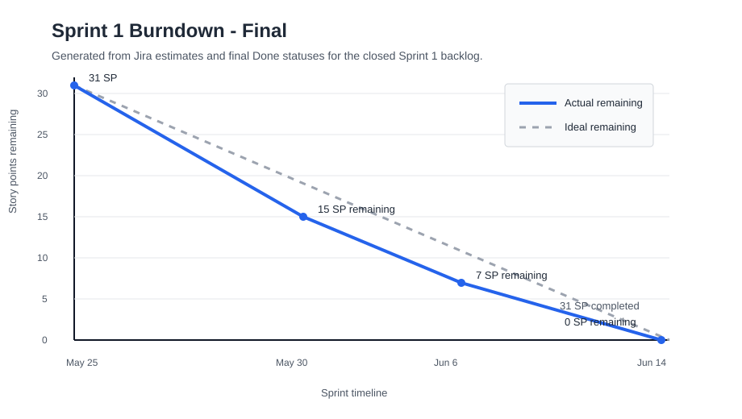

# SentinelOps Weekly Progress Report

# 1. Report Metadata

| Field | Value |
|---|---|
| Course | SWENG 894 - Software Engineering Capstone Experience |
| Project | SentinelOps |
| Student | Eli Vazquez |
| Sprint | Sprint 1 |
| Reporting Week | Week 3 |
| Reporting Period | 2026-06-08 to 2026-06-14 |
| Report Date | 2026-06-14 |
| Git Repository | <https://github.com/swevazquez/SentinelOpsProject> |
| Jira Board | <https://psu-capstone-sentinelops.atlassian.net/jira/software/projects/SCRUM/boards/1/backlog> |

---

# 2. Sprint Goal and Current Sprint Status

## Sprint Goal

Sprint 1 established a working and repeatable predictive-maintenance data workflow.
The completed scope generates representative telemetry, persists raw data, produces
asset-level features, orchestrates the workflow, reports workflow failures, enforces
component boundaries, supports repeatable local execution, and provides reviewed UI
wireframes for later dashboard implementation.

## Current Sprint Status

All eight Sprint 1 stories are Done in Jira, and Sprint 1 is closed with 31 of 31
story points completed. The merged `main` branch passed the full local validation
suite on 2026-06-14.

| ID | Requirement / User Story | Priority | Estimate | Status |
|---|---|---|---|---|
| SCRUM-1 / FR-01 | Telemetry Generation and Ingestion | High | 5 SP | Done |
| SCRUM-2 / FR-02 | Raw Telemetry Storage | High | 3 SP | Done |
| SCRUM-3 / FR-03 | Feature Engineering Processing | High | 5 SP | Done |
| SCRUM-4 / FR-04 | Workflow Orchestration | High | 8 SP | Done |
| SCRUM-17 / NFR-01 | Failed Workflow Detection and Reporting | High | 3 SP | Done |
| SCRUM-19 / NFR-03 | Component Responsibility Separation | High | 2 SP | Done |
| SCRUM-20 / NFR-04 | Repeatable Local Execution | Medium | 2 SP | Done |
| SCRUM-27 / UX-01 | Operational Dashboard Wireframe | High | 3 SP | Done |

## Definition of Done Review

| Area | Sprint Closeout Evidence |
|---|---|
| Requirements | Jira descriptions and acceptance criteria were reviewed before implementation. |
| Design | Workflow, component-boundary, local-execution, and UI design documentation are committed. |
| Development | Each implementation used a traceable SCRUM branch, commit, and pull request. |
| Testing | Unit, integration, architecture, system, smoke, and design-review evidence is available. |
| Integration | Local CI and GitHub Actions passed for the Week 3 pull requests. |
| Documentation | Architecture, setup, workflow, UI, and weekly-report documentation were updated. |
| Validation | Every Sprint 1 story was reviewed against its Jira acceptance criteria before closeout. |

## Acceptance-Criteria Closeout

| Requirement | Acceptance Evidence | Result |
|---|---|---|
| SCRUM-1 / FR-01 | Configured asset profiles produce deterministic representative telemetry with required fields and run IDs. | Passed |
| SCRUM-2 / FR-02 | Valid telemetry is persisted to the configured raw-data location; empty and mixed-run data is rejected. | Passed |
| SCRUM-3 / FR-03 | Raw telemetry is grouped into stored asset-level feature rows for predictive scoring. | Passed |
| SCRUM-4 / FR-04 | Workflow order, shared run IDs, persisted artifacts, Airflow execution, and clean-checkout reproduction were verified. | Passed |
| SCRUM-17 / NFR-01 | Running, completed, and failed states are persisted and logged; failure records retain step and error details. | Passed |
| SCRUM-19 / NFR-03 | Responsibilities and dependency direction are documented and enforced by architecture tests. | Passed |
| SCRUM-20 / NFR-04 | Prerequisite checks, idempotent setup, `.env` preservation, and isolated workflow execution were verified. | Passed |
| SCRUM-27 / UX-01 | Four editable wireframes, four reviewed PNG exports, alternate states, data dependencies, and SCRUM-10 traceability are available. | Passed |

## Burndown Summary

| Metric | Value |
|---|---|
| Sprint Total Estimated Effort | 31 story points |
| Completed Effort | 31 story points |
| Remaining Effort | 0 story points |
| Completion Rate | 100% |
| Sprint Status | Complete |



## Risks, Roadblocks, and Mitigation

| Risk / Roadblock | Impact | Mitigation / Next Step |
|---|---|---|
| Airflow system verification depends on a working Docker Desktop daemon. | A stopped or unhealthy daemon delays environment-dependent workflow testing. | Restart Docker Desktop, verify the engine first, and retain automated DAG syntax and integration checks as faster diagnostic gates. |
| Sprint 2 UI implementation depends on APIs and prediction data not yet implemented. | Wireframes cannot yet be validated against live backend responses. | Use the documented panel-to-data mapping as the API contract during Sprint 2 grooming and implementation. |
| Week 3 implementation was concentrated on the final reporting day. | Late discovery could have threatened sprint completion. | Groom acceptance criteria earlier and review remaining story points at midweek in future sprints. |

---

# 3. Software Testing

## Testing Overview

Week 3 testing concentrated on the three remaining non-functional requirements and
the complete merged Sprint 1 baseline. The final local CI run executed 23 tests and
the Sprint 1 smoke workflow. It also checked generated-data tracking, Airflow DAG
syntax, and Markdown readability.

The complete Airflow container execution for SCRUM-4 was repeated on 2026-06-14
using Airflow 2.10.5, PostgreSQL 16, Docker Engine 28.3.3, and Docker Compose
2.39.2. Both Airflow tasks and the DAG run completed successfully. The generated
raw and processed artifacts contained 96 and 4 rows respectively and shared run ID
`airflow-20260614T142850Z`.

## Test Results by Test Type

| Test Type | Scope | Result |
|---|---|---|
| Unit | Telemetry generation and validation, feature engineering and storage, workflow status persistence, and Airflow failure-callback behavior. | 15 automated tests passed. |
| Integration | Workflow order, raw-to-feature handoff, shared run IDs, success status, failure status, and exception propagation. | 4 automated tests passed. |
| Architecture | Allowed dependency direction and controlled prohibited-import detection. | 2 automated tests passed. |
| System | Isolated clean-checkout setup and execution plus the complete Airflow DAG execution through Docker Compose. | 2 automated clean-checkout tests and 1 Airflow system procedure passed. |
| User Acceptance / Design Review | Four operational wireframes reviewed for requirement alignment, hierarchy, alternate states, controls, clipping, and data dependencies. | 1 parameterized review covering 4 views passed. |
| Regression / CI | Complete merged Sprint 1 suite, smoke workflow, generated-data tracking, DAG syntax, Markdown checks, and Jira traceability. | 23 automated tests and all local and GitHub Actions checks passed. |

## Requirement-to-Test Traceability Matrix

| Requirement ID | Test Case ID | Test Type | Test Objective | Implementation Evidence | Status |
|---|---|---|---|---|---|
| SCRUM-1 / FR-01 | TC-FR01-01 | Unit | Verify configured assets produce representative telemetry with required fields, deterministic row counts, and valid run IDs. | [`d2a174c`](https://github.com/swevazquez/SentinelOpsProject/commit/d2a174cb993ca5064f56546cd156d757d6371202) and `tests/unit/test_telemetry.py` | Passed |
| SCRUM-2 / FR-02 | TC-FR02-01 | Unit | Verify valid telemetry persistence and rejection of empty or mixed-run data. | [`29b44e1`](https://github.com/swevazquez/SentinelOpsProject/commit/29b44e1094ad46feccbb371aeea213619325450f) and `tests/unit/test_telemetry.py` | Passed |
| SCRUM-3 / FR-03 | TC-FR03-01 | Unit | Verify raw telemetry transformation, feature values, output schema, persistence, and invalid-input handling. | [`cd9085b`](https://github.com/swevazquez/SentinelOpsProject/commit/cd9085bb164eff7a27218f03a05d02c924d740f0) and `tests/unit/test_features.py` | Passed |
| SCRUM-4 / FR-04 | TC-FR04-01 | Integration | Verify raw persistence precedes feature processing and artifacts share one run ID. | [`b0f25e9`](https://github.com/swevazquez/SentinelOpsProject/commit/b0f25e9e18764d2316104faa58508ad0cb6cebd9) and `tests/integration/test_sprint1_workflow.py` | Passed |
| SCRUM-4 / FR-04 | TC-FR04-04 | System | Execute the merged DAG through Airflow and verify task order, states, artifacts, counts, and run-ID consistency. | [`b0f25e9`](https://github.com/swevazquez/SentinelOpsProject/commit/b0f25e9e18764d2316104faa58508ad0cb6cebd9) and `airflow/dags/sentinelops_sprint1_pipeline.py` | Passed |
| SCRUM-17 / NFR-01 | TC-NFR01-01 | Unit / Integration | Verify structured workflow status, logs, failure details, Airflow callback behavior, and exception propagation. | [`60eb46a`](https://github.com/swevazquez/SentinelOpsProject/commit/60eb46a155101e30cfb466aec0c315f519e700a0) | Passed |
| SCRUM-19 / NFR-03 | TC-NFR03-01 | Architecture | Verify implemented component dependency rules and actionable violation reporting. | [`6477a18`](https://github.com/swevazquez/SentinelOpsProject/commit/6477a187b2ac0bee347fa15a960df694590a8d21) | Passed |
| SCRUM-20 / NFR-04 | TC-NFR04-01 | System | Verify prerequisites, idempotent setup, `.env` preservation, and workflow artifacts in an isolated checkout. | [`9ee2fab`](https://github.com/swevazquez/SentinelOpsProject/commit/9ee2fabec240bfd7633e5f3c4f3c36e3ca2790f0) | Passed |
| SCRUM-27 / UX-01 | TC-UX01-01 | User Acceptance / Design Review | Verify all four wireframes align with requirements, intended users, alternate states, controls, and API/data dependencies. | [`c075ea1`](https://github.com/swevazquez/SentinelOpsProject/commit/c075ea1f0080963e174dd999152577dd9ea38db8) and `docs/diagrams/ui/` | Passed |
| Sprint 1 backlog | TC-SPRINT1-01 | Regression / CI | Verify the complete merged Sprint 1 baseline and smoke workflow. | `./scripts/check-ci.sh` and GitHub Actions for PRs [#6](https://github.com/swevazquez/SentinelOpsProject/pull/6), [#7](https://github.com/swevazquez/SentinelOpsProject/pull/7), and [#8](https://github.com/swevazquez/SentinelOpsProject/pull/8) | Passed |

The detailed SCRUM-1, SCRUM-2, SCRUM-3, and SCRUM-27 execution procedures were
reported when those cases were implemented. The specifications below provide the
complete Week 3 execution procedures and final merged-system verification.

## Test Case Specifications

### TC-NFR01-01 - Workflow Failure Detection and Reporting

| Field | Description |
|---|---|
| Related Requirement | SCRUM-17 / NFR-01 |
| Test Type | Unit / Integration |
| Objective | Verify running, completed, and failed workflow status records; log messages; failed-step details; Airflow callback behavior; and preservation of the original exception. |
| Preconditions | Repository root on merged `main`; Python 3.12 or later. |
| Test Data / Parameters | Run IDs `status-test`, `integration-run`, `failed-run`, and `airflow-failed-run`; simulated feature-processing failure. |
| Execution Environment | Python standard-library `unittest`; temporary directories; mocked Airflow decorator module for callback isolation. |
| Expected Final Result | Status JSON contains the run ID and correct state; failures contain step and error details; logs contain run ID and state; original exceptions remain visible. |
| Actual Result | Six focused status, callback, and workflow tests passed. |
| Evidence | `services/workflows/status.py`, `tests/unit/test_workflow_status.py`, `tests/unit/test_airflow_failure_reporting.py`, `tests/integration/test_sprint1_workflow.py`, and commit [`60eb46a`](https://github.com/swevazquez/SentinelOpsProject/commit/60eb46a155101e30cfb466aec0c315f519e700a0). |
| Cleanup / Reset | Temporary directories are removed automatically. Runtime files under `data/workflow-status/` are ignored by Git. |
| Status | Passed |

#### Execution Steps

1. Review the shared workflow status contract.
   - Command or action: Open `services/workflows/status.py`.
   - Expected result: The module defines running, completed, and failed states and persists run ID, timestamp, step, and error data.
2. Run the focused status and workflow tests.
   - Command or action: `python3 -m unittest tests.unit.test_workflow_status tests.unit.test_airflow_failure_reporting tests.integration.test_sprint1_workflow -v`
   - Expected result: Six tests execute without failures.
3. Verify the successful-run result.
   - Command or action: Review `test_workflow_persists_raw_and_feature_artifacts_for_one_run`.
   - Expected result: The final status is `completed`, the run ID is retained, and error fields are empty.
4. Verify the failure results.
   - Command or action: Review the failed-workflow and Airflow-callback test results.
   - Expected result: Both records use `failed`, identify the failed step, retain the error message, and log the run ID.
5. Verify exception behavior.
   - Command or action: Confirm the failed-workflow test expects `RuntimeError`.
   - Expected result: Failure evidence is recorded and the original exception is not suppressed.

#### Step Results

| Step | Actual Result | Status |
|---|---|---|
| 1 | The shared reporter contained the required structured fields and states. | Passed |
| 2 | Six focused tests passed. | Passed |
| 3 | Completed status retained the integration run ID. | Passed |
| 4 | Local and Airflow failures retained the failed step, error, run ID, and log evidence. | Passed |
| 5 | The original exception remained observable. | Passed |

### TC-NFR03-01 - Component Boundary Enforcement

| Field | Description |
|---|---|
| Related Requirement | SCRUM-19 / NFR-03 |
| Test Type | Architecture |
| Objective | Verify documented component ownership and enforce the dependency direction for implemented Python components. |
| Preconditions | Repository root on merged `main`; Python 3.12 or later. |
| Test Data / Parameters | Current simulator, processing, workflow, and Airflow imports; temporary simulator file importing `services.workflows`. |
| Execution Environment | Python AST parser and standard-library `unittest`. |
| Expected Final Result | Current repository imports pass; the controlled prohibited import fails with its file and dependency identified. |
| Actual Result | Both architecture tests passed and were included in the complete CI suite. |
| Evidence | `docs/architecture/component-responsibilities.md`, `tests/architecture/dependency_rules.py`, `tests/architecture/test_component_boundaries.py`, and commit [`6477a18`](https://github.com/swevazquez/SentinelOpsProject/commit/6477a187b2ac0bee347fa15a960df694590a8d21). |
| Cleanup / Reset | The temporary violating fixture is deleted automatically. |
| Status | Passed |

#### Execution Steps

1. Review component ownership and prohibited responsibilities.
   - Command or action: Open `docs/architecture/component-responsibilities.md`.
   - Expected result: API, orchestration, processing, analytics, simulator, dashboard, and agent responsibilities are separated.
2. Run the architecture tests.
   - Command or action: `python3 -m unittest tests.architecture.test_component_boundaries -v`
   - Expected result: Two tests execute without failures.
3. Verify the current repository.
   - Command or action: Review `test_implemented_components_follow_dependency_rules`.
   - Expected result: No prohibited dependency is found.
4. Verify violation detection.
   - Command or action: Review `test_violation_reports_file_and_forbidden_dependency`.
   - Expected result: The controlled import reports `services/simulator/invalid.py` and `services.workflows`.
5. Confirm regression integration.
   - Command or action: Run `./scripts/check-ci.sh`.
   - Expected result: The architecture tests are discovered within the complete suite.

#### Step Results

| Step | Actual Result | Status |
|---|---|---|
| 1 | Ownership and dependency rules were explicitly documented. | Passed |
| 2 | Two focused architecture tests passed. | Passed |
| 3 | No current component violation was found. | Passed |
| 4 | The controlled violation identified the file and dependency. | Passed |
| 5 | The tests ran within the 23-test regression suite. | Passed |

### TC-NFR04-01 - Repeatable Clean-Checkout Execution

| Field | Description |
|---|---|
| Related Requirement | SCRUM-20 / NFR-04 |
| Test Type | System |
| Objective | Verify required prerequisites, idempotent setup, `.env` preservation, and Sprint 1 workflow execution from an isolated repository copy. |
| Preconditions | Repository root; Python 3.12 or later. Docker is not required for this test. |
| Test Data / Parameters | Temporary checkout fixture; run ID `clean-checkout`; marker `LOCAL_MARKER=preserve`. |
| Execution Environment | Local macOS shell, Python standard library, and temporary filesystem. |
| Expected Final Result | Setup creates `.env` and runtime directories, repeated setup preserves the marker, and raw, feature, and completed status artifacts are produced. |
| Actual Result | Both clean-checkout system tests passed. The prerequisite command also reported Python availability and Docker Compose as optional. |
| Evidence | `scripts/check-prerequisites.sh`, `scripts/setup.sh`, `tests/system/test_clean_checkout.py`, README local setup instructions, and commit [`9ee2fab`](https://github.com/swevazquez/SentinelOpsProject/commit/9ee2fabec240bfd7633e5f3c4f3c36e3ca2790f0). |
| Cleanup / Reset | The isolated checkout and generated artifacts are removed automatically. |
| Status | Passed |

#### Execution Steps

1. Check local prerequisites.
   - Command or action: `./scripts/check-prerequisites.sh`
   - Expected result: Python 3.12 or later is reported as required; Docker Compose is reported as optional for Airflow review.
2. Run the focused clean-checkout tests.
   - Command or action: `python3 -m unittest tests.system.test_clean_checkout -v`
   - Expected result: Two tests execute without failures.
3. Verify initial and repeated setup.
   - Command or action: Review `test_setup_is_idempotent_and_workflow_creates_expected_artifacts`.
   - Expected result: The first setup creates `.env`; the second preserves `LOCAL_MARKER=preserve`.
4. Verify generated workflow artifacts.
   - Command or action: Inspect the assertions for run ID `clean-checkout`.
   - Expected result: Raw telemetry, processed features, and completed workflow status files exist.
5. Verify prerequisite failure behavior.
   - Command or action: Review `test_prerequisite_check_reports_missing_python`.
   - Expected result: A missing Python command returns a nonzero status and an actionable Python 3.12 requirement message.

#### Step Results

| Step | Actual Result | Status |
|---|---|---|
| 1 | Python was available; Docker Compose was correctly reported as optional. | Passed |
| 2 | Two focused system tests passed. | Passed |
| 3 | Repeated setup preserved the existing `.env` marker. | Passed |
| 4 | All three expected workflow artifacts were created. | Passed |
| 5 | Missing-Python behavior returned an actionable error. | Passed |

### TC-FR04-04 - Final Airflow DAG Execution

| Field | Description |
|---|---|
| Related Requirement | SCRUM-4 / FR-04 |
| Test Type | System |
| Objective | Execute the merged Sprint 1 DAG through Airflow and verify ordered task execution, successful states, expected artifacts, row counts, and one shared run identifier. |
| Preconditions | Docker Desktop running; repository root; `.env` available; ports 5432 and 8080 available. |
| Test Data / Parameters | DAG `sentinelops_sprint1_pipeline`; logical date `2026-06-14T14:30:00+00:00`; four configured asset profiles; 24 hourly samples. |
| Execution Environment | Docker Engine 28.3.3; Docker Compose 2.39.2; Airflow 2.10.5 with Python 3.12; PostgreSQL 16. |
| Expected Final Result | PostgreSQL is healthy; Airflow loads the DAG; raw generation precedes feature processing; both tasks and the DAG run succeed; 96 raw rows and 4 feature rows share one run ID. |
| Actual Result | The DAG run succeeded. Both tasks were marked `SUCCESS`; raw and processed artifacts contained 96 and 4 rows and shared run ID `airflow-20260614T142850Z`. |
| Evidence | Airflow `dags test` output and generated files `data/raw/telemetry_airflow-20260614T142850Z.csv` and `data/processed/features_airflow-20260614T142850Z.csv`. |
| Cleanup / Reset | Run `docker compose down` after evidence is recorded. Generated data remains ignored by Git. |
| Status | Passed |

#### Execution Steps

1. Verify Docker and prepare the local environment.
   - Command or action: `docker info --format 'Docker Engine {{.ServerVersion}}'` followed by `./scripts/setup.sh`.
   - Expected result: Docker reports its engine version; setup confirms Python and Docker Compose and preserves the existing `.env`.
2. Start PostgreSQL and Airflow.
   - Command or action: `docker compose up -d postgres airflow`
   - Expected result: PostgreSQL becomes healthy and Airflow starts.
3. Confirm DAG discovery.
   - Command or action: `docker compose exec -T airflow airflow dags list | grep sentinelops_sprint1_pipeline`
   - Expected result: Airflow lists the Sprint 1 DAG.
4. Execute the DAG.
   - Command or action: `docker compose exec -T airflow airflow dags test sentinelops_sprint1_pipeline 2026-06-14T14:30:00+00:00`
   - Expected result: `generate_raw_telemetry` succeeds before `engineer_feature_output`, and the DAG run finishes in `success`.
5. Verify artifacts and shared run ID.
   - Command or action: Inspect the generated CSV files and count their data rows.
   - Expected result: Raw output contains 96 rows, processed output contains 4 rows, four assets are present, and both files use `airflow-20260614T142850Z`.

#### Step Results

| Step | Actual Result | Status |
|---|---|---|
| 1 | Docker Engine 28.3.3 and Docker Compose 2.39.2 were available; setup preserved `.env`. | Passed |
| 2 | PostgreSQL became healthy and Airflow started. | Passed |
| 3 | Airflow listed `sentinelops_sprint1_pipeline`. | Passed |
| 4 | Both tasks and the DAG run completed successfully in dependency order. | Passed |
| 5 | The artifacts contained 96 raw rows, 4 feature rows, four assets, and one shared run ID. | Passed |

### TC-SPRINT1-01 - Merged-Main Regression Validation

| Field | Description |
|---|---|
| Related Requirement | Complete Sprint 1 backlog |
| Test Type | Regression / CI |
| Objective | Verify the integrated Sprint 1 baseline after all Week 3 pull requests merged. |
| Preconditions | Local `main` synchronized with `origin/main`; Python 3.12 or later. |
| Test Data / Parameters | `RUN_ID=ci-smoke`; four configured asset profiles. |
| Execution Environment | Local macOS shell and GitHub Actions Ubuntu runner with Python 3.12. |
| Expected Final Result | All tests pass; smoke workflow produces 96 raw rows and 4 feature rows; generated-data, Airflow syntax, and Markdown checks pass. |
| Actual Result | Twenty-three tests and every remaining local CI check passed. GitHub Actions passed for PRs #6, #7, and #8. |
| Evidence | `./scripts/check-ci.sh`; [PR #6 checks](https://github.com/swevazquez/SentinelOpsProject/actions/runs/27499865660), [PR #7 checks](https://github.com/swevazquez/SentinelOpsProject/actions/runs/27500858652), and [PR #8 checks](https://github.com/swevazquez/SentinelOpsProject/actions/runs/27501002274). |
| Cleanup / Reset | Generated smoke artifacts remain ignored by Git. |
| Status | Passed |

#### Execution Steps

1. Confirm the merged branch state.
   - Command or action: `git status --short --branch`
   - Expected result: `main` tracks `origin/main`; only known local report-artifact changes may appear.
2. Run the complete validation command.
   - Command or action: `./scripts/check-ci.sh`
   - Expected result: Test discovery runs before the Sprint 1 smoke workflow.
3. Verify automated test results.
   - Command or action: Review the test summary.
   - Expected result: `Ran 23 tests` and `OK`.
4. Verify smoke and static checks.
   - Command or action: Review the remaining command output.
   - Expected result: 96 raw rows, 4 feature rows, valid DAG syntax, no tracked generated data, and readable Markdown files.
5. Verify remote integration.
   - Command or action: Open the GitHub Actions checks for PRs #6, #7, and #8.
   - Expected result: CI and Jira traceability checks report success.

#### Step Results

| Step | Actual Result | Status |
|---|---|---|
| 1 | Local `main` matched `origin/main`. | Passed |
| 2 | The complete CI script executed. | Passed |
| 3 | Twenty-three tests passed. | Passed |
| 4 | Smoke workflow and all static/document checks passed. | Passed |
| 5 | Week 3 pull-request checks passed in GitHub Actions. | Passed |

## Code Coverage Analysis

Statement coverage was measured with Python's standard-library `trace` module so the
analysis is reproducible without adding a coverage dependency:

```bash
python3 -m trace --count --missing --summary \
  --coverdir /tmp/sentinelops-trace \
  --ignore-dir '/opt/homebrew:/Library:/private/var/folders' \
  --module unittest discover -s tests
```

| Production Module | Executable Lines | Statement Coverage |
|---|---:|---:|
| `services/simulator/telemetry.py` | 157 | 69.4% |
| `services/spark_jobs/features.py` | 112 | 77.7% |
| `services/workflows/sprint1.py` | 104 | 73.1% |
| `services/workflows/status.py` | 43 | 90.7% |
| `airflow/dags/sentinelops_sprint1_pipeline.py` | 50 | 64.0% |
| **Sprint 1 production total** | **466** | **73.6%** |

The coverage result is consistent with the Sprint 1 scope. Core workflow status and
feature-processing behavior have the strongest statement coverage. Lower simulator
and workflow percentages primarily reflect command-line entrypoints and defensive
validation branches. The Airflow percentage excludes task execution performed in the
separate container process; those runtime paths are covered by TC-FR04-04, which
executed the complete DAG and verified successful task states and artifacts.

The `trace` measurement does not follow subprocesses created by the clean-checkout
system tests or the Docker container. Those behaviors are therefore represented by
system-test evidence rather than counted as covered statements. Future work should
add branch-aware `coverage.py` reporting to CI when external development dependencies
are introduced.

## Testing Summary

No failed or blocked tests remained at Sprint 1 closeout. The test suite increased
from 16 tests in Week 2 to 23 tests in Week 3 by adding workflow-status, Airflow
failure-callback, architecture-boundary, and isolated clean-checkout coverage.
Sprint-wide testing includes linked implementation evidence, unit, integration,
system, user-acceptance, architecture, and regression results; a complete
requirements traceability matrix; and measured production statement coverage.

---

# 4. Source Code Development

## Summary of Contributions

Week 3 completed the remaining Sprint 1 non-functional requirements:

- SCRUM-17 added structured workflow status artifacts, operational logging, failed
  step and error reporting, and an Airflow failure callback.
- SCRUM-19 documented component ownership and added AST-based dependency checks.
- SCRUM-20 added prerequisite reporting, idempotent setup, optional Docker handling,
  and isolated clean-checkout system tests.
- All three stories were merged through traceable pull requests with passing local
  and GitHub Actions validation.

## Repository and Story Links

| Resource | Link |
|---|---|
| Git Repository | <https://github.com/swevazquez/SentinelOpsProject> |
| Jira Board | <https://psu-capstone-sentinelops.atlassian.net/jira/software/projects/SCRUM/boards/1/backlog> |
| SCRUM-17 | <https://psu-capstone-sentinelops.atlassian.net/browse/SCRUM-17> |
| SCRUM-19 | <https://psu-capstone-sentinelops.atlassian.net/browse/SCRUM-19> |
| SCRUM-20 | <https://psu-capstone-sentinelops.atlassian.net/browse/SCRUM-20> |
| Pull Requests | [#6](https://github.com/swevazquez/SentinelOpsProject/pull/6), [#7](https://github.com/swevazquez/SentinelOpsProject/pull/7), [#8](https://github.com/swevazquez/SentinelOpsProject/pull/8) |

## Important Commits

| Commit | Commit Summary | Related Requirement | Notes |
|---|---|---|---|
| [`60eb46a`](https://github.com/swevazquez/SentinelOpsProject/commit/60eb46a155101e30cfb466aec0c315f519e700a0) | Add workflow failure reporting | SCRUM-17 / NFR-01 | Adds status persistence, logging, failure callback, tests, and workflow documentation. |
| [`6477a18`](https://github.com/swevazquez/SentinelOpsProject/commit/6477a187b2ac0bee347fa15a960df694590a8d21) | Enforce component boundaries | SCRUM-19 / NFR-03 | Adds ownership documentation and executable dependency rules. |
| [`9ee2fab`](https://github.com/swevazquez/SentinelOpsProject/commit/9ee2fabec240bfd7633e5f3c4f3c36e3ca2790f0) | Make local setup repeatable | SCRUM-20 / NFR-04 | Adds prerequisite checks, idempotent setup, clean-checkout tests, and revised instructions. |

## UI Design and Sprint-Requirement Alignment

The Sprint 1 UI deliverable is SCRUM-27, a design precursor to SCRUM-10 / FR-10.
The four wireframes define one connected operational experience rather than four
unrelated images. The operations overview is the entry point; it links to an asset
details view for maintenance investigation, a workflow details view for execution
diagnostics, and an operations assistant for guided queries and approval-gated
actions.

### Wireframe-to-Requirement Mapping

| Wireframe | Sprint Tasks and Requirements | Alignment and Key Elements |
|---|---|---|
| Operations overview | SCRUM-27 AC 1-4; SCRUM-4; SCRUM-17; future SCRUM-10 / FR-10 | Summarizes asset risk, maintenance priority, workflow health, failed/running/completed runs, scoring recency, and navigation to detailed evidence. |
| Asset details | SCRUM-27 AC 1, 3, and 4; future SCRUM-10 / FR-10 | Connects an asset summary to telemetry trends, prediction evidence, risk score, history, and maintenance recommendations. |
| Workflow details | SCRUM-27 AC 1-4; SCRUM-4 / FR-04; SCRUM-17 / NFR-01 | Shows ordered tasks, run status, duration, artifacts, failure details, logs, retry, and rerun controls. It visually represents the workflow and failure-reporting behavior implemented in Sprint 1. |
| Operations assistant | SCRUM-27 AC 2-4; future controlled agent interaction | Separates questions, answers, tool evidence, suggested prompts, action impact, approval, completion, rejection, and unavailable states. |

### Sprint UI Coverage

| Sprint Requirement | Wireframe Coverage | Rationale |
|---|---|---|
| SCRUM-1 / FR-01 | Indirect through operations overview and asset details | Telemetry generation is backend behavior; its outputs support asset health and telemetry panels rather than requiring a separate generation screen. |
| SCRUM-2 / FR-02 | Indirect through asset details and workflow details | Raw persistence is represented as telemetry evidence and run artifacts; no separate storage administration UI is in Sprint 1 scope. |
| SCRUM-3 / FR-03 | Indirect through asset details and operations overview | Engineered features support prediction and risk summaries planned for Sprint 2; no direct feature-editing UI is required. |
| SCRUM-4 / FR-04 | Operations overview and workflow details | Both views show workflow state, task sequence, artifacts, and recovery controls. |
| SCRUM-17 / NFR-01 | Operations overview and workflow details | Failed-run visibility, failure details, logs, and recovery actions are explicitly represented. |
| SCRUM-19 / NFR-03 | All views follow documented service boundaries | Component separation is an architecture constraint, not a distinct user workflow; the views identify API and data dependencies rather than bypassing them. |
| SCRUM-20 / NFR-04 | No separate wireframe required | Repeatable local setup is a developer workflow documented and tested through scripts, not an end-user interaction. |
| SCRUM-27 / UX-01 | All four wireframes | This story owns the interface hierarchy, alternate states, design rationale, data dependencies, and traceability to SCRUM-10 / FR-10. |

### Overall Design and Key Elements

The design prioritizes exceptions and decisions before raw detail. Maintenance
managers see asset risk and priority first; reliability engineers can open telemetry
and prediction evidence; operations analysts can inspect task execution and failures;
and protected operational actions remain approval-gated. Loading, empty, failed,
unavailable, and permission-required states are defined so future implementation
does not present missing or stale data as a healthy condition.


The editable Excalidraw sources, Mermaid outlines, panel-to-data mappings, and design
rationale are maintained under `docs/diagrams/ui/`. Jira records SCRUM-27 as blocking
SCRUM-10, preserving the relationship between the reviewed design and the planned
dashboard implementation.

---

# 5. Sprint Retrospective

## What Went Well

- Story-by-story branches and pull requests maintained clear Jira-to-code
  traceability.
- The Sprint 1 workflow remained a working vertical slice while observability,
  maintainability, and repeatability were added.
- The test suite expanded with meaningful failure, architecture, and clean-checkout
  coverage rather than relying only on happy-path unit tests.
- UI wireframes established a concrete design and data-contract input for Sprint 2.
- All 31 planned story points reached Done with passing local and remote validation.

## Challenges

- Several non-functional stories began with broad one-sentence requirements and
  required grooming into testable acceptance criteria before implementation.
- Sprint closeout work was concentrated on the final reporting day, increasing
  schedule risk despite the small remaining point total.
- Docker Desktop required a restart before the final Airflow test, confirming that
  environment-dependent system checks need an explicit daemon-readiness step.
- Earlier UI reporting showed the wireframes but did not explain their relationship
  to each Sprint requirement in enough detail.

## Improvements for the Next Sprint

- Groom non-functional and UI stories before the sprint starts.
- Define test evidence and interface-design coverage when each story enters the
  sprint, not during report preparation.
- Keep a lightweight acceptance-evidence table current throughout the sprint.
- Spread closeout work across the sprint and reserve the final day for reconciliation
  rather than implementation.
- Repeat environment-dependent system tests earlier when required tools are
  available.

## Retrospective Actions

| Action | Intended Result |
|---|---|
| Add explicit UI-to-story mapping to future reports. | Demonstrate how each design artifact satisfies sprint requirements. |
| Identify UI-related stories during grooming and verify wireframe coverage. | Prevent missing interaction designs before implementation. |
| Record test commands and evidence when a story merges. | Reduce report reconstruction effort and improve traceability. |
| Review remaining story points midweek. | Detect concentrated end-of-sprint risk earlier. |

---

# 6. Backlog Grooming

## Backlog Changes This Week

| Change Type | Requirement | Description | Rationale | Impact |
|---|---|---|---|---|
| Refined | SCRUM-17 / NFR-01 | Added six acceptance criteria for status artifacts, logs, failure details, Airflow callback behavior, and exception propagation. | The original requirement did not define observable failure evidence. | Produced a narrow, testable observability implementation. |
| Refined | SCRUM-19 / NFR-03 | Added ownership, dependency-direction, prohibited-import, and CI acceptance criteria. | Component separation required an enforceable definition rather than documentation alone. | Added executable architecture checks without introducing a new framework. |
| Refined | SCRUM-20 / NFR-04 | Added prerequisite, idempotency, `.env` preservation, artifact, optional-Docker, and isolated-checkout criteria. | Repeatable setup needed observable behavior from a clean environment. | Clarified the Python-only workflow and added system-level setup tests. |

## Backlog Grooming Rationale

No new Sprint 1 scope was added during Week 3. Grooming converted the three remaining
non-functional requirements into verifiable outcomes while preserving their existing
7-point estimate. This avoided speculative infrastructure and kept the work aligned
with the academic MVP: shared status files and logs for observability, AST checks for
component boundaries, and standard-library setup tests for repeatability.

The final Sprint 1 total remained 31 story points. With all stories Done, Sprint 2 can
begin from a stable telemetry, feature, workflow, observability, architecture, setup,
and UI-design baseline.

---

# 7. Plan for Next Week

Early next week will focus on Sprint 2 grooming and selecting the first
implementation-ready story.

- Review Sprint 2 priorities, dependencies, estimates, and acceptance criteria
  before starting implementation.
- Use the reviewed wireframes and panel-to-data mappings when grooming SCRUM-10 /
  FR-10 dashboard work.
- Select and begin the highest-priority vertical slice with clear acceptance
  criteria and test evidence.
- Establish test and reporting evidence at story start so it remains current
  throughout the sprint.

---

# 8. Overall Sprint Assessment

Sprint 1 completed successfully with 31 of 31 story points Done. The sprint goal was
met through an integrated telemetry-to-feature workflow with Airflow orchestration,
failure visibility, enforced component boundaries, repeatable local setup, and
reviewed operational UI designs.

The final merged baseline passed 23 automated tests, the Sprint 1 smoke workflow,
generated-data checks, Airflow DAG syntax validation, documentation checks, and a
complete Airflow 2.10.5 DAG execution through Docker Compose. GitHub Actions also
passed for all three Week 3 pull requests. Sprint 1 and the Week 3 weekly progress
report are finalized, providing a verified baseline for Sprint 2.
