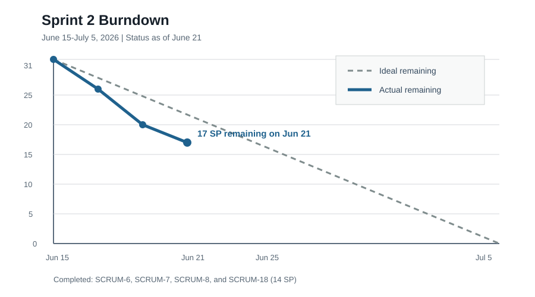

# SentinelOps Weekly Progress Report

# 1. Report Metadata

| Field | Value |
|---|---|
| Course | SWENG 894 - Software Engineering Capstone Experience |
| Project | SentinelOps |
| Student | Eli Vazquez |
| Sprint | Sprint 2 |
| Reporting Week | Week 4 |
| Reporting Period | 2026-06-15 to 2026-06-21 |
| Report Date | 2026-06-21 |
| Report Status | Current through 2026-06-21 |
| Git Repository | <https://github.com/swevazquez/SentinelOpsProject> |
| Jira Board | <https://psu-capstone-sentinelops.atlassian.net/jira/software/projects/SCRUM/boards/1/backlog> |

---

# 2. Sprint Goal, Planning, and Current Status

## Sprint Goal

Sprint 2 will extend the Sprint 1 telemetry and feature workflow into a
demonstrable predictive-maintenance product slice. The sprint goal is to generate
traceable asset predictions, expose operational data through clear APIs, display
asset and workflow conditions through the reviewed dashboard design, and verify
that the complete demonstration-scale workflow performs reliably.

Sprint 2 runs from June 15 through July 5, 2026. This first-week report reflects
the sprint status at the close of the first reporting week on June 21.

## Groomed Product Backlog With Effort Estimation

The Sprint 2 candidate backlog was reviewed for business priority, technical
dependency, implementation risk, demo value, and effort. All nine selected items
have Jira story-point estimates. The sequence favors a working vertical slice:
scoring and persistence first, followed by workflow visibility and APIs, then the
dashboard and performance hardening.

| Jira / Requirement | Product Backlog Item | Priority | Estimate | Dependency / Grooming Result |
|---|---|---:|---:|---|
| SCRUM-5 / FR-05 | Workflow Execution Visibility | High | 3 SP | Uses Sprint 1 workflow status records and supports API and dashboard views. |
| SCRUM-6 / FR-06 | Predictive Maintenance Scoring | High | 5 SP | Enabling story for prediction indicators, storage, APIs, and dashboard summaries. |
| SCRUM-7 / FR-07 | Maintenance Risk Indicators | High | 3 SP | Builds status, priority, and recommended action on the scoring result. |
| SCRUM-8 / FR-08 | Prediction Result Storage | Medium | 3 SP | Persists and retrieves prediction records for API and dashboard consumers. |
| SCRUM-9 / FR-09 | Operational APIs | High | 5 SP | Depends on workflow and prediction retrieval contracts. |
| SCRUM-10 / FR-10 | Operational Dashboard | High | 5 SP | Depends on SCRUM-27 wireframes and operational API responses. |
| SCRUM-18 / NFR-02 | Prediction Traceability | High | 3 SP | Cross-cutting scoring and storage requirement. |
| SCRUM-21 / NFR-05 | Clear API Responses | High | 2 SP | Cross-cutting API requirement for normal, error, and unavailable states. |
| SCRUM-24 / NFR-08 | Demonstration-Scale Workflow Performance | Medium | 2 SP | Validates the integrated workflow before the sprint demo. |
| **Total** |  |  | **31 SP** |  |

## Sprint Backlog With Highest-Priority Requirements

All nine groomed items were selected for Sprint 2 because together they form the
smallest credible scoring-to-dashboard demo. High-priority functional and quality
requirements account for 26 points. The two medium-priority items provide
retrievable prediction data and demo performance evidence required by the
high-priority user experience.

| Jira / Requirement | Sprint Backlog Item | Priority | Estimate | Status |
|---|---|---:|---:|---|
| SCRUM-6 / FR-06 | Predictive Maintenance Scoring | High | 5 SP | Done |
| SCRUM-7 / FR-07 | Maintenance Risk Indicators | High | 3 SP | Done |
| SCRUM-18 / NFR-02 | Prediction Traceability | High | 3 SP | Done |
| SCRUM-5 / FR-05 | Workflow Execution Visibility | High | 3 SP | To Do |
| SCRUM-9 / FR-09 | Operational APIs | High | 5 SP | To Do |
| SCRUM-21 / NFR-05 | Clear API Responses | High | 2 SP | To Do |
| SCRUM-10 / FR-10 | Operational Dashboard | High | 5 SP | To Do |
| SCRUM-8 / FR-08 | Prediction Result Storage | Medium | 3 SP | Done |
| SCRUM-24 / NFR-08 | Demonstration-Scale Workflow Performance | Medium | 2 SP | To Do |

## Definition of Done

The following Definition of Done applies to every Sprint 2 backlog item.

| Area | Definition of Done Criteria |
|---|---|
| Requirements | Jira story, priority, estimate, dependencies, and acceptance criteria are reviewed before implementation. |
| Design | Affected architecture, data contracts, workflows, APIs, and UI mappings are updated or confirmed. |
| Development | The smallest complete behavior is implemented on a story-specific branch using the established component boundaries. |
| Testing | Focused unit, integration, system, or user-acceptance tests cover meaningful success and failure behavior. |
| Integration | `./scripts/check-ci.sh` passes locally and required GitHub pull-request checks pass. |
| Traceability | Jira key appears in the branch, commit, and pull request; the report links directly to implementation evidence. |
| Documentation | Usage, behavior, constraints, and report evidence are updated where the story changes them. |
| Review | A pull request presents acceptance-criteria evidence and is merged into `main`. |
| Validation | The merged implementation is compared with the acceptance criteria before Jira is moved to Done. |

## Acceptance Criteria for Sprint Backlog Items

| Jira / Requirement | Acceptance Criteria |
|---|---|
| SCRUM-5 / FR-05 | Given a workflow has executed, when workflow status is requested, then running, completed, or failed state and available execution details are returned. |
| SCRUM-6 / FR-06 | Given valid processed feature data, when predictive scoring executes, then one bounded prediction result is generated for each associated asset. |
| SCRUM-7 / FR-07 | Given predictive scoring completed, when results are retrieved, then each asset includes a risk score, status, maintenance priority, and recommended action. |
| SCRUM-8 / FR-08 | Given prediction results were generated, when storage completes, then the complete records can be retrieved by workflow run and asset. |
| SCRUM-9 / FR-09 | Given the API is running, when valid asset, prediction, workflow, or health requests are submitted, then the requested operational data or status response is returned. |
| SCRUM-10 / FR-10 | Given operational data exists, when the dashboard is opened, then asset status, prediction summaries, maintenance priority, and workflow execution information are displayed according to the reviewed wireframes. |
| SCRUM-18 / NFR-02 | Given a prediction is generated and stored, when its traceability fields are inspected, then the workflow run, processed feature path, and valid SHA-256 input fingerprint are retained. |
| SCRUM-21 / NFR-05 | Given API behavior is normal, invalid, missing, or unavailable, when a request is made, then the response uses an appropriate status and a clear, consistent response body. |
| SCRUM-24 / NFR-08 | Given the demonstration-scale dataset and local environment, when the integrated telemetry-to-scoring workflow executes repeatedly, then it completes within the documented demo threshold without incomplete outputs. |

## Current Sprint Status

The first implementation slice is complete. SCRUM-6, SCRUM-7, SCRUM-8, and
SCRUM-18 were implemented through separate pull requests and marked Done in Jira.
Fourteen of 31 story points are complete, leaving 17 points.

| Metric | Value |
|---|---|
| Sprint Total Estimated Effort | 31 story points |
| Completed Effort | 14 story points |
| Remaining Effort | 17 story points |
| Completion Rate | 45.2% |
| Sprint Status | On track |



## Risks, Roadblocks, and Mitigation

| Risk / Roadblock | Impact | Mitigation / Next Step |
|---|---|---|
| API and dashboard work represents the remaining integration chain. | Delay in SCRUM-9 would directly reduce time available for SCRUM-10 and the final demo. | Complete SCRUM-5 before SCRUM-9, keep response contracts narrow, and implement dashboard panels against those contracts. |
| Current prediction persistence is a local CSV repository rather than PostgreSQL. | The architecture target and demonstration implementation are not yet identical. | Preserve the repository interface and replace the backend only when the change is required by the API or demo; avoid blocking the working vertical slice. |
| Jira acceptance criteria for NFR stories remain concise. | Ambiguous quality requirements can produce incomplete evidence. | Use the report's measurable criteria for SCRUM-21 and SCRUM-24 during implementation and update Jira if refinement is needed. |
| The sprint requires a final demonstration. | Individually complete components may still fail as an integrated workflow. | Reserve the final sprint week for end-to-end rehearsal, performance evidence, seeded demo data, and recovery-path validation. |

---

# 3. Software Testing

## Testing Overview

Testing this week focused on predictive scoring, maintenance indicators,
prediction persistence and retrieval, and input traceability. The merged `main`
branch passed 38 automated tests during final report validation on June 21. The
local CI command also executed the existing telemetry-to-feature smoke workflow,
checked generated-data tracking, compiled the Airflow DAG, and checked Markdown
readability.

GitHub Actions passed both required checks for each of PRs #9 through #12.

## Test Results by Type

| Test Type | Scope | Result |
|---|---|---|
| Unit | Risk calculation, scoring validation, threshold boundaries, repository validation, retrieval ordering, and traceability fingerprints. | Passed |
| Integration | Telemetry generation through feature engineering, scoring, prediction storage, retrieval, maintenance indicators, and source fingerprint preservation. | Passed |
| Architecture | Existing component dependency rules remained valid after ML storage additions. | Passed |
| System / Regression | Clean-checkout tests and complete local CI including the Sprint 1 smoke workflow. | Passed |
| Remote CI | CI and Jira traceability checks for four merged pull requests. | Passed |

## Requirement-to-Test Traceability Matrix

| Requirement | Test Case | Type | Objective | Implementation Evidence | Status |
|---|---|---|---|---|---|
| SCRUM-6 / FR-06 | TC-FR06-01 | Unit / Integration | Generate one bounded prediction for every processed asset and reject invalid scoring input. | [`a3b08fe`](https://github.com/swevazquez/SentinelOpsProject/commit/a3b08fe) and `tests/unit/test_scoring.py` | Passed |
| SCRUM-7 / FR-07 | TC-FR07-01 | Unit / Integration | Verify status, priority, and recommended action at every risk threshold and in stored results. | [`12dc08e`](https://github.com/swevazquez/SentinelOpsProject/commit/12dc08e) and `tests/unit/test_scoring.py` | Passed |
| SCRUM-8 / FR-08 | TC-FR08-01 | Unit / Integration | Persist complete prediction records and retrieve them by workflow run and asset. | [`7656375`](https://github.com/swevazquez/SentinelOpsProject/commit/7656375) and `tests/unit/test_prediction_store.py` | Passed |
| SCRUM-18 / NFR-02 | TC-NFR02-01 | Unit / Integration | Verify prediction records retain workflow run, source path, and exact feature-input SHA-256 fingerprint. | [`8f88d67`](https://github.com/swevazquez/SentinelOpsProject/commit/8f88d67) and `tests/integration/test_predictive_scoring.py` | Passed |
| Sprint 2 merged baseline | TC-SPRINT2-01 | Regression / CI | Verify all merged Sprint 1 and current Sprint 2 behavior and repository safeguards. | `./scripts/check-ci.sh` and PRs [#9](https://github.com/swevazquez/SentinelOpsProject/pull/9), [#10](https://github.com/swevazquez/SentinelOpsProject/pull/10), [#11](https://github.com/swevazquez/SentinelOpsProject/pull/11), and [#12](https://github.com/swevazquez/SentinelOpsProject/pull/12) | Passed |
| SCRUM-5 / FR-05 | TC-FR05-01 | Unit / API | Retrieve workflow running, completed, and failed states with execution details. | Planned for next story. | Planned |
| SCRUM-9 / FR-09 and SCRUM-21 / NFR-05 | TC-FR09-01 | API / Integration | Verify operational endpoints and clear success, error, missing, and unavailable responses. | Planned after SCRUM-5. | Planned |
| SCRUM-10 / FR-10 | TC-FR10-01 | User Acceptance / System | Verify dashboard panels display the planned asset, prediction, priority, and workflow data without clipping or missing states. | Reviewed wireframes under `docs/diagrams/ui/`; implementation planned. | Planned |
| SCRUM-24 / NFR-08 | TC-NFR08-01 | Performance / System | Measure repeated demonstration-scale end-to-end workflow duration and output completeness. | Planned for demo hardening. | Planned |

## Test Case Specifications

### TC-FR06-01 - Predictive Maintenance Scoring

| Field | Description |
|---|---|
| Related Requirement | SCRUM-6 / FR-06 |
| Test Type | Unit / Integration |
| Objective | Verify valid processed features generate one bounded prediction per asset with model metadata, while invalid feature contracts are rejected. |
| Preconditions | Repository root on merged `main`; Python 3.12 or later. |
| Test Data / Parameters | Two in-memory assets and the two-asset integration profile in `tests/integration/test_predictive_scoring.py`. |
| Execution Environment | Python standard-library `unittest`; temporary directories. |
| Expected Final Result | Predictions are generated for all associated assets, scores remain from 0 through 1, and missing fields, mixed runs, and duplicate assets are rejected. |
| Actual Result | Focused scoring and integration tests passed. |
| Evidence | `services/ml/scoring.py`, `tests/unit/test_scoring.py`, `tests/integration/test_predictive_scoring.py`, and commit [`a3b08fe`](https://github.com/swevazquez/SentinelOpsProject/commit/a3b08fe). |
| Cleanup / Reset | Temporary test directories are removed automatically. |
| Status | Passed |

#### Execution Steps

1. Run the focused scoring tests.
   - Command or action: `python3 -m unittest tests.unit.test_scoring tests.integration.test_predictive_scoring -v`
   - Expected result: Scoring and end-to-end prediction tests execute without failure.
2. Verify asset coverage.
   - Command or action: Review `test_processed_features_generate_predictions_for_associated_assets`.
   - Expected result: `TEST-1` and `TEST-2` each have one prediction associated with `sprint2-run`.
3. Verify score bounds and ordering behavior.
   - Command or action: Review the risk assertions and degraded-feature comparison.
   - Expected result: Every score is between 0 and 1, and degraded features produce a higher score.
4. Verify invalid input handling.
   - Command or action: Review missing-field, mixed-run, and duplicate-asset tests.
   - Expected result: Each invalid contract raises a descriptive `ValueError`.
5. Run regression validation.
   - Command or action: `./scripts/check-ci.sh`
   - Expected result: The complete 38-test suite and all repository checks pass.

#### Step Results

| Step | Actual Result | Status |
|---|---|---|
| 1 | Focused scoring and integration tests passed. | Passed |
| 2 | One result was generated for each configured asset. | Passed |
| 3 | Scores remained bounded and degraded conditions increased risk. | Passed |
| 4 | Invalid scoring contracts were rejected. | Passed |
| 5 | The merged 38-test regression suite passed. | Passed |

### TC-FR07-01 - Maintenance Risk Indicators

| Field | Description |
|---|---|
| Related Requirement | SCRUM-7 / FR-07 |
| Test Type | Unit / Integration |
| Objective | Verify every prediction includes an understandable asset status, maintenance priority, and recommended action derived from documented thresholds. |
| Preconditions | Repository root on merged `main`; Python 3.12 or later. |
| Test Data / Parameters | Boundary scores `0.00`, `0.25`, `0.50`, `0.75`, and `1.00`; generated integration predictions. |
| Execution Environment | Python standard-library `unittest`. |
| Expected Final Result | Thresholds map to healthy/routine, watch/medium, warning/high, and critical/immediate indicators with a non-empty action. |
| Actual Result | All threshold and integration assertions passed. |
| Evidence | `services/ml/scoring.py`, `services/ml/README.md`, `tests/unit/test_scoring.py`, and commit [`12dc08e`](https://github.com/swevazquez/SentinelOpsProject/commit/12dc08e). |
| Cleanup / Reset | None beyond automatic temporary-directory removal. |
| Status | Passed |

#### Execution Steps

1. Review documented indicator thresholds.
   - Command or action: Open `services/ml/README.md`.
   - Expected result: Four non-overlapping score ranges and their status and priority values are documented.
2. Run focused scoring tests.
   - Command or action: `python3 -m unittest tests.unit.test_scoring -v`
   - Expected result: Threshold-boundary tests pass.
3. Verify exact boundary behavior.
   - Command or action: Review `test_maintenance_indicators_cover_priority_thresholds`.
   - Expected result: Scores at `0.25`, `0.50`, and `0.75` enter medium, high, and immediate priority respectively.
4. Verify integrated records.
   - Command or action: Review the stored priority assertions in `tests/integration/test_predictive_scoring.py`.
   - Expected result: The higher-risk integration asset receives immediate priority and every record includes an action.
5. Run regression validation.
   - Command or action: `./scripts/check-ci.sh`
   - Expected result: All 38 tests and supporting checks pass.

#### Step Results

| Step | Actual Result | Status |
|---|---|---|
| 1 | Thresholds and labels were documented. | Passed |
| 2 | Focused scoring tests passed. | Passed |
| 3 | All boundary values mapped to the expected indicators. | Passed |
| 4 | Stored integration results retained priority and action fields. | Passed |
| 5 | Complete local CI passed. | Passed |

### TC-FR08-01 - Prediction Storage and Retrieval

| Field | Description |
|---|---|
| Related Requirement | SCRUM-8 / FR-08 |
| Test Type | Unit / Integration |
| Objective | Verify complete prediction batches are stored atomically and retrieved by workflow run or asset without losing fields. |
| Preconditions | Repository root on merged `main`; Python 3.12 or later. |
| Test Data / Parameters | Temporary CSV repository; run IDs `run-1`, `run-2`, and `sprint2-run`; assets `A-100`, `A-101`, `A-200`, `TEST-1`, and `TEST-2`. |
| Execution Environment | Python standard library and temporary filesystem. |
| Expected Final Result | Stored rows match generated rows, missing runs return an empty list, asset history is newest first, and invalid records are rejected. |
| Actual Result | Repository and integration tests passed. |
| Evidence | `services/ml/prediction_store.py`, `tests/unit/test_prediction_store.py`, `tests/integration/test_predictive_scoring.py`, and commit [`7656375`](https://github.com/swevazquez/SentinelOpsProject/commit/7656375). |
| Cleanup / Reset | Temporary repositories are removed automatically; generated `data/predictions/` files are ignored by Git. |
| Status | Passed |

#### Execution Steps

1. Run focused repository tests.
   - Command or action: `python3 -m unittest tests.unit.test_prediction_store -v`
   - Expected result: Round-trip, lookup, ordering, and validation tests pass.
2. Verify workflow-run retrieval.
   - Command or action: Review `test_save_and_get_by_run_preserve_prediction_fields`.
   - Expected result: Two stored records are returned unchanged for `run-1`.
3. Verify asset-history retrieval.
   - Command or action: Review `test_get_by_asset_returns_newest_prediction_first`.
   - Expected result: `run-2` is returned before `run-1` for `A-100`.
4. Verify invalid storage input.
   - Command or action: Review missing-field, unsafe-run-ID, invalid-score, and invalid-fingerprint tests.
   - Expected result: Each malformed record is rejected before persistence.
5. Verify generated-data safeguards.
   - Command or action: Run `./scripts/check-ci.sh`.
   - Expected result: CI confirms no generated prediction file is tracked.

#### Step Results

| Step | Actual Result | Status |
|---|---|---|
| 1 | Focused repository tests passed. | Passed |
| 2 | Workflow-run retrieval preserved every prediction field. | Passed |
| 3 | Asset history was sorted newest first. | Passed |
| 4 | Malformed and unsafe records were rejected. | Passed |
| 5 | Generated prediction data safeguards passed. | Passed |

### TC-NFR02-01 - Prediction Input Traceability

| Field | Description |
|---|---|
| Related Requirement | SCRUM-18 / NFR-02 |
| Test Type | Unit / Integration |
| Objective | Verify predictions identify the workflow run and exact processed feature input used during scoring. |
| Preconditions | Repository root on merged `main`; Python 3.12 or later. |
| Test Data / Parameters | Generated `features_sprint2-run.csv`; independent SHA-256 calculation; reordered in-memory feature rows. |
| Execution Environment | Python standard library, `hashlib`, and temporary filesystem. |
| Expected Final Result | File scoring records the source path and exact file digest; storage retains both fields; equivalent in-memory rows produce a stable canonical digest. |
| Actual Result | File and in-memory traceability tests passed. |
| Evidence | `services/ml/scoring.py`, `services/ml/prediction_store.py`, `tests/unit/test_scoring.py`, `tests/integration/test_predictive_scoring.py`, and commit [`8f88d67`](https://github.com/swevazquez/SentinelOpsProject/commit/8f88d67). |
| Cleanup / Reset | Temporary feature and prediction files are removed automatically. |
| Status | Passed |

#### Execution Steps

1. Run focused traceability tests.
   - Command or action: `python3 -m unittest tests.unit.test_scoring tests.unit.test_prediction_store tests.integration.test_predictive_scoring -v`
   - Expected result: Fingerprint generation, validation, and preservation tests pass.
2. Verify file-based source identity.
   - Command or action: Review the independent `hashlib.sha256(feature_result.path.read_bytes())` assertion.
   - Expected result: Every stored result contains the generated feature path and independently calculated digest.
3. Verify workflow-run traceability.
   - Command or action: Review stored prediction assertions for `run_id`.
   - Expected result: Every result retains `sprint2-run`.
4. Verify deterministic in-memory identity.
   - Command or action: Review `test_score_feature_rows_produces_stable_input_fingerprint`.
   - Expected result: Reordering equivalent feature rows does not change the canonical fingerprint.
5. Verify malformed fingerprint handling.
   - Command or action: Review `test_save_rejects_invalid_source_fingerprint`.
   - Expected result: A non-SHA-256 value is rejected before storage.

#### Step Results

| Step | Actual Result | Status |
|---|---|---|
| 1 | Fifteen focused scoring, storage, and integration tests passed. | Passed |
| 2 | Stored path and SHA-256 matched the exact feature file. | Passed |
| 3 | Workflow run identity remained available after retrieval. | Passed |
| 4 | Canonical in-memory fingerprints were stable across row order. | Passed |
| 5 | Invalid fingerprint metadata was rejected. | Passed |

### TC-SPRINT2-01 - Merged-Main Regression and CI

| Field | Description |
|---|---|
| Related Requirement | Current Sprint 2 completed scope and Sprint 1 regression baseline |
| Test Type | Regression / CI |
| Objective | Verify merged scoring, indicators, storage, and traceability do not break established workflow behavior. |
| Preconditions | Local `main` synchronized with `origin/main`; Python 3.12 or later. |
| Test Data / Parameters | `RUN_ID=ci-smoke`; four sample asset profiles. |
| Execution Environment | Local macOS shell and GitHub Actions Ubuntu runner with Python 3.12. |
| Expected Final Result | All tests pass; smoke output contains 96 telemetry rows and 4 feature rows; generated-data, DAG syntax, Markdown, and Jira traceability checks pass. |
| Actual Result | Thirty-eight local tests passed. Both required GitHub checks passed for PRs #9, #10, #11, and #12. |
| Evidence | `./scripts/check-ci.sh` and the linked pull requests. |
| Cleanup / Reset | Generated smoke artifacts remain ignored by Git. |
| Status | Passed |

#### Execution Steps

1. Confirm merged branch state.
   - Command or action: `git status --short --branch`
   - Expected result: `main` tracks `origin/main`; only known report artifacts may be present.
2. Run local CI.
   - Command or action: `./scripts/check-ci.sh`
   - Expected result: Test discovery reports `Ran 38 tests` and `OK`.
3. Verify smoke artifacts.
   - Command or action: Review the CI output.
   - Expected result: The smoke workflow creates 96 raw telemetry rows and 4 processed feature rows.
4. Verify static and repository checks.
   - Command or action: Review the remaining CI output.
   - Expected result: Generated-data, DAG syntax, and Markdown checks pass.
5. Verify remote checks.
   - Command or action: Open checks for PRs #9 through #12.
   - Expected result: CI and Jira traceability checks are successful for each PR.

#### Step Results

| Step | Actual Result | Status |
|---|---|---|
| 1 | Local `main` matched the merged remote branch. | Passed |
| 2 | Thirty-eight tests passed. | Passed |
| 3 | Smoke outputs contained the expected row counts. | Passed |
| 4 | Repository, DAG, and documentation checks passed. | Passed |
| 5 | Eight required GitHub checks passed across four PRs. | Passed |

## Code Coverage Analysis

Statement coverage was measured on June 21 with Python's standard-library
`trace` module:

```bash
python3 -m trace --count --missing --summary \
  --coverdir /tmp/sentinelops-week4-trace \
  --ignore-dir '/opt/homebrew:/Library:/private/var/folders' \
  --module unittest discover -s tests
```

| Production Module | Executable Lines | Statement Coverage |
|---|---:|---:|
| `services/ml/scoring.py` | 134 | 91.0% |
| `services/ml/prediction_store.py` | 94 | 94.7% |
| `services/simulator/telemetry.py` | 157 | 69.4% |
| `services/spark_jobs/features.py` | 112 | 77.7% |
| `services/workflows/sprint1.py` | 104 | 73.1% |
| `services/workflows/status.py` | 43 | 90.7% |
| `airflow/dags/sentinelops_sprint1_pipeline.py` | 50 | 64.0% |
| **Current production total** | **694** | **approximately 79.8%** |

The new scoring and prediction-storage modules have the strongest coverage at
91.0% and 94.7%. Lower percentages remain concentrated in command-line
entrypoints, defensive branches, and Airflow runtime paths executed in a
separate container process. The total is an approximate aggregate derived from
the module-level `trace` results; user-acceptance and Docker execution evidence
are not represented as Python statement coverage.

## Testing Summary

The first Sprint 2 slice is supported by direct commit links, implementation
files, focused unit and integration tests, detailed reproduction steps, a
requirement-to-test matrix, local regression evidence, remote CI evidence, and
current statement coverage. No failed or blocked tests remain for the four Done
stories. Tests for remaining Sprint 2 requirements are identified as Planned and
will be implemented with their stories.

---

# 4. Source Code Development

## Summary of Contributions

Week 4 established the predictive output foundation required by the API,
dashboard, and final demo:

- SCRUM-6 added deterministic predictive maintenance scoring from processed
  feature rows.
- SCRUM-7 added asset status, maintenance priority, and recommended action.
- SCRUM-8 added a prediction repository contract with local persistence and
  retrieval by workflow run or asset.
- SCRUM-18 added workflow-run, source-path, and SHA-256 input traceability.
- Unit and integration coverage expanded the complete suite from 23 to 38 tests.

## Repository, Story, and Pull Request Links

| Resource | Link |
|---|---|
| Git Repository | <https://github.com/swevazquez/SentinelOpsProject> |
| Jira Board | <https://psu-capstone-sentinelops.atlassian.net/jira/software/projects/SCRUM/boards/1/backlog> |
| SCRUM-6 | <https://psu-capstone-sentinelops.atlassian.net/browse/SCRUM-6> |
| SCRUM-7 | <https://psu-capstone-sentinelops.atlassian.net/browse/SCRUM-7> |
| SCRUM-8 | <https://psu-capstone-sentinelops.atlassian.net/browse/SCRUM-8> |
| SCRUM-18 | <https://psu-capstone-sentinelops.atlassian.net/browse/SCRUM-18> |
| Pull Requests | [#9](https://github.com/swevazquez/SentinelOpsProject/pull/9), [#10](https://github.com/swevazquez/SentinelOpsProject/pull/10), [#11](https://github.com/swevazquez/SentinelOpsProject/pull/11), [#12](https://github.com/swevazquez/SentinelOpsProject/pull/12) |

## Important Commits

| Commit | Summary | Requirement | Acceptance Evidence |
|---|---|---|---|
| [`a3b08fe`](https://github.com/swevazquez/SentinelOpsProject/commit/a3b08fe) | Add predictive maintenance scoring | SCRUM-6 / FR-06 | One bounded result per associated asset with validation and model metadata. |
| [`12dc08e`](https://github.com/swevazquez/SentinelOpsProject/commit/12dc08e) | Add maintenance risk indicators | SCRUM-7 / FR-07 | Status, priority, and recommended action added using tested thresholds. |
| [`7656375`](https://github.com/swevazquez/SentinelOpsProject/commit/7656375) | Persist prediction results | SCRUM-8 / FR-08 | Full records persisted and retrievable by workflow run and asset. |
| [`8f88d67`](https://github.com/swevazquez/SentinelOpsProject/commit/8f88d67) | Add prediction input traceability | SCRUM-18 / NFR-02 | Workflow run, feature path, and valid SHA-256 retained through storage. |

## UI Design and Sprint-Requirement Alignment

Sprint 2 does not require new wireframes. The four reviewed SCRUM-27 wireframes
cover all user-visible Sprint 2 requirements and identify the data dependencies
now being implemented. Backend and quality requirements that do not require
separate screens are represented through the operational evidence they provide.

| Sprint 2 Requirement | Wireframe Coverage | Alignment |
|---|---|---|
| SCRUM-5 / FR-05 | Operations overview and workflow details | Running, completed, and failed workflow states appear in summary and diagnostic views. |
| SCRUM-6 / FR-06 | Operations overview and asset details | Prediction summaries and asset risk scores visualize scoring output. |
| SCRUM-7 / FR-07 | Operations overview and asset details | Risk status, maintenance priority, and recommendation guide review order and action. |
| SCRUM-8 / FR-08 | Indirect across prediction panels | Stored results supply latest prediction and history data; storage administration is not an end-user workflow. |
| SCRUM-9 / FR-09 | All four views | Each view documents API or data dependencies that must be supplied through the application boundary. |
| SCRUM-10 / FR-10 | Operations overview, asset details, and workflow details | These views directly define the planned operational dashboard hierarchy and drill-down paths. |
| SCRUM-18 / NFR-02 | Asset details | Prediction evidence can expose run ID, source artifact, model metadata, and scoring time for review. |
| SCRUM-21 / NFR-05 | All four views | Loading, empty, failed, unavailable, and permission-required states define expected UI behavior for clear API responses. |
| SCRUM-24 / NFR-08 | No separate wireframe required | Performance is a system constraint validated through timing evidence rather than a distinct user screen. |

The operations overview remains the demo entry point. It presents asset risk,
maintenance priority, workflow health, and scoring recency. Asset details provide
telemetry and prediction evidence, while workflow details explain task execution
and failures. The operations assistant remains outside this sprint's implemented
scope but retains a documented dependency on the same API boundary.

---

# 5. Backlog Grooming

## Backlog Changes This Week

| Change | Requirement | Description | Rationale | Impact |
|---|---|---|---|---|
| Estimated | SCRUM-18 / NFR-02 | Assigned 3 SP. | Traceability crosses scoring, storage, and verification. | Sprint scope includes exact input evidence rather than only a run ID. |
| Estimated | SCRUM-21 / NFR-05 | Assigned 2 SP. | Clear response behavior is focused but requires normal and failure-state tests. | API work includes consistent error and unavailable states. |
| Estimated | SCRUM-24 / NFR-08 | Assigned 2 SP. | Demo-scale timing requires a threshold, repeated execution, and evidence. | Final demo preparation includes measurable performance validation. |
| Sequenced | SCRUM-6, SCRUM-7, SCRUM-8, SCRUM-18 | Selected as the first vertical slice. | Scoring output and retrieval are prerequisites for APIs and dashboard views. | Four stories and 14 SP completed first. |
| Clarified | SCRUM-8 / FR-08 | Implemented a repository contract with local CSV storage. | No database migration layer exists, and the academic MVP needs a testable local path. | API callers receive a stable interface; PostgreSQL can replace the backend later. |

## Backlog Grooming Rationale

Sprint 2 totals 31 points, matching the prior sprint's planned capacity while
carrying more cross-component integration risk. The selected order protects the
demo path: prediction behavior and evidence first, workflow visibility next,
operational APIs after the data contracts, dashboard integration after the APIs,
and performance validation once the complete workflow exists.

The estimates are consistent with the current project scale. Five-point stories
represent cross-component behavior or a complete user-facing feature; three-point
stories represent focused service capabilities; two-point NFR stories represent
narrow quality verification applied to an existing implementation.

## Planning Observations

| Observation | Planning Response |
|---|---|
| The Sprint 2 Jira goal field is empty even though the report and implementation sequence define a clear goal. | Add the sprint goal in Jira so board-level planning matches report evidence. |
| Original acceptance criteria are intentionally concise. | Refine measurable behavior before beginning SCRUM-5, SCRUM-9, SCRUM-21, and SCRUM-24. |
| Completing 14 points during the first week creates strong early progress but does not remove integration risk. | Track remaining dependency risk separately from point completion and avoid assuming the sprint is nearly finished. |
| CSV storage differs from the target PostgreSQL architecture. | Preserve the repository abstraction and make a deliberate demo-driven decision before replacing it. |

---

# 6. Plan for Next Week

The next reporting period will move from backend prediction capability to
operational access:

- Implement SCRUM-5 workflow execution visibility using existing workflow status
  records.
- Implement SCRUM-9 operational APIs after workflow and prediction retrieval
  contracts are available.
- Apply SCRUM-21 clear response behavior to normal, missing, invalid, and
  unavailable API states.
- Prepare SCRUM-10 dashboard integration using the reviewed wireframe-to-data
  mappings.
- Keep test specifications, direct commit links, and acceptance evidence current
  as each story merges.

---

# 7. Overall Sprint Assessment

Sprint 2 is on track as of June 21, 2026. Four of nine stories and 14 of 31 story
points are Done. The completed slice converts processed telemetry features into
bounded asset risk scores, understandable maintenance indicators, retrievable
prediction records, and verifiable source-input traceability.

The merged baseline passes 38 automated tests, the local smoke workflow,
generated-data checks, Airflow DAG syntax validation, Markdown checks, and eight
required GitHub checks across four pull requests. Current production statement
coverage is approximately 79.8%.

The remaining 17 points contain the sprint's main integration and demonstration
risk: workflow visibility, APIs, clear response states, the operational
dashboard, and performance evidence. Completing those items in dependency order
and reserving time for an end-to-end rehearsal remains necessary to meet the
Sprint 2 demo goal.
