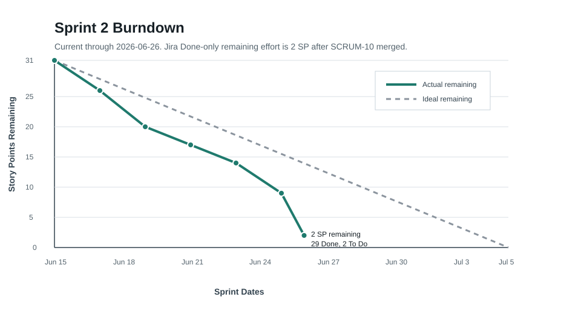

# SentinelOps Weekly Progress Report

# 1. Report Metadata

| Field | Value |
|---|---|
| Course | SWENG 894 - Software Engineering Capstone Experience |
| Project | SentinelOps |
| Student | Eli Vazquez |
| Sprint | Sprint 2 |
| Reporting Week | Week 5 |
| Reporting Period | 2026-06-22 to 2026-06-28 |
| Report Date | 2026-06-26 |
| Report Status | Current through 2026-06-26 |
| Git Repository | <https://github.com/swevazquez/SentinelOpsProject> |
| Jira Board | <https://psu-capstone-sentinelops.atlassian.net/jira/software/projects/SCRUM/boards/1/backlog> |

---

# 2. Sprint Goal and Current Sprint Status

## Sprint Goal

Sprint 2 extends the telemetry, feature engineering, and scoring foundation into a demonstrable predictive-maintenance product slice. The sprint goal is to expose workflow status, prediction results, asset profiles, and clear API response states, then use those contracts in a dashboard that presents asset condition, maintenance priority, prediction summaries, and workflow execution state for the sprint demo.

Sprint 2 runs from 2026-06-15 through 2026-07-05. This report is current through 2026-06-26.

## Current Sprint Status

This week completed the API-to-dashboard portion of the Sprint 2 vertical slice. SCRUM-5, SCRUM-9, SCRUM-21, and SCRUM-10 were merged and marked Done. The only remaining Sprint 2 backlog item is SCRUM-24, the demonstration-scale performance validation story.

| Metric | Value |
|---|---|
| Sprint Total Estimated Effort | 31 story points |
| Completed Effort | 29 story points |
| Remaining Effort | 2 story points |
| Completion Rate | 93.5% |
| Sprint Status | On track for the Sprint 2 demo |

## Sprint Backlog Snapshot

| Jira / Requirement | Sprint Backlog Item | Priority | Estimate | Current Status | Evidence |
|---|---|---:|---:|---|---|
| SCRUM-5 / FR-05 | Workflow Execution Visibility | High | 3 SP | Done | PR [#13](https://github.com/swevazquez/SentinelOpsProject/pull/13) |
| SCRUM-6 / FR-06 | Predictive Maintenance Scoring | High | 5 SP | Done | PR [#9](https://github.com/swevazquez/SentinelOpsProject/pull/9) |
| SCRUM-7 / FR-07 | Maintenance Risk Indicators | High | 3 SP | Done | PR [#10](https://github.com/swevazquez/SentinelOpsProject/pull/10) |
| SCRUM-8 / FR-08 | Prediction Result Storage | Medium | 3 SP | Done | PR [#11](https://github.com/swevazquez/SentinelOpsProject/pull/11) |
| SCRUM-9 / FR-09 | Operational APIs | High | 5 SP | Done | PR [#14](https://github.com/swevazquez/SentinelOpsProject/pull/14) |
| SCRUM-10 / FR-10 | Operational Dashboard | High | 5 SP | Done | PR [#16](https://github.com/swevazquez/SentinelOpsProject/pull/16) |
| SCRUM-18 / NFR-02 | Prediction Traceability | High | 3 SP | Done | PR [#12](https://github.com/swevazquez/SentinelOpsProject/pull/12) |
| SCRUM-21 / NFR-05 | Clear API Responses | High | 2 SP | Done | PR [#15](https://github.com/swevazquez/SentinelOpsProject/pull/15) |
| SCRUM-24 / NFR-08 | Demonstration-Scale Workflow Performance | Medium | 2 SP | To Do | Planned before demo |

---

# 3. UI Design

## Wireframe Coverage for Planned Sprint Requirements

The Sprint 2 UI work uses the SCRUM-27 wireframes from Week 3 as the design baseline. The table below maps every Sprint 2 backlog item to the relevant wireframe coverage.

| Sprint Requirement | Relevant Wireframe | Alignment |
|---|---|---|
| SCRUM-5 / FR-05 | Operations overview; workflow details | Workflow health, running/completed/failed counts, latest runs, task sequence, failure details, and recovery evidence are represented. |
| SCRUM-6 / FR-06 | Operations overview; asset details | Predictive scoring outputs feed the overview risk distribution and individual asset risk values. |
| SCRUM-7 / FR-07 | Operations overview; asset details | Maintenance priority, asset health, risk score, and recommended action are visible in the dashboard and asset-detail design. |
| SCRUM-8 / FR-08 | Operations overview; asset details | Stored predictions support the latest scoring run, prediction history, and risk evidence shown in the UI. |
| SCRUM-9 / FR-09 | All dashboard views | API responses provide the assets, predictions, workflow states, and health information consumed by the UI. |
| SCRUM-10 / FR-10 | Operations overview | The implemented dashboard follows the reviewed overview layout and left-navigation behavior. |
| SCRUM-18 / NFR-02 | Asset details; workflow details | Traceability fields connect prediction results to workflow run and source feature evidence. |
| SCRUM-21 / NFR-05 | Operations overview; assistant; all alternate states | Normal, missing, invalid, and unavailable API states are represented so the UI does not present missing data as healthy. |
| SCRUM-24 / NFR-08 | Operations overview; workflow details | Demo performance validation will use workflow status, scoring recency, and execution evidence shown in the dashboard and workflow-detail views. |

## Wireframe Descriptions

The operations overview is the primary Sprint 2 screen. It opens on a summary of assets at risk, active alerts, workflow health, and last scoring run. The left navigation then separates Assets, Workflows, and Assistant into focused views, matching the planned interaction model from Week 3.

The asset details wireframe supports maintenance investigation. It explains an asset's current condition, risk score, telemetry trend, prediction evidence, and recommended action.

The workflow details wireframe supports operational diagnostics. It shows ordered task execution, run status, duration, artifacts, failure details, logs, and recovery controls.

The operations assistant wireframe shows the planned controlled assistant experience. It separates conversation, tool evidence, suggested questions, action approval, and unavailable/error states.

## Implemented Dashboard Alignment

SCRUM-10 implemented the first dashboard slice under `frontend/dashboard/`. The page opens to Overview only. Selecting Assets, Workflows, or Assistant from the left navigation switches to that dedicated view. This matches the Week 3 planned interaction: the overview is the entry point, while detailed asset, workflow, and assistant views are separate work areas.

| Implemented View | Requirement Coverage | Implementation Evidence |
|---|---|---|
| Overview | SCRUM-7, SCRUM-8, SCRUM-10, SCRUM-24 | Summary cards and prediction distribution in `frontend/dashboard/index.html` and `frontend/dashboard/app.js`. |
| Assets | SCRUM-6, SCRUM-7, SCRUM-8, SCRUM-10 | Asset status, risk, priority, update timing, and status filter. |
| Workflows | SCRUM-5, SCRUM-9, SCRUM-10 | Running/completed/failed chips and recent workflow list. |
| Assistant | SCRUM-9, SCRUM-21 | Normal, missing, invalid, and unavailable response-state mapping. |

---

# 4. Software Testing

## Testing Overview

Testing this week covered the complete Sprint 2 backlog to date: workflow status visibility, predictive scoring, maintenance indicators, prediction storage, prediction traceability, operational APIs, clear API response states, dashboard UI behavior, regression behavior, and code coverage analysis. The merged `main` branch passed 64 automated tests on 2026-06-26.

## Summary of Test Results

| Test Type | Scope | Result |
|---|---|---|
| Unit | Workflow status, API operations, scoring, prediction storage, telemetry, feature processing, dashboard structure, dashboard navigation, and response-state rendering. | Passed |
| Integration | Telemetry-to-feature-to-scoring workflow, prediction persistence, and traceability behavior. | Passed |
| Architecture | Component-boundary rules remained valid after API and dashboard additions. | Passed |
| System / Regression | Clean-checkout safeguards, generated-data checks, workflow smoke test, Airflow DAG syntax, and Markdown readability. | Passed |
| User Acceptance / Design Review | Dashboard opens to Overview only and left navigation switches to Assets, Workflows, and Assistant views aligned with the reviewed wireframes. | Passed |
| Remote CI | GitHub CI passed for PRs #13, #14, #15, and #16. | Passed |
| Coverage Analysis | Standard-library trace coverage completed with 64 tests and module-level coverage output. | Passed |

## Requirement-to-Test Traceability Matrix

| Requirement | Test Case | Type | Objective | Implementation Evidence | Status |
|---|---|---|---|---|---|
| SCRUM-5 / FR-05 | TC-FR05-01 | Unit / Workflow | Verify workflow status can be recorded, retrieved, listed, summarized, and represented as running, completed, or failed. | [`64f7a07`](https://github.com/swevazquez/SentinelOpsProject/commit/64f7a07807662715cd83830fd09c94c7e76ff636), `tests/unit/test_workflow_status.py`, `tests/unit/test_airflow_failure_reporting.py` | Passed |
| SCRUM-6 / FR-06 | TC-FR06-01 | Unit / Integration | Verify processed features generate bounded prediction results for associated assets. | [`a3b08fe`](https://github.com/swevazquez/SentinelOpsProject/commit/a3b08fe), `tests/unit/test_scoring.py`, `tests/integration/test_predictive_scoring.py` | Passed |
| SCRUM-7 / FR-07 | TC-FR07-01 | Unit / Integration | Verify risk score, status, maintenance priority, and recommended action are produced. | [`12dc08e`](https://github.com/swevazquez/SentinelOpsProject/commit/12dc08e), `tests/unit/test_scoring.py` | Passed |
| SCRUM-8 / FR-08 | TC-FR08-01 | Unit / Integration | Verify prediction records are stored and retrieved by workflow run and asset. | [`7656375`](https://github.com/swevazquez/SentinelOpsProject/commit/7656375), `tests/unit/test_prediction_store.py` | Passed |
| SCRUM-9 / FR-09 | TC-FR09-01 | Unit / API | Verify operational API helpers return health, asset, workflow, prediction, and summary data. | [`9fba1e2`](https://github.com/swevazquez/SentinelOpsProject/commit/9fba1e2f1b7e491f587648fea61f9b2285dd4ed7), `tests/unit/test_api_operations.py` | Passed |
| SCRUM-10 / FR-10 | TC-FR10-01 | UI / User Acceptance | Verify dashboard views display asset status, workflow execution information, and prediction summaries according to reviewed wireframes. | [`e609042`](https://github.com/swevazquez/SentinelOpsProject/commit/e609042be5aa92e106a757ee181b31dc0e528f3c), PR [#16](https://github.com/swevazquez/SentinelOpsProject/pull/16), `tests/unit/test_dashboard_ui.py` | Passed |
| SCRUM-18 / NFR-02 | TC-NFR02-01 | Unit / Integration | Verify prediction records retain workflow run, source feature path, and SHA-256 input fingerprint. | [`8f88d67`](https://github.com/swevazquez/SentinelOpsProject/commit/8f88d67), `tests/integration/test_predictive_scoring.py` | Passed |
| SCRUM-21 / NFR-05 | TC-NFR05-01 | Unit / API | Verify normal, missing, invalid, and unavailable API states use clear status codes and response bodies. | [`921f349`](https://github.com/swevazquez/SentinelOpsProject/commit/921f349a5d89b59408f9bfc430aed3e216395443), PR [#15](https://github.com/swevazquez/SentinelOpsProject/pull/15), `tests/unit/test_api_operations.py` | Passed |
| SCRUM-24 / NFR-08 | TC-NFR08-01 | Performance / System | Measure repeated demonstration-scale workflow duration and output completeness. | Planned for remaining 2 SP of Sprint 2. | Planned |
| Sprint 2 baseline | TC-SPRINT2-02 | Regression / CI | Verify all merged Sprint 1 and Sprint 2 behavior passes together. | `./scripts/check-ci.sh` | Passed |
| Sprint 2 codebase | TC-COV-02 | Coverage Analysis | Measure statement coverage with the standard-library trace runner. | `python3 -m trace --count --missing --summary --coverdir /tmp/sentinelops-week5-trace --ignore-dir /opt/homebrew:/Library:/private/var/folders --module unittest discover -s tests` | Passed |

## Test Case Specifications

### TC-FR05-01 - Workflow Execution Visibility

| Field | Description |
|---|---|
| Related Requirement | SCRUM-5 / FR-05 |
| Test Type | Unit / Workflow |
| Objective | Verify workflow execution state is visible for running, completed, and failed workflow runs. |
| Preconditions | Repository root on merged `main`; Python 3.12 or later. |
| Test Data / Parameters | Temporary workflow status directory; run IDs `running-run`, `completed-run`, and `failed-run`. |
| Execution Environment | Python standard-library `unittest`; temporary filesystem. |
| Expected Final Result | Workflow status records can be written, retrieved, listed, summarized, and returned with failure detail. |
| Actual Result | Focused workflow tests and full local CI passed. |
| Evidence | `tests/unit/test_workflow_status.py`, `tests/unit/test_airflow_failure_reporting.py`, PR #13. |
| Cleanup / Reset | Temporary test directories are removed automatically. |
| Status | Passed |

#### Execution Steps

1. Run `python3 -m unittest tests.unit.test_workflow_status tests.unit.test_airflow_failure_reporting -v`.
   - Expected result: Workflow status and failure-reporting tests pass.
2. Review completed-run assertions.
   - Expected result: Completed run records retain run ID, state, timestamp, and artifact fields.
3. Review failed-run assertions.
   - Expected result: Failed run records retain failed step and error message.
4. Review summary-count assertions.
   - Expected result: Running, completed, and failed counts are reported separately.
5. Run `./scripts/check-ci.sh`.
   - Expected result: The full local CI script passes.

#### Step Results

| Step | Actual Result | Status |
|---|---|---|
| 1 | Focused workflow tests passed during SCRUM-5 implementation. | Passed |
| 2 | Completed status retrieval is covered by unit tests. | Passed |
| 3 | Failed workflow reporting is covered by unit tests. | Passed |
| 4 | Summary status counts are covered by unit tests. | Passed |
| 5 | Full local CI passed on merged `main` with 64 tests. | Passed |

### TC-FR06-01 - Predictive Maintenance Scoring

| Field | Description |
|---|---|
| Related Requirement | SCRUM-6 / FR-06 |
| Test Type | Unit / Integration |
| Objective | Verify valid processed features generate one bounded prediction per associated asset and invalid scoring contracts are rejected. |
| Preconditions | Repository root on merged `main`; Python 3.12 or later. |
| Test Data / Parameters | In-memory assets and integration feature rows in `tests/integration/test_predictive_scoring.py`. |
| Execution Environment | Python standard-library `unittest`; temporary filesystem. |
| Expected Final Result | Every asset receives one prediction, risk scores remain between 0 and 1, and invalid input raises descriptive errors. |
| Actual Result | Focused scoring and integration tests passed. |
| Evidence | `services/ml/scoring.py`, `tests/unit/test_scoring.py`, `tests/integration/test_predictive_scoring.py`, PR #9. |
| Cleanup / Reset | Temporary files are removed automatically. |
| Status | Passed |

#### Execution Steps

1. Run `python3 -m unittest tests.unit.test_scoring tests.integration.test_predictive_scoring -v`.
   - Expected result: Scoring and integration tests pass.
2. Review asset-coverage assertions.
   - Expected result: Each configured asset has exactly one prediction.
3. Review score-bound assertions.
   - Expected result: Risk scores remain between 0 and 1.
4. Review invalid input assertions.
   - Expected result: Missing fields, mixed runs, and duplicate assets are rejected.
5. Run `./scripts/check-ci.sh`.
   - Expected result: The full regression suite passes.

#### Step Results

| Step | Actual Result | Status |
|---|---|---|
| 1 | Focused scoring and integration tests passed. | Passed |
| 2 | Asset prediction coverage was verified. | Passed |
| 3 | Score bounds were verified. | Passed |
| 4 | Invalid contracts were rejected. | Passed |
| 5 | Full local CI passed on merged `main` with 64 tests. | Passed |

### TC-FR07-01 - Maintenance Risk Indicators

| Field | Description |
|---|---|
| Related Requirement | SCRUM-7 / FR-07 |
| Test Type | Unit / Integration |
| Objective | Verify predictions include asset status, maintenance priority, and recommended action. |
| Preconditions | Repository root on merged `main`; Python 3.12 or later. |
| Test Data / Parameters | Boundary scores and generated integration predictions. |
| Execution Environment | Python standard-library `unittest`. |
| Expected Final Result | Thresholds map to documented health, watch, warning, and critical indicators with non-empty actions. |
| Actual Result | Threshold and integration assertions passed. |
| Evidence | `services/ml/scoring.py`, `tests/unit/test_scoring.py`, PR #10. |
| Cleanup / Reset | None beyond temporary test cleanup. |
| Status | Passed |

#### Execution Steps

1. Run `python3 -m unittest tests.unit.test_scoring -v`.
   - Expected result: Scoring tests pass.
2. Review threshold-boundary assertions.
   - Expected result: Boundary values map to expected status and priority levels.
3. Review recommended-action assertions.
   - Expected result: Each prediction includes an actionable recommendation.
4. Review integration prediction assertions.
   - Expected result: Stored integration records retain maintenance indicators.
5. Run `./scripts/check-ci.sh`.
   - Expected result: Full local CI passes.

#### Step Results

| Step | Actual Result | Status |
|---|---|---|
| 1 | Focused scoring tests passed. | Passed |
| 2 | Threshold behavior was verified. | Passed |
| 3 | Recommended actions were verified. | Passed |
| 4 | Stored integration records retained indicators. | Passed |
| 5 | Full local CI passed on merged `main` with 64 tests. | Passed |

### TC-FR08-01 - Prediction Storage and Retrieval

| Field | Description |
|---|---|
| Related Requirement | SCRUM-8 / FR-08 |
| Test Type | Unit / Integration |
| Objective | Verify complete prediction batches are stored and retrieved by workflow run or asset. |
| Preconditions | Repository root on merged `main`; Python 3.12 or later. |
| Test Data / Parameters | Temporary CSV repository; run and asset identifiers used in `tests/unit/test_prediction_store.py`. |
| Execution Environment | Python standard library and temporary filesystem. |
| Expected Final Result | Stored records round-trip without losing fields; missing runs return an empty list; invalid records are rejected. |
| Actual Result | Repository and integration tests passed. |
| Evidence | `services/ml/prediction_store.py`, `tests/unit/test_prediction_store.py`, PR #11. |
| Cleanup / Reset | Temporary repositories are removed automatically. |
| Status | Passed |

#### Execution Steps

1. Run `python3 -m unittest tests.unit.test_prediction_store -v`.
   - Expected result: Repository tests pass.
2. Review workflow-run retrieval assertions.
   - Expected result: Stored rows return unchanged for the run ID.
3. Review asset-history retrieval assertions.
   - Expected result: Asset predictions return newest first.
4. Review invalid storage input assertions.
   - Expected result: Malformed records are rejected before persistence.
5. Run `./scripts/check-ci.sh`.
   - Expected result: Full local CI passes and generated data remains untracked.

#### Step Results

| Step | Actual Result | Status |
|---|---|---|
| 1 | Focused repository tests passed. | Passed |
| 2 | Workflow-run retrieval preserved prediction fields. | Passed |
| 3 | Asset history ordering was verified. | Passed |
| 4 | Invalid records were rejected. | Passed |
| 5 | Full local CI passed on merged `main` with 64 tests. | Passed |

### TC-FR09-01 - Operational API Retrieval

| Field | Description |
|---|---|
| Related Requirement | SCRUM-9 / FR-09 |
| Test Type | Unit / API |
| Objective | Verify operational API helpers expose health, asset, workflow, summary, and prediction information. |
| Preconditions | Repository root on merged `main`; Python 3.12 or later. |
| Test Data / Parameters | Temporary asset profile CSV, workflow status records, and prediction repository rows. |
| Execution Environment | Python standard-library `unittest`; temporary filesystem. |
| Expected Final Result | API helpers return operational data for valid requests and not-found or validation responses for missing or invalid identifiers. |
| Actual Result | Focused API tests and full local CI passed. |
| Evidence | `services/api/operations.py`, `tests/unit/test_api_operations.py`, PR #14. |
| Cleanup / Reset | Temporary test directories are removed automatically. |
| Status | Passed |

#### Execution Steps

1. Run `python3 -m unittest tests.unit.test_api_operations -v`.
   - Expected result: API operation tests pass.
2. Review health and asset response assertions.
   - Expected result: Health returns `200`; asset profiles return configured assets.
3. Review workflow response assertions.
   - Expected result: Workflow status, list, and summary responses return expected state data.
4. Review prediction response assertions.
   - Expected result: Stored predictions are retrieved by workflow run and asset.
5. Run `./scripts/check-ci.sh`.
   - Expected result: Full local CI passes.

#### Step Results

| Step | Actual Result | Status |
|---|---|---|
| 1 | Focused API tests passed. | Passed |
| 2 | Health and asset responses returned expected data. | Passed |
| 3 | Workflow responses returned expected state data. | Passed |
| 4 | Prediction lookups returned expected data. | Passed |
| 5 | Full local CI passed on merged `main` with 64 tests. | Passed |

### TC-FR10-01 - Operational Dashboard

| Field | Description |
|---|---|
| Related Requirement | SCRUM-10 / FR-10 |
| Test Type | UI / User Acceptance |
| Objective | Verify the dashboard displays asset status, workflow execution information, and prediction summaries according to the reviewed wireframes. |
| Preconditions | Repository root on merged `main`; browser can open static files; Python 3.12 or later for automated checks. |
| Test Data / Parameters | Sample dashboard data in `frontend/dashboard/app.js`; reviewed wireframes in `docs/diagrams/ui/`. |
| Execution Environment | Static HTML/CSS/JavaScript; Python standard-library `unittest`; Node syntax check. |
| Expected Final Result | Dashboard opens to Overview only; left navigation switches to Assets, Workflows, and Assistant; required data elements are present. |
| Actual Result | Focused dashboard tests, JavaScript syntax check, PR #16 CI, and full local CI passed. |
| Evidence | `frontend/dashboard/index.html`, `frontend/dashboard/styles.css`, `frontend/dashboard/app.js`, `tests/unit/test_dashboard_ui.py`, PR #16. |
| Cleanup / Reset | None. The page is directly openable and does not start a server. |
| Status | Passed |

#### Execution Steps

1. Run `python3 -m unittest tests.unit.test_dashboard_ui -v`.
   - Expected result: Seven dashboard tests pass.
2. Verify default view.
   - Command or action: Review `test_dashboard_opens_to_overview_only`.
   - Expected result: Overview is visible by default; Assets, Workflows, and Assistant start hidden.
3. Verify navigation behavior.
   - Command or action: Review `test_dashboard_navigation_switches_between_views`.
   - Expected result: Each left-navigation control targets a separate view and `showView` hides non-selected views.
4. Verify requirement data coverage.
   - Command or action: Review asset, prediction, workflow, and response-state assertions.
   - Expected result: Asset status, risk, priority, workflow states, prediction summary data, and API states are represented.
5. Run `node --check frontend/dashboard/app.js` and `./scripts/check-ci.sh`.
   - Expected result: JavaScript parses successfully and full local CI passes.

#### Step Results

| Step | Actual Result | Status |
|---|---|---|
| 1 | Seven dashboard tests passed. | Passed |
| 2 | Overview-only initial state was verified. | Passed |
| 3 | Left-navigation view switching was verified. | Passed |
| 4 | Dashboard data coverage was verified. | Passed |
| 5 | JavaScript syntax and full CI passed. | Passed |

### TC-NFR02-01 - Prediction Input Traceability

| Field | Description |
|---|---|
| Related Requirement | SCRUM-18 / NFR-02 |
| Test Type | Unit / Integration |
| Objective | Verify predictions identify the workflow run and exact processed feature input used during scoring. |
| Preconditions | Repository root on merged `main`; Python 3.12 or later. |
| Test Data / Parameters | Generated feature file, independent SHA-256 calculation, and reordered in-memory feature rows. |
| Execution Environment | Python standard library, `hashlib`, and temporary filesystem. |
| Expected Final Result | File scoring records source path and exact digest; storage retains both fields; equivalent rows produce stable canonical digest. |
| Actual Result | File and in-memory traceability tests passed. |
| Evidence | `services/ml/scoring.py`, `tests/integration/test_predictive_scoring.py`, PR #12. |
| Cleanup / Reset | Temporary feature and prediction files are removed automatically. |
| Status | Passed |

#### Execution Steps

1. Run `python3 -m unittest tests.unit.test_scoring tests.integration.test_predictive_scoring -v`.
   - Expected result: Traceability-related scoring tests pass.
2. Review source-path assertions.
   - Expected result: Prediction records retain processed feature path.
3. Review SHA-256 assertions.
   - Expected result: Prediction records retain the exact input fingerprint.
4. Review storage round-trip assertions.
   - Expected result: Traceability fields persist and retrieve unchanged.
5. Run `./scripts/check-ci.sh`.
   - Expected result: Full local CI passes.

#### Step Results

| Step | Actual Result | Status |
|---|---|---|
| 1 | Focused scoring and integration tests passed. | Passed |
| 2 | Source paths were retained. | Passed |
| 3 | SHA-256 fingerprints were retained. | Passed |
| 4 | Storage round-trip preserved traceability fields. | Passed |
| 5 | Full local CI passed on merged `main` with 64 tests. | Passed |

### TC-NFR05-01 - Clear API Response States

| Field | Description |
|---|---|
| Related Requirement | SCRUM-21 / NFR-05 |
| Test Type | Unit / API |
| Objective | Verify API responses use clear status codes, labels, messages, and data bodies for normal, missing, invalid, and unavailable states. |
| Preconditions | Repository root on merged `main`; Python 3.12 or later. |
| Test Data / Parameters | Temporary asset profile CSV, missing source, invalid source, workflow run IDs, prediction records, and invalid identifier `../bad`. |
| Execution Environment | Python standard-library `unittest`; temporary filesystem. |
| Expected Final Result | Normal responses return `200` and `ok`; missing records return `404` and `not_found`; invalid identifiers return `400` and `error`; unavailable source returns `503` and `unavailable`. |
| Actual Result | Focused API tests, PR #15 CI, and full local CI passed. |
| Evidence | `services/api/operations.py`, `tests/unit/test_api_operations.py`, PR #15. |
| Cleanup / Reset | Temporary test directories are removed automatically. |
| Status | Passed |

#### Execution Steps

1. Run `python3 -m unittest tests.unit.test_api_operations -v`.
   - Expected result: API response tests pass.
2. Verify normal response shape.
   - Expected result: Success responses include `status`, `request_state`, `message`, and `data`.
3. Verify missing-record response shape.
   - Expected result: Missing resources return `404` and `not_found`.
4. Verify invalid and unavailable states.
   - Expected result: Invalid identifiers return `400`; missing asset source returns `503`.
5. Run `./scripts/check-ci.sh`.
   - Expected result: Full local CI passes.

#### Step Results

| Step | Actual Result | Status |
|---|---|---|
| 1 | Focused API tests passed. | Passed |
| 2 | Normal response fields were verified. | Passed |
| 3 | Missing-resource states were verified. | Passed |
| 4 | Invalid and unavailable states were verified. | Passed |
| 5 | Full local CI passed on merged `main` with 64 tests. | Passed |

### TC-NFR08-01 - Demonstration-Scale Workflow Performance

| Field | Description |
|---|---|
| Related Requirement | SCRUM-24 / NFR-08 |
| Test Type | Performance / System |
| Objective | Measure repeated demonstration-scale workflow duration and output completeness. |
| Preconditions | SCRUM-24 is not implemented yet; workflow, scoring, storage, API, and dashboard slices are available. |
| Test Data / Parameters | Planned demo run IDs and seeded asset profiles. |
| Execution Environment | Local shell and project workflow scripts. |
| Expected Final Result | Repeated demo-scale runs complete within the documented threshold and produce complete raw, feature, prediction, and status outputs. |
| Actual Result | Not yet executed; planned for the remaining 2 story points. |
| Evidence | Planned after current report date. |
| Cleanup / Reset | Generated runtime outputs remain ignored by Git. |
| Status | Planned |

#### Execution Steps

1. Confirm merged demo baseline.
   - Command or action: `git status --short --branch`
   - Expected result: Work starts from synchronized `main`.
2. Run repeated workflow executions.
   - Command or action: Execute the seeded workflow with multiple demo run IDs.
   - Expected result: Each run completes without incomplete outputs.
3. Record timing evidence.
   - Command or action: Capture start/end time or command timing for each run.
   - Expected result: Each run is within the defined demo threshold.
4. Verify output completeness.
   - Command or action: Inspect raw, processed, prediction, and workflow-status artifacts.
   - Expected result: Expected artifact counts and shared run IDs are present.
5. Run regression validation.
   - Command or action: `./scripts/check-ci.sh`
   - Expected result: Full local CI passes after performance evidence is added.

#### Step Results

| Step | Actual Result | Status |
|---|---|---|
| 1 | Planned for SCRUM-24. | Not Run |
| 2 | Planned for SCRUM-24. | Not Run |
| 3 | Planned for SCRUM-24. | Not Run |
| 4 | Planned for SCRUM-24. | Not Run |
| 5 | Planned for SCRUM-24. | Not Run |

### TC-SPRINT2-02 - Sprint Regression and Local CI

| Field | Description |
|---|---|
| Related Requirement | Sprint 2 integrated baseline |
| Test Type | Regression / CI |
| Objective | Verify current Sprint 1 and Sprint 2 functionality passes together after SCRUM-10 merged. |
| Preconditions | Merged `main`; generated data may exist locally but should not be tracked by Git. |
| Test Data / Parameters | Full test discovery suite; Sprint 1 smoke workflow run ID `ci-smoke`. |
| Execution Environment | Local shell; Python standard-library `unittest`; Airflow DAG syntax check. |
| Expected Final Result | Repository scaffold check, generated-data tracking check, automated tests, smoke workflow, Airflow DAG syntax, and Markdown readability all pass. |
| Actual Result | `./scripts/check-ci.sh` passed on 2026-06-26 with 64 tests. |
| Evidence | Output included `Ran 64 tests`, `OK`, and `CI checks passed.` |
| Cleanup / Reset | Generated runtime data remains under ignored generated-data locations. |
| Status | Passed |

#### Execution Steps

1. Run `./scripts/check-ci.sh`.
   - Expected result: Repository scaffold and generated-data checks start.
2. Confirm automated tests pass.
   - Expected result: Output includes `Ran 64 tests` and `OK`.
3. Confirm smoke workflow completes.
   - Expected result: Raw telemetry and processed feature files are produced for `ci-smoke`.
4. Confirm DAG and Markdown checks pass.
   - Expected result: Airflow DAG syntax and Markdown readability checks pass.
5. Capture final status.
   - Expected result: Output includes `CI checks passed.`

#### Step Results

| Step | Actual Result | Status |
|---|---|---|
| 1 | Local CI started successfully. | Passed |
| 2 | 64 automated tests passed. | Passed |
| 3 | Sprint 1 smoke workflow completed for `ci-smoke`. | Passed |
| 4 | Airflow DAG syntax and Markdown readability checks passed. | Passed |
| 5 | Local CI reported `CI checks passed.` | Passed |

### TC-COV-02 - Code Coverage Analysis

| Field | Description |
|---|---|
| Related Requirement | Sprint 2 testing rubric |
| Test Type | Coverage Analysis |
| Objective | Measure source-code coverage for the current automated test suite and identify areas needing future test investment. |
| Preconditions | Merged `main`; Python standard library available. |
| Test Data / Parameters | Complete `tests` discovery suite. |
| Execution Environment | `python3 -m trace` with output under `/tmp/sentinelops-week5-trace`. |
| Expected Final Result | Test suite passes and trace summary reports module-level coverage. |
| Actual Result | 64 tests passed. Production module coverage included `services.api.operations` at 91.4%, `services.workflows.status` at 91.5%, `services.ml.scoring` at 91.0%, `services.ml.prediction_store` at 94.7%, `services.spark_jobs.features` at 77.7%, `services.workflows.sprint1` at 73.1%, `services.simulator.telemetry` at 70.7%, and the Airflow DAG at 64.0%. Dashboard test module coverage was 98.8%. |
| Evidence | Trace command output generated on 2026-06-26. |
| Cleanup / Reset | Coverage artifacts are written to `/tmp/sentinelops-week5-trace` and are outside the repository. |
| Status | Passed |

#### Execution Steps

1. Run `python3 -m trace --count --missing --summary --coverdir /tmp/sentinelops-week5-trace --ignore-dir /opt/homebrew:/Library:/private/var/folders --module unittest discover -s tests`.
   - Expected result: Test discovery runs the full suite.
2. Confirm suite result.
   - Expected result: Output includes `Ran 64 tests` and `OK`.
3. Review API and workflow coverage.
   - Expected result: `services.api.operations` and `services.workflows.status` report above 90%.
4. Review lower-covered modules.
   - Expected result: Airflow DAG, simulator, workflow orchestration, and Spark feature modules are identified for future test investment.
5. Preserve report evidence.
   - Expected result: This report records the command and key coverage values without committing generated coverage files.

#### Step Results

| Step | Actual Result | Status |
|---|---|---|
| 1 | Trace coverage command completed. | Passed |
| 2 | 64 tests passed. | Passed |
| 3 | API and workflow status modules reported above 90% coverage. | Passed |
| 4 | Lower-covered orchestration and simulator modules were identified. | Passed |
| 5 | Coverage evidence was summarized in this report. | Passed |

## Testing Summary

The current report provides test case specifications for every Sprint 2 backlog item. SCRUM-24 remains planned because it is the only Sprint 2 story not yet implemented. All implemented stories have automated or design-review evidence, and the merged baseline passes local and remote CI.

---

# 5. Source Code Development

## Summary of Contributions

Development this week completed the operational access and first dashboard slice required for the Sprint 2 demo.

Key contributions include:

- SCRUM-5 added workflow execution status records and failure reporting.
- SCRUM-9 added operational API helpers for health, assets, workflow status, workflow summary, and prediction retrieval.
- SCRUM-21 added consistent API response states for success, missing resources, invalid requests, and unavailable sources.
- SCRUM-10 added a directly openable dashboard aligned with the reviewed operations overview wireframe and left-navigation interaction.
- Repository hygiene continued by keeping generated PDF exports out of tracked source control.

## Repository and Story Links

| Resource | Link |
|---|---|
| Git Repository | <https://github.com/swevazquez/SentinelOpsProject> |
| Jira Board | <https://psu-capstone-sentinelops.atlassian.net/jira/software/projects/SCRUM/boards/1/backlog> |
| SCRUM-5 | <https://psu-capstone-sentinelops.atlassian.net/browse/SCRUM-5> |
| SCRUM-9 | <https://psu-capstone-sentinelops.atlassian.net/browse/SCRUM-9> |
| SCRUM-10 | <https://psu-capstone-sentinelops.atlassian.net/browse/SCRUM-10> |
| SCRUM-21 | <https://psu-capstone-sentinelops.atlassian.net/browse/SCRUM-21> |

## Important Commits

| Commit | Commit Summary | Related Requirement / User Story | Notes |
|---|---|---|---|
| [`64f7a07`](https://github.com/swevazquez/SentinelOpsProject/commit/64f7a07807662715cd83830fd09c94c7e76ff636) | SCRUM-5 Add workflow status visibility | SCRUM-5 / FR-05 | Provides workflow status records and tests for running, completed, and failed states. |
| [`9fba1e2`](https://github.com/swevazquez/SentinelOpsProject/commit/9fba1e2f1b7e491f587648fea61f9b2285dd4ed7) | SCRUM-9 Add operational API handlers | SCRUM-9 / FR-09 | Exposes operational data through API response helpers and tests. |
| [`921f349`](https://github.com/swevazquez/SentinelOpsProject/commit/921f349a5d89b59408f9bfc430aed3e216395443) | SCRUM-21 Clarify API response states | SCRUM-21 / NFR-05 | Adds consistent response states for API consumers. |
| [`e609042`](https://github.com/swevazquez/SentinelOpsProject/commit/e609042be5aa92e106a757ee181b31dc0e528f3c) | SCRUM-10 Add operational dashboard | SCRUM-10 / FR-10 | Adds dashboard HTML, CSS, JavaScript, view navigation, and UI tests. |
| [`b7a6643`](https://github.com/swevazquez/SentinelOpsProject/commit/b7a664309fb2a51dc399aa8b0f2f152afa6a93fe) | Merge pull request #16 from SCRUM-10-operational-dashboard | SCRUM-10 / FR-10 | Merges the dashboard slice into `main`. |

## Pull Request Evidence

| Pull Request | Status on 2026-06-26 | Sprint Contribution |
|---|---|---|
| [#13 - SCRUM-5 Add workflow status visibility](https://github.com/swevazquez/SentinelOpsProject/pull/13) | Merged | Workflow state foundation for APIs and dashboard consumers. |
| [#14 - SCRUM-9 Add operational API handlers](https://github.com/swevazquez/SentinelOpsProject/pull/14) | Merged | Operational API retrieval layer for assets, workflows, and predictions. |
| [#15 - SCRUM-21 Clarify API response states](https://github.com/swevazquez/SentinelOpsProject/pull/15) | Merged | Clear response states required by UI alternate states. |
| [#16 - SCRUM-10 Add operational dashboard](https://github.com/swevazquez/SentinelOpsProject/pull/16) | Merged | Demo-facing dashboard slice aligned with the reviewed wireframe. |

---

# 6. Backlog Grooming

## Backlog Changes This Week

| Change Type | Requirement ID | Description | Rationale | Impact |
|---|---|---|---|---|
| Updated status | SCRUM-5 / FR-05 | Moved to Done after PR #13 merged. | Workflow status visibility met acceptance criteria and passed validation. | Adds completed workflow-state foundation for APIs and dashboard. |
| Updated status | SCRUM-9 / FR-09 | Moved to Done after PR #14 merged. | Operational API helpers met acceptance criteria and passed validation. | Enables dashboard implementation against stable response contracts. |
| Updated status | SCRUM-21 / NFR-05 | Moved to Done after PR #15 merged. | Clear API response states were validated and merged. | Reduces dashboard error-state ambiguity. |
| Updated status | SCRUM-10 / FR-10 | Moved to Done after PR #16 merged. | The dashboard slice matched the reviewed overview wireframe and passed UI tests. | Adds visible demo-facing progress for the sprint rubric and Sprint 2 goal. |
| Confirmed priority | SCRUM-24 / NFR-08 | Remains the final Sprint 2 story. | Demo readiness still needs measured performance evidence. | Next work should focus on repeated demo-scale runs and timing evidence. |

## Backlog Grooming Rationale

No new sprint scope was added. Grooming this week refined the implementation sequence: finish API response stabilization, implement the dashboard against the reviewed wireframe, then reserve the remaining effort for demonstration-scale performance validation. The product backlog remains aligned with the Sprint 2 goal and the sprint backlog now has 29 of 31 story points Done.

---

# 7. Plan for Next Week

Next week should complete the remaining demo-hardening work.

Planned activities:

- Implement SCRUM-24 performance validation for repeated demonstration-scale workflow runs.
- Record timing evidence and output completeness for raw telemetry, processed features, predictions, and workflow status.
- Rehearse the Sprint 2 demo using the merged dashboard and seeded data.
- Update the final Sprint 2 report with SCRUM-24 evidence, final burndown, and demo readiness assessment.

---

# 8. Overall Sprint Assessment

Sprint 2 is on track. The sprint has 29 of 31 story points Done, with only SCRUM-24 remaining. The completed work now covers the scoring, prediction persistence, traceability, workflow visibility, operational API, clear response-state, and dashboard slices needed for the sprint demo. The remaining risk is limited to measured performance evidence and final demo rehearsal.
