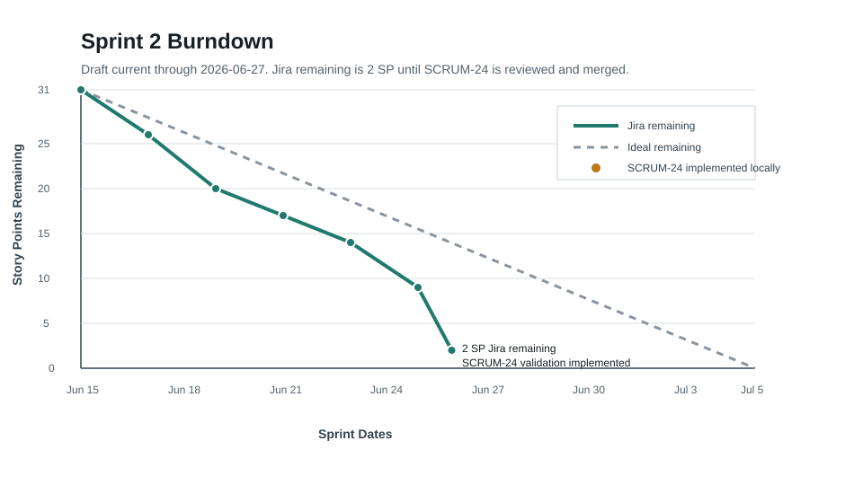

# SentinelOps Weekly Progress Report

# 1. Report Metadata

| Field | Value |
|---|---|
| Course | SWENG 894 - Software Engineering Capstone Experience |
| Project | SentinelOps |
| Student | Eli Vazquez |
| Sprint | Sprint 2 |
| Reporting Week | Week 6 |
| Reporting Period | 2026-06-29 to 2026-07-05 |
| Report Date | 2026-06-27 |
| Report Status | Draft prepared ahead; current through 2026-06-27 |
| Git Repository | <https://github.com/swevazquez/SentinelOpsProject> |
| Jira Board | <https://psu-capstone-sentinelops.atlassian.net/jira/software/projects/SCRUM/boards/1/backlog> |

---

# 2. Sprint Goal and Current Sprint Status

Sprint 2 builds a demonstrable predictive-maintenance slice from the Sprint 1 telemetry workflow. The sprint goal is to generate and store predictions, expose workflow and prediction data through APIs, display the results in an operational dashboard, and validate that the demonstration workflow performs reliably.

As of 2026-06-27, 29 of 31 story points are Done in Jira. SCRUM-24 is implemented locally on branch `SCRUM-24-demo-performance-validation` and is ready for review. Jira will show 31 of 31 story points Done after SCRUM-24 is reviewed, merged, and transitioned.

| Metric | Value |
|---|---|
| Sprint Total Estimated Effort | 31 story points |
| Jira Done Effort | 29 story points |
| Implemented / Pending Review | 2 story points |
| Jira Remaining Effort | 2 story points |
| Sprint Status | On track for milestone demo |

---

# 3. Software Testing

## Summary of Test Results

The merged baseline plus SCRUM-24 branch passed local validation on 2026-06-27.

| Test Type | Scope | Result |
|---|---|---|
| Unit | Telemetry, feature processing, scoring, prediction storage, API operations, dashboard behavior, workflow status, and Airflow failure reporting. | Passed |
| Integration | Telemetry-to-feature-to-prediction flow and prediction traceability. | Passed |
| Architecture | Component-boundary rules, including the SCRUM-24 script-level validator placement. | Passed |
| System | Clean-checkout setup, workflow smoke test, and demo performance validation. | Passed |
| User Acceptance | Dashboard opens to Overview and separates Assets, Workflows, and Assistant views through left navigation. | Passed |
| Coverage Analysis | Standard-library trace coverage completed with 67 tests. | Passed |

## Requirement-to-Test Traceability Matrix

| Requirement | Test Case | Type | Objective | Implementation Evidence | Status |
|---|---|---|---|---|---|
| SCRUM-5 / FR-05 | TC-FR05-01 | Unit / Workflow | Verify running, completed, and failed workflow status visibility. | [`64f7a07`](https://github.com/swevazquez/SentinelOpsProject/commit/64f7a07807662715cd83830fd09c94c7e76ff636), `tests/unit/test_workflow_status.py` | Passed |
| SCRUM-6 / FR-06 | TC-FR06-01 | Unit / Integration | Verify processed features generate prediction results for each asset. | [`a3b08fe`](https://github.com/swevazquez/SentinelOpsProject/commit/a3b08fe), `tests/unit/test_scoring.py` | Passed |
| SCRUM-7 / FR-07 | TC-FR07-01 | Unit / Integration | Verify risk score, status, priority, and recommended action. | [`12dc08e`](https://github.com/swevazquez/SentinelOpsProject/commit/12dc08e), `tests/unit/test_scoring.py` | Passed |
| SCRUM-8 / FR-08 | TC-FR08-01 | Unit / Integration | Verify prediction persistence and lookup by run and asset. | [`7656375`](https://github.com/swevazquez/SentinelOpsProject/commit/7656375), `tests/unit/test_prediction_store.py` | Passed |
| SCRUM-9 / FR-09 | TC-FR09-01 | Unit / API | Verify operational API response helpers. | [`9fba1e2`](https://github.com/swevazquez/SentinelOpsProject/commit/9fba1e2f1b7e491f587648fea61f9b2285dd4ed7), `tests/unit/test_api_operations.py` | Passed |
| SCRUM-10 / FR-10 | TC-FR10-01 | UI / User Acceptance | Verify dashboard views, default Overview screen, and left-navigation switching. | [`e609042`](https://github.com/swevazquez/SentinelOpsProject/commit/e609042be5aa92e106a757ee181b31dc0e528f3c), `tests/unit/test_dashboard_ui.py` | Passed |
| SCRUM-18 / NFR-02 | TC-NFR02-01 | Unit / Integration | Verify prediction input traceability fields. | [`8f88d67`](https://github.com/swevazquez/SentinelOpsProject/commit/8f88d67), `tests/integration/test_predictive_scoring.py` | Passed |
| SCRUM-21 / NFR-05 | TC-NFR05-01 | Unit / API | Verify normal, missing, invalid, and unavailable API response states. | [`921f349`](https://github.com/swevazquez/SentinelOpsProject/commit/921f349a5d89b59408f9bfc430aed3e216395443), `tests/unit/test_api_operations.py` | Passed |
| SCRUM-24 / NFR-08 | TC-NFR08-01 | System / Performance | Verify repeated demo-scale workflow runs complete under threshold with complete outputs. | `f9a67f4`, `scripts/demo_performance.py`, `tests/system/test_demo_performance.py` | Passed locally |
| Sprint 2 baseline | TC-SPRINT2-03 | Regression / CI | Verify the complete local test suite, smoke workflow, DAG syntax, generated-data safeguards, and Markdown checks. | `./scripts/check-ci.sh` | Passed |
| Sprint 2 codebase | TC-COV-03 | Coverage Analysis | Measure statement coverage with `python3 -m trace`. | `/tmp/sentinelops-week6-trace` output | Passed |

## Test Case Specifications

### TC-NFR08-01 - Demonstration-Scale Workflow Performance

| Field | Description |
|---|---|
| Related Requirement | SCRUM-24 / NFR-08 |
| Test Type | Performance / System |
| Objective | Verify repeated demonstration-scale workflows complete within the documented local threshold and produce complete raw, feature, prediction, and workflow-status outputs. |
| Preconditions | Repository branch `SCRUM-24-demo-performance-validation`; Python 3.12 or later; sample asset profile data available. |
| Test Data / Parameters | Three 24-hour demo runs; four configured assets; threshold 5 seconds per run. |
| Execution Environment | Local shell and Python standard library. |
| Expected Final Result | Each run completes with 96 raw rows, 4 feature rows, 4 prediction rows, completed workflow status, and duration below 5 seconds. |
| Actual Result | `./scripts/check-demo-performance.sh` passed: 3 runs, max 0.0016 seconds, average 0.0013 seconds, threshold 5 seconds. |
| Evidence | `scripts/check-demo-performance.sh`, `scripts/demo_performance.py`, `tests/system/test_demo_performance.py`, and local commit `f9a67f4`. |
| Cleanup / Reset | Runtime evidence is written to ignored `data/performance/latest-demo-performance.json`; raw, processed, prediction, and workflow-status outputs are ignored by Git. |
| Status | Passed locally |

#### Execution Steps

1. Run the focused performance tests.
   - Command or action: `python3 -m unittest tests.system.test_demo_performance -v`
   - Expected result: Complete-output, threshold-failure, and invalid-parameter tests pass.
2. Run the demo performance script.
   - Command or action: `./scripts/check-demo-performance.sh`
   - Expected result: Three demo-scale runs complete under the threshold.
3. Verify output completeness.
   - Command or action: Review `data/performance/latest-demo-performance.json`.
   - Expected result: Each run has raw, feature, prediction, and completed workflow-status evidence.
4. Run full local CI.
   - Command or action: `./scripts/check-ci.sh`
   - Expected result: Full local validation passes.
5. Record report evidence.
   - Command or action: Include timing, threshold, and test evidence in this report.
   - Expected result: SCRUM-24 has reproducible performance evidence.

#### Step Results

| Step | Actual Result | Status |
|---|---|---|
| 1 | Three focused performance tests passed. | Passed |
| 2 | Demo validation passed with max 0.0016 seconds and average 0.0013 seconds. | Passed |
| 3 | Runtime evidence was generated under `data/performance/`. | Passed |
| 4 | Full local CI passed with 67 tests. | Passed |
| 5 | Evidence is summarized in this report. | Passed |

### TC-SPRINT2-03 - Full Local Regression

| Field | Description |
|---|---|
| Related Requirement | Sprint 2 baseline |
| Test Type | Regression / CI |
| Objective | Verify all implemented Sprint 1 and Sprint 2 behavior passes together. |
| Preconditions | Branch `SCRUM-24-demo-performance-validation`; generated runtime files ignored by Git. |
| Test Data / Parameters | Full `tests` discovery suite and `ci-smoke` workflow run. |
| Execution Environment | Local shell; Python standard-library `unittest`; Airflow DAG syntax check. |
| Expected Final Result | Tests, smoke workflow, DAG syntax, generated-data safeguards, and Markdown readability pass. |
| Actual Result | `./scripts/check-ci.sh` passed with 67 tests. |
| Evidence | Local command output from 2026-06-27. |
| Cleanup / Reset | Generated runtime outputs remain ignored. |
| Status | Passed |

### TC-COV-03 - Coverage Analysis

| Field | Description |
|---|---|
| Related Requirement | Sprint 2 testing rubric |
| Test Type | Coverage Analysis |
| Objective | Measure statement coverage for the current automated suite. |
| Preconditions | Branch `SCRUM-24-demo-performance-validation`; Python standard library available. |
| Test Data / Parameters | Complete `tests` discovery suite. |
| Execution Environment | `python3 -m trace` with output under `/tmp/sentinelops-week6-trace`. |
| Expected Final Result | Test suite passes and trace summary reports module-level coverage. |
| Actual Result | 67 tests passed. Key production/script coverage included `services.api.operations` at 91.4%, `services.workflows.status` at 91.5%, `services.ml.scoring` at 91.0%, `services.ml.prediction_store` at 94.7%, `scripts.demo_performance` at 75.3%, and dashboard UI test module at 98.8%. |
| Evidence | Trace command output generated on 2026-06-27. |
| Cleanup / Reset | Coverage artifacts are outside the repository under `/tmp/sentinelops-week6-trace`. |
| Status | Passed |

---

# 4. Source Code Development

## Summary of Recent Contributions

The upcoming report period closes the last Sprint 2 gap by adding demonstration-scale performance validation. The new SCRUM-24 validator repeatedly runs the demo workflow, stores predictions, checks output completeness, records timing, and fails when runs exceed the configured threshold.

## Repository and Important Commits

| Resource | Link |
|---|---|
| Git Repository | <https://github.com/swevazquez/SentinelOpsProject> |
| Jira Board | <https://psu-capstone-sentinelops.atlassian.net/jira/software/projects/SCRUM/boards/1/backlog> |

| Commit | Commit Summary | Related Requirement | Notes |
|---|---|---|---|
| [`e609042`](https://github.com/swevazquez/SentinelOpsProject/commit/e609042be5aa92e106a757ee181b31dc0e528f3c) | SCRUM-10 Add operational dashboard | SCRUM-10 / FR-10 | Adds dashboard views and UI tests. |
| `f9a67f4` | SCRUM-24 Add demo performance validation | SCRUM-24 / NFR-08 | Adds performance validator, script, system tests, ignored runtime evidence, and README instructions. |

## Burndown Summary

| Metric | Value |
|---|---|
| Sprint Total Estimated Effort | 31 story points |
| Jira Done Effort | 29 story points |
| Implemented / Pending Review | 2 story points |
| Jira Remaining Effort | 2 story points |
| Expected Remaining After SCRUM-24 Merge | 0 story points |

---

# 5. Sprint Retrospective

## What Went Well

- Story-by-story branches kept Jira, GitHub, tests, and reports traceable.
- The Sprint 2 implementation reached a complete demo slice: scoring, storage, traceability, workflow visibility, APIs, dashboard, and performance validation.
- Local CI stayed fast enough to run frequently, which helped detect the SCRUM-24 architecture-boundary issue before review.
- The UI feedback from prior reports was converted into a concrete dashboard implementation aligned with the reviewed wireframe.

## What Did Not Go Well

- Some report artifacts were generated outside the normal commit flow and should be reconciled before final closeout.
- SCRUM-24 initially placed performance validation in the workflow package, which violated the component-boundary rules.
- The dashboard story required iteration after comparing the implementation against the Week 3 wireframe and interaction model.

## Improvements

- Keep the report draft updated immediately after each story merges.
- Continue running architecture tests during implementation, not only at the end of the story.
- For future UI work, start from the reviewed wireframe and interaction notes before coding.
- Keep demo evidence scripts separate from production workflow components when their purpose is measurement or reporting.

---

# 6. Backlog Grooming

| Change Type | Requirement ID | Description | Rationale | Impact |
|---|---|---|---|---|
| Updated implementation status | SCRUM-24 / NFR-08 | Demo performance validation implemented locally and ready for review. | The Sprint 2 demo needs measurable repeatability evidence. | Completes the final remaining Sprint 2 implementation item after review and merge. |
| Confirmed sprint scope | Sprint 2 backlog | No new sprint scope was added. | The sprint goal can be met with the planned backlog. | Keeps closeout focused on review, merge, demo rehearsal, and reporting. |

All Sprint 2 backlog changes are reported above. No additional product backlog scope changes occurred while preparing this report draft.

---

# 7. Plan for Submission Week

- Push SCRUM-24 and create a pull request when ready to publish the branch.
- Review and merge SCRUM-24, then transition Jira to Done.
- Update this report's status, commit link, and burndown from 2 remaining story points to 0.
- Record the milestone demo using the prepared script under the capstone workspace root.
- Submit the final Week 6 report after verifying Jira, GitHub, and local evidence agree.

---

# 8. Overall Sprint Assessment

Sprint 2 is effectively implementation-complete from a local development perspective. The only remaining administrative step is to publish, review, and merge SCRUM-24. The project is ready for the milestone demo because the implemented application can demonstrate telemetry generation, feature processing, predictive scoring, prediction storage, workflow status, API contracts, dashboard views, automated tests, coverage evidence, and performance validation.
