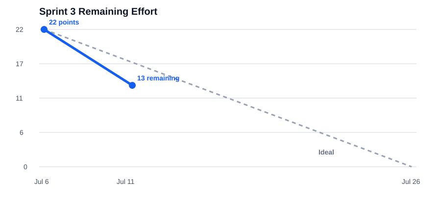

# SentinelOps Weekly Progress Report

# 1. Report Metadata

| Field | Value |
|---|---|
| Course | SWENG 894 - Software Engineering Capstone Experience |
| Project | SentinelOps |
| Student | Eli Vazquez |
| Sprint | Sprint 3 |
| Reporting Week | Week 7 |
| Reporting Period | 2026-07-06 to 2026-07-12 |
| Report Date | 2026-07-11 |
| Report Status | Current through 2026-07-11 |
| Git Repository | <https://github.com/swevazquez/SentinelOpsProject> |
| Jira Board | <https://psu-capstone-sentinelops.atlassian.net/jira/software/projects/SCRUM/boards/1/backlog> |

---

# 2. Sprint Goal and Planning

Sprint 3 adds controlled user interaction to the predictive-maintenance MVP. The sprint goal is to support manual workflow execution, introduce approved read-only agent tools, and build toward AI-assisted operational queries and approval-gated actions. This week also specifies the significant machine-learning algorithm that will expand the predictive component after instructor review.

## Groomed Product Backlog and Sprint Backlog

| Jira / Requirement | Backlog Item | Priority | Estimate | Status |
|---|---|---|---:|---|
| SCRUM-11 / FR-11 | Manual Workflow Execution | Medium | 3 SP | Done |
| SCRUM-12 / FR-12 | AI-Assisted Operational Queries | Low | 5 SP | To Do |
| SCRUM-13 / FR-13 | Controlled Agent Tool Access | Low | 3 SP | Done |
| SCRUM-14 / FR-14 | Approval-Gated Operational Actions | Low | 3 SP | To Do |
| SCRUM-22 / NFR-06 | Restricted AI-Assisted Workflow Actions | High | 3 SP | To Do |
| SCRUM-23 / NFR-07 | Agent Tool Usage Logging | Medium | 2 SP | To Do |
| SCRUM-28 / SAC | Specify ML-Based Remaining Useful Life Algorithm | High | 3 SP | Done |

All Sprint 3 items now have estimates. The sprint contains 22 story points; 9 points are Done and 13 remain.

## Definition of Done

| Area | Criteria Applied to Every Sprint Item |
|---|---|
| Requirements | Scope and Given/When/Then acceptance criteria are documented in Jira and remain traceable to the source requirement. |
| Design | Affected API, workflow, data, security, agent-tool, or UI behavior is documented before implementation. |
| Development | Behavior is implemented through existing component boundaries with no uncontrolled writes or speculative infrastructure. |
| Testing | Focused success, validation, and failure-path tests are added; planned items have complete reproducible test specifications. |
| Integration | The feature is exercised through its actual boundary, including UI-to-API behavior when user interaction is required. |
| Documentation | Reviewer-facing setup, interfaces, evidence, and architectural rationale are updated. |
| Review | Changes are committed with the Jira key and direct acceptance evidence is available. |
| Validation | Focused tests and `PYTHON_BIN=.venv/bin/python ./scripts/check-ci.sh` pass; user-facing changes receive desktop and mobile inspection. |

## Acceptance Criteria

| Requirement | Acceptance Criteria |
|---|---|
| FR-11 | Given the supported predictive-maintenance workflow, when a user starts it from the dashboard, then the API returns a run ID and the UI displays running, completed, or failed status. Unsupported or malformed requests do not execute. |
| FR-12 | Given the assistant is available, when a user submits a supported asset, prediction, or workflow question, then the response is derived from an approved operational tool and identifies unavailable information clearly. |
| FR-13 | Given an assistant tool request, when the tool is resolved, then only a registered read-only tool with validated arguments can execute through the API operation boundary. |
| FR-14 | Given an assistant requests an operational action, when approval has not been granted, then no workflow starts; after explicit approval, only the reviewed request may execute once. |
| NFR-06 | Given any AI-assisted action request, when its operation is not predefined and approved, then it is rejected before an operational write occurs. |
| NFR-07 | Given an agent tool is attempted, when it succeeds or fails, then tool name, time, request context, outcome, and non-sensitive error evidence are recorded for review. |
| SAC | Given the current MVP and NASA C-MAPSS FD001, when the specification is reviewed, then it clearly defines the Random Forest RUL algorithm, flow, value, evaluation, integration, and post-feedback implementation strategy in no more than three PDF pages. |

---

# 3. Backlog Grooming

| Change | Item | Description and Rationale | Impact |
|---|---|---|---|
| Sprint transition | Sprint 2 / Sprint 3 | Closed the completed 31-point Sprint 2 and activated Sprint 3. | Establishes the current reporting and burndown baseline. |
| Added | SCRUM-28 / SAC | Added a 3-point specification story for the required significant algorithmic component. | Makes proposal work visible without committing to implementation before instructor feedback. |
| Estimated | SCRUM-22 / NFR-06 | Assigned 3 points for action allowlisting and enforcement. | Removes an estimation gap and exposes the security work in capacity planning. |
| Estimated | SCRUM-23 / NFR-07 | Assigned 2 points for structured agent-tool audit logging. | Removes an estimation gap and completes the 22-point sprint baseline. |
| Refined | FR-11 | Included FastAPI routing, background execution, live workflow status, and dashboard interaction. | Delivers the story as an end-to-end user workflow rather than a backend-only helper. |
| Deferred | ML implementation | Training and inference stories will be created after instructor feedback on the SAC. | Avoids premature implementation while preserving a phased strategy. |

No other product backlog scope was added or removed during this reporting period.

---

# 4. Source Code Development

## Summary of Contributions

- Added the first live FastAPI application and same-origin dashboard serving.
- Added `POST /api/workflows`, workflow list/detail routes, background predictive execution, generated run IDs, and validation.
- Integrated the Workflows dashboard with live API refresh, request states, and responsive manual execution controls.
- Added five schema-defined, read-only agent tools for assets, workflows, and predictions; unapproved tools and invalid arguments are rejected.
- Specified the NASA C-MAPSS FD001 Random Forest RUL component with a rendered algorithm flow.

## Important Commits

| Commit | Summary | Related Story | Evidence |
|---|---|---|---|
| [`deb9ab6`](https://github.com/swevazquez/SentinelOpsProject/commit/deb9ab611b16dc555508e77644ec76a2ec126f97) | Add manual workflow execution | SCRUM-11 / FR-11 | FastAPI routes, predictive workflow composition, dashboard interaction, integration/UI tests, and local run documentation. |
| [`91904b2`](https://github.com/swevazquez/SentinelOpsProject/commit/91904b2635c41bba9fd3538bc300eed39f332de7) | Add controlled agent tools | SCRUM-13 / FR-13 | Explicit read-only registry, closed schemas, API delegation, rejection tests, and agent documentation. |
| [`0ca9f42`](https://github.com/swevazquez/SentinelOpsProject/commit/0ca9f425dd8cd0670a5c6f1127871e4be19ce371) | Specify RUL algorithmic component | SCRUM-28 / SAC | Two-page specification, Graphviz source, and reviewable SVG flow. |

## Burndown

| Metric | Value |
|---|---:|
| Sprint Total | 22 SP |
| Completed | 9 SP |
| Remaining | 13 SP |
| Completion | 40.9% |
| Assessment | On track; more than one-third completed in the first reporting week. |

---

# 5. Software Testing

## Results and Traceability

| Requirement | Test Case | Type | Objective | Status / Evidence |
|---|---|---|---|---|
| FR-11 | TC-FR11-01 | Integration / UI | Start the supported workflow, observe status, and reject invalid requests. | Passed; `tests/integration/test_manual_workflow_api.py`, `tests/unit/test_dashboard_ui.py` |
| FR-12 | TC-FR12-01 | Integration / UAT | Answer supported operational questions through approved tools. | Planned |
| FR-13 | TC-FR13-01 | Unit | Enforce the approved read-only registry and exact schemas. | Passed; `tests/unit/test_agent_tools.py` |
| FR-14 | TC-FR14-01 | Integration / Security | Block unapproved actions and execute one explicitly approved action. | Planned |
| NFR-06 | TC-NFR06-01 | Security | Reject undefined or non-approved AI operations before writes. | Planned |
| NFR-07 | TC-NFR07-01 | Unit / Audit | Record reviewable tool-attempt evidence without sensitive arguments. | Planned |
| SAC | TC-SAC-01 | Document review | Verify rubric coverage, visual clarity, sources, and page limit. | Passed; `docs/algorithmic-component.md`, rendered two-page PDF |
| Sprint baseline | TC-SPRINT3-01 | Regression | Run all tests, smoke workflow, architecture rules, DAG syntax, and safeguards. | Passed; 76 tests and `./scripts/check-ci.sh` |

## TC-FR11-01 - Manual Predictive Workflow Execution

| Field | Specification |
|---|---|
| Preconditions | Repository at `deb9ab6` or later; Python 3.12; dependencies installed with `uv sync --extra dev`; sample asset profiles present. |
| Test Data | Workflow name `predictive-maintenance`; invalid name `unapproved-workflow`; malformed payload containing unexpected `hours`. |
| Commands | `.venv/bin/python -m unittest tests.integration.test_manual_workflow_api tests.unit.test_dashboard_ui -v`; then `.venv/bin/uvicorn services.api.app:app --host 127.0.0.1 --port 8000`. |
| Expected Result | Valid request returns HTTP 202 and a file-safe run ID; raw/features/predictions and completed status exist. Invalid requests return 400/422 without status files. Failure records `failed`. Dashboard exposes run, disabled/loading, success/error, refresh, and responsive states. |
| Actual Result | 12 focused FR-11/API/UI tests passed. Full CI passed. Live API returned workflow status data. Playwright desktop and 390px mobile screenshots showed no overlap or horizontal overflow after the navigation correction. |
| Cleanup | Stop Uvicorn. Generated runtime data remains ignored by Git. |

Steps: (1) run the focused tests and confirm all pass; (2) start Uvicorn and open `http://127.0.0.1:8000`; (3) open Workflows and run the supported workflow; (4) confirm the returned run appears and reaches completed or failed; (5) verify raw, processed, prediction, and status artifacts share its run ID; (6) submit invalid requests and confirm no workflow starts.

## TC-FR12-01 - AI-Assisted Operational Query

| Field | Specification |
|---|---|
| Preconditions | FR-13 approved tools available; FR-12 assistant service and UI implemented; sample asset, workflow, and prediction records present. |
| Test Data | Questions for asset `PUMP-1`, workflow `run-1`, an existing prediction, an unknown asset, and an unsupported general question. |
| Planned Command / Action | Start the API/dashboard, open Assistant, submit each question, and inspect the selected tool and response evidence. Narrow automated command will target the FR-12 integration test; full regression uses `./scripts/check-ci.sh`. |
| Expected Result | Supported questions use the matching approved read-only tool and return operational data. Missing data is explicit. Unsupported questions do not invent data or invoke an unapproved tool. |
| Evidence / Cleanup | Planned FR-12 tests, assistant transcript fixture, and UI screenshot; clear generated conversation fixtures after execution. |
| Status | Planned; implementation begins after the current 9-point slice. |

## TC-FR13-01 - Controlled Read-Only Tool Registry

| Field | Specification |
|---|---|
| Preconditions | Repository at `91904b2` or later; sample asset, workflow, and prediction records. |
| Test Data | Five approved tools, exact valid arguments, missing/extra arguments, and unapproved `run_workflow`. |
| Command | `.venv/bin/python -m unittest tests.unit.test_agent_tools -v` followed by `PYTHON_BIN=.venv/bin/python ./scripts/check-ci.sh`. |
| Expected Result | Approved tools return structured API results; every schema rejects additional properties; unknown tools and invalid arguments raise validation errors; all registered tools are read-only. |
| Actual Result | Four focused tests passed and the complete regression passed. No write-capable tool is registered. |
| Cleanup | Temporary test data is removed automatically. |

## TC-FR14-01 - Approval-Gated Agent Action

| Field | Specification |
|---|---|
| Preconditions | FR-11 workflow endpoint and FR-13 registry available; FR-14 approval state and action tool implemented. |
| Test Data | One valid workflow request, denied request, expired approval, replayed approval, and modified post-approval payload. |
| Planned Command / Action | Run the focused FR-14 integration tests; in the Assistant request a workflow, deny it, then repeat and approve it once. |
| Expected Result | No denied, expired, replayed, or modified request writes status data. Exactly one matching workflow starts after explicit approval and remains traceable to that decision. |
| Evidence / Cleanup | Planned test output, audit record, workflow status, and UI approval-state screenshots; remove temporary approval fixtures. |
| Status | Planned. |

## TC-NFR06-01 - Restricted AI-Assisted Operations

| Field | Specification |
|---|---|
| Preconditions | Agent policy and approval-gated action registry implemented. |
| Test Data | Approved read, approved gated workflow action, unknown operation, direct storage mutation request, and malformed arguments. |
| Planned Command | Execute the NFR-06 security test module and full CI. |
| Expected Result | Reads use approved FR-13 tools; operational writes require the FR-14 gate; unknown and direct-mutation operations are rejected before side effects. |
| Evidence / Cleanup | Test output plus unchanged pre/post storage fingerprints for rejected operations; temporary files removed. |
| Status | Planned. |

## TC-NFR07-01 - Agent Tool Usage Logging

| Field | Specification |
|---|---|
| Preconditions | Structured agent audit logger implemented and configured to a temporary test destination. |
| Test Data | Successful lookup, validation failure, missing result, rejected tool, approved action, and denied action. |
| Planned Command | Execute the NFR-07 audit-log unit/integration tests and full CI. |
| Expected Result | Each attempt records timestamp, tool, request/correlation ID, outcome, duration, and sanitized error category; secrets and raw sensitive arguments are absent. |
| Evidence / Cleanup | Parsed audit fixture and assertions for required/forbidden fields; temporary audit logs removed. |
| Status | Planned. |

## TC-SAC-01 - Algorithmic Component Specification Review

| Field | Specification |
|---|---|
| Preconditions | `docs/algorithmic-component.md`, Graphviz, Quarto, and XeLaTeX available. |
| Commands | `dot -Tsvg docs/diagrams/algorithmic-component-flow.dot -o docs/images/algorithmic-component-flow.svg`; `quarto render docs/algorithmic-component.md --to pdf`; use Ghostscript to verify page count and render pages for visual inspection. |
| Expected Result | PDF is at most three pages and clearly covers product overview, specific Random Forest RUL behavior, visual flow, WHAT/HOW/WHY, feasibility, evaluation, integration, and references. |
| Actual Result | PDF rendered successfully at two pages. Both pages and the flowchart were visually inspected and readable. |
| Cleanup | PDF is a local ignored export; Markdown, DOT, and SVG remain reviewable source artifacts. |

---

# 6. Risks, Roadblocks, and Mitigation

| Risk | Impact | Mitigation |
|---|---|---|
| Instructor changes the SAC direction | ML implementation may need redesign. | Keep implementation stories deferred until feedback and retain the existing baseline scorer. |
| FD001 schema differs from current simulator telemetry | Runtime integration cannot reuse training features directly. | Specify a versioned feature contract and adapter; validate offline and runtime transformations independently. |
| FR-12 depends on controlled tools and later action approval | Assistant scope can spread across UI, model, API, and security. | Deliver read-only queries first, then add one narrow approval-gated action under FR-14/NFR-06. |
| Limited remaining schedule | UI/API/agent integration could displace testing. | Continue vertical story slices, enforce focused tests plus full CI, and avoid framework migration. |

---

# 7. Plan for Week 8

- Implement FR-12 as one working Assistant query path from UI through an approved FR-13 tool.
- Implement FR-14 and NFR-06 together so no write-capable agent tool exists without an approval gate.
- Add NFR-07 structured tool-attempt logging to both read and action paths.
- Incorporate instructor SAC feedback, then groom ML implementation stories without starting unapproved scope.
- Continue live UI integration in the existing Assistant and Workflows views.

---

# 8. Overall Sprint Assessment

Sprint 3 is on track. Nine of 22 points are Done, representing 40.9% of the sprint. The completed work establishes the first live UI-to-FastAPI workflow action, a controlled read-only agent-tool boundary, and an instructor-ready RUL algorithm proposal. Thirteen points remain across assistant queries, approval-gated actions, operation restrictions, and audit logging. The next priority is a complete FR-12 read-only assistant slice followed by the coupled FR-14/NFR-06 security boundary.
