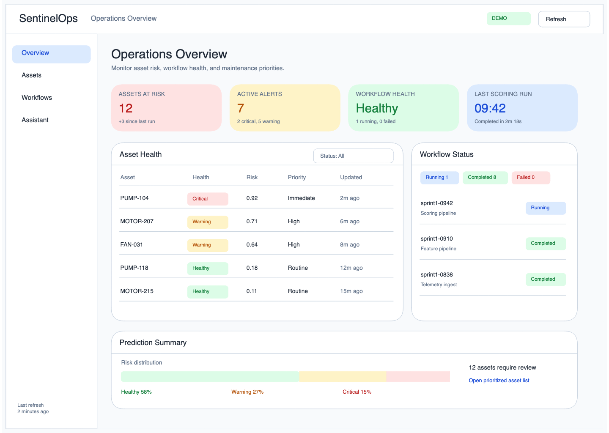
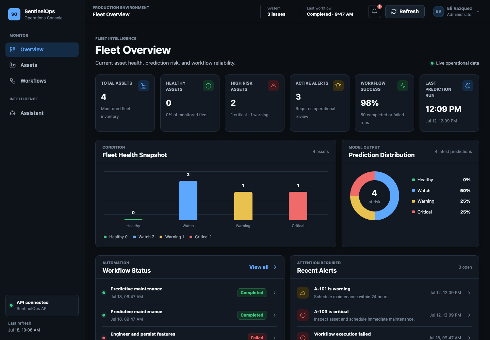
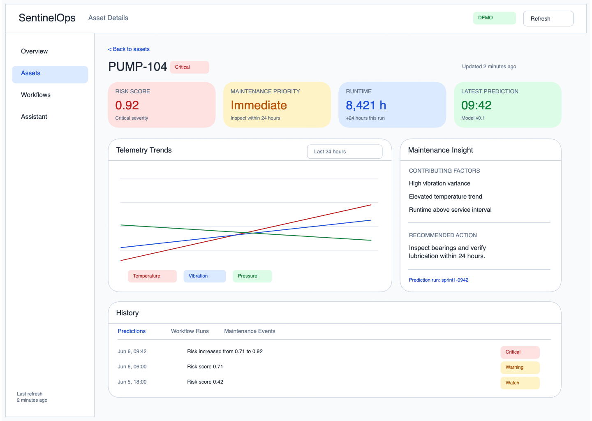
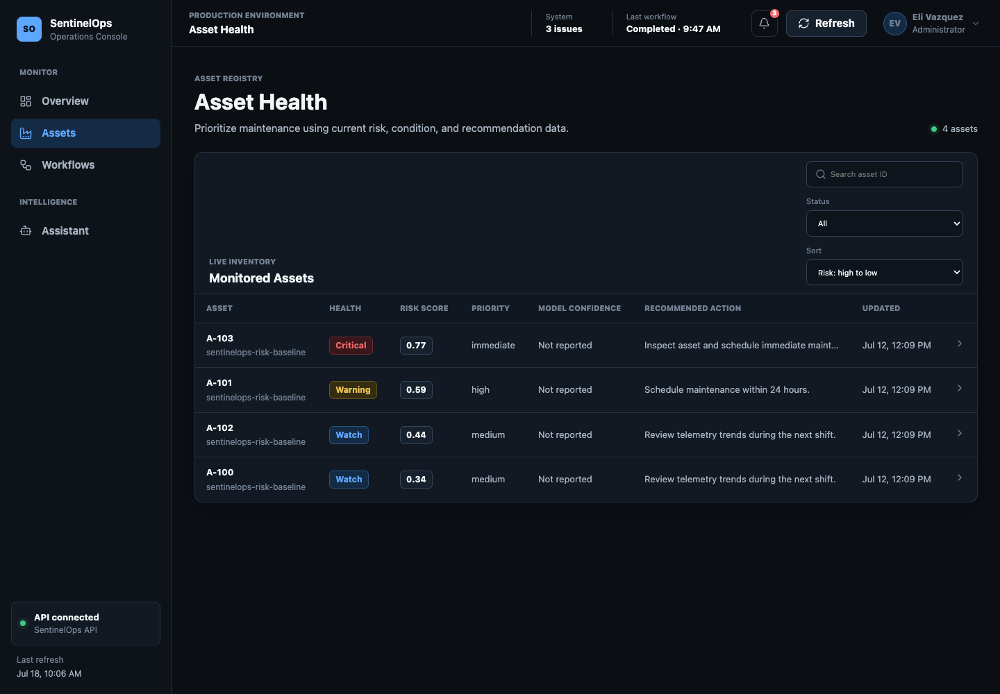
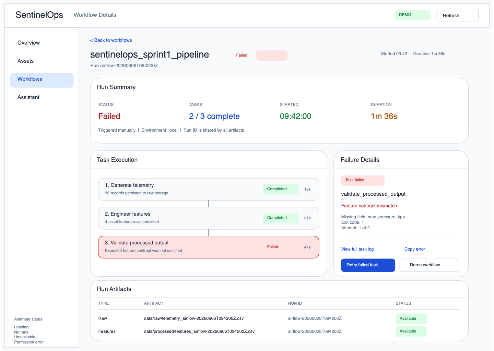
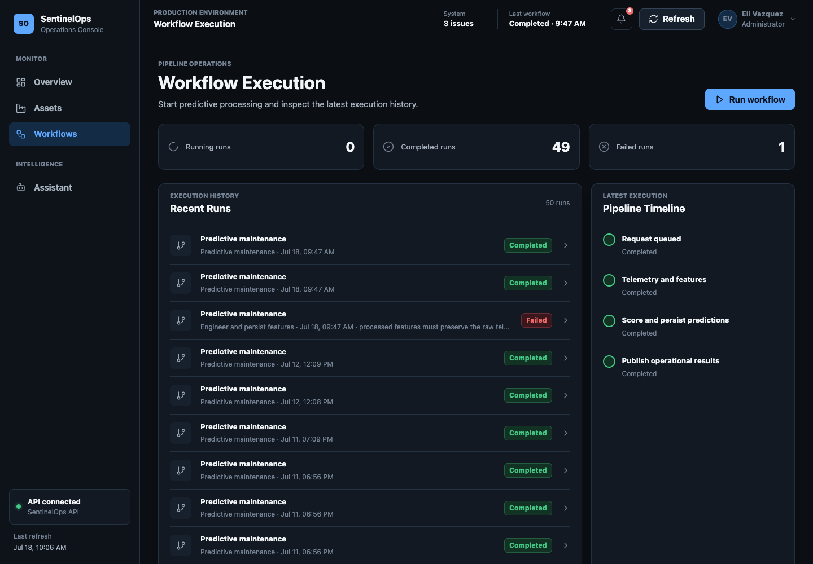
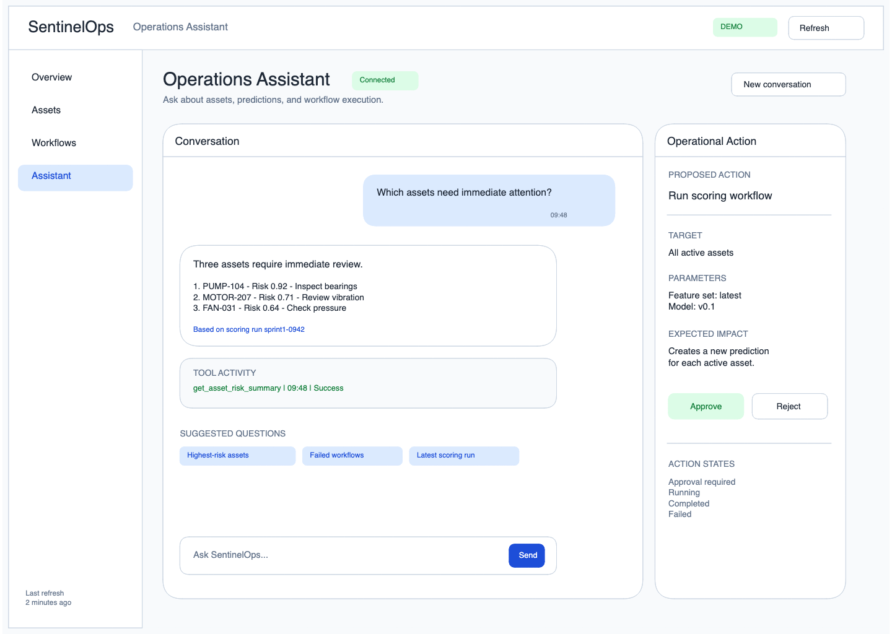
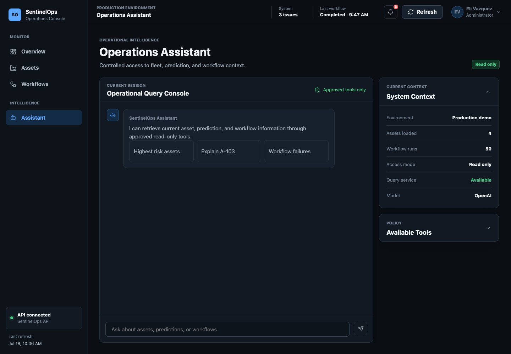
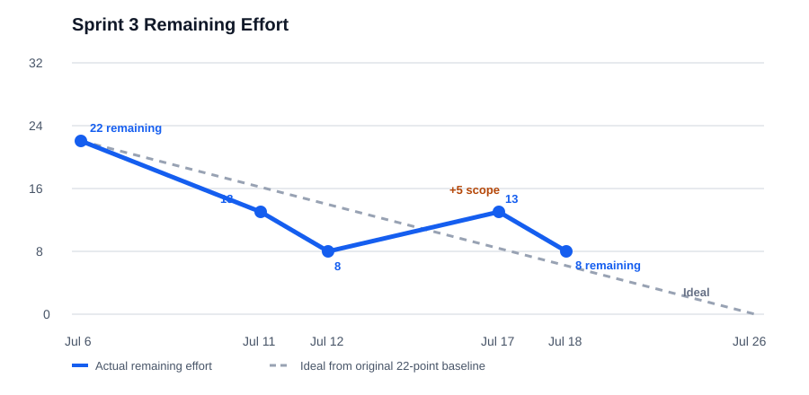

# SentinelOps Weekly Progress Report

# 1. Report Metadata

| Field | Value |
|---|---|
| Course | SWENG 894 - Software Engineering Capstone Experience |
| Project | SentinelOps |
| Student | Eli Vazquez |
| Sprint | Sprint 3 |
| Reporting Week | Week 8 |
| Reporting Period | 2026-07-13 to 2026-07-19 |
| Report Date | 2026-07-18 |
| Report Status | Current through 2026-07-18; no additional development is planned before the reporting period closes |
| Git Repository | <https://github.com/swevazquez/SentinelOpsProject> |
| Jira Board | <https://psu-capstone-sentinelops.atlassian.net/jira/software/projects/SCRUM/boards/1/backlog> |

---

# 2. Sprint Goal and Planning

Sprint 3 extends the predictive-maintenance MVP with controlled user interaction. The sprint goal is to provide manual workflow execution, approved AI-assisted operational queries, controlled agent tools, and a secure foundation for approval-gated actions. Following instructor approval of the significant algorithmic component, the sprint now also establishes the reproducible data contract required for Remaining Useful Life model development.

## Groomed Product Backlog and Highest-Priority Sprint Backlog

| Jira / Requirement | Backlog Item | Priority | Estimate | Current Status |
|---|---|---:|---:|---|
| SCRUM-11 / FR-11 | Manual Workflow Execution | Medium | 3 SP | Done |
| SCRUM-12 / FR-12 | AI-Assisted Operational Queries | Low | 5 SP | Done |
| SCRUM-13 / FR-13 | Controlled Agent Tool Access | Low | 3 SP | Done |
| SCRUM-14 / FR-14 | Approval-Gated Operational Actions | Low | 3 SP | To Do |
| SCRUM-22 / NFR-06 | Restricted AI-Assisted Workflow Actions | High | 3 SP | To Do |
| SCRUM-23 / NFR-07 | Agent Tool Usage Logging | Medium | 2 SP | To Do |
| SCRUM-28 / SAC | ML-Based Remaining Useful Life Algorithm Specification | High | 3 SP | Done |
| SCRUM-29 / UI | Modernize the SentinelOps Operational Dashboard UI | Medium | 5 SP | Done |
| SCRUM-30 / SAC | Prepare C-MAPSS FD001 Data and RUL Contract | High | 5 SP | Done |

Sprint 3 contains 32 story points. Twenty-four points are complete and eight remain, resulting in 75% completion. The remaining work is the approval and audit-control sequence represented by `SCRUM-22`, `SCRUM-23`, and `SCRUM-14`.

## Definition of Done

| Area | Criteria Applied to Every Sprint Item |
|---|---|
| Requirements | Scope and Given/When/Then acceptance criteria are documented in Jira and traceable to the source requirement. |
| Design | Affected API, workflow, data, security, agent-tool, ML-contract, or UI behavior is documented before implementation. |
| Development | The behavior is implemented within the existing component boundaries with no uncontrolled writes or speculative infrastructure. |
| Testing | Focused success, validation, failure, and security-path tests are added or completely specified. |
| Integration | The feature is exercised through its actual boundary, including UI-to-API, model-to-tool, or data-preparation behavior when applicable. |
| Documentation | Reviewer-facing setup, interfaces, evidence, traceability, and architectural rationale are updated. |
| Review | Changes are committed with the Jira key and submitted through a story-specific pull request. |
| Validation | Focused tests and the full CI validation pass; user-facing changes receive desktop and tablet inspection. |

## Acceptance Criteria

| Requirement | Acceptance Criteria |
|---|---|
| FR-11 | A user can start the supported predictive-maintenance workflow, receive a run ID, observe running/completed/failed status, and receive validation errors for unsupported or malformed requests. |
| FR-12 | Supported asset, prediction, and workflow questions return grounded responses through approved operational tools; unavailable information is identified without fabrication. |
| FR-13 | Only registered read-only tools with closed schemas and validated arguments can execute through the API operation boundary. |
| FR-14 | No operational action executes before explicit approval; one approval authorizes only the exact reviewed request once. |
| NFR-06 | Undefined, modified, replayed, or non-approved AI operations are rejected before an operational write occurs. |
| NFR-07 | Every agent-tool attempt records timestamp, tool, correlation context, outcome, duration, and sanitized error evidence without secrets. |
| SAC Specification | The approved proposal clearly defines the product, Random Forest RUL solution, visual flow, rationale, evaluation strategy, limitations, and implementation sequence within three pages. |
| UI Modernization | Overview, Assets, Workflows, and Assistant use the SentinelOps design system, preserve API behavior, and provide consistent navigation, drill-down, status, loading, empty, error, and feedback interactions. |
| SAC Data Contract | FD001 acquisition is checksum-pinned; records and trajectories are validated; labels use capped RUL; partitions are disjoint by engine; and versioned metadata records the source, schema, feature groups, preprocessing policy, and split. |

---

# 3. UI Design

The four reviewed wireframes define the original information architecture for every Sprint 3 user-facing requirement. They are retained below as the design baseline rather than presented as screenshots of the current product. Each is paired with the implemented interface from `main` to show how the information hierarchy and interactions evolved during SCRUM-29. The significant algorithm flow provides the corresponding visual design artifact for the two non-UI SAC stories. No separate application screen is appropriate for data acquisition or model-contract behavior.

## Wireframe Descriptions

| Wireframe | Description | Sprint Alignment |
|---|---|---|
| Operations Overview | Presents fleet KPIs, risk and prediction summaries, workflow health, alerts, refresh state, and object-level drill-down entry points. | FR-11 workflow state and SCRUM-29 fleet-health interaction patterns. |
| Asset Details | Presents current status, risk, prediction metadata, telemetry trends, contributing factors, maintenance recommendations, and history for one asset. | FR-12 asset/prediction queries and SCRUM-29 asset inspection behavior. |
| Workflow Details | Presents run status, ordered task execution, failure information, artifacts, logs, and controlled recovery actions. | FR-11 execution status, FR-14 approval-gated actions, NFR-06 restrictions, NFR-07 evidence, and SCRUM-29 workflow details. |
| Operations Assistant | Presents supported prompts, grounded responses, tool evidence, proposed action impact, explicit approval/rejection, and unavailable/error states. | FR-12, FR-13, FR-14, NFR-06, NFR-07, and SCRUM-29 Assistant behavior. |
| Algorithm Component Flow | Separates offline FD001 preparation and model training from runtime scoring, persistence, API, and dashboard exposure. | SCRUM-28 specification and SCRUM-30 data-contract boundary. |

## Before-and-After Design Evidence

### Operations Overview

**Before - reviewed information-architecture wireframe**

**After - implemented Fleet Overview**

The wireframe established the required fleet, workflow, alert, and prediction hierarchy, but its generic blocks did not communicate operational severity or current system state. The implemented view adds the persistent application shell, live KPI values, semantic health colors, fleet and prediction visualizations, notification status, refresh feedback, and direct object-level inspection. These changes make fleet condition and required attention understandable without opening another view.

### Asset Registry and Details

**Before - reviewed Asset Details wireframe**

**After - implemented Asset Health registry**

The original artifact concentrated on a single asset after navigation. The implemented registry adds search, health filtering, risk sorting, maintenance priority, recommendation, model confidence, and update time so a maintenance manager can compare the fleet before drilling down. Selecting any row opens the matching asset dialog without leaving the current view, creating a consistent inspection pattern with alerts and notifications.

### Workflow Execution

**Before - reviewed Workflow Details wireframe**

**After - implemented Workflow Execution view**

The wireframe defined ordered execution and failure evidence but assumed a separate detail screen and future recovery controls. The implemented view keeps execution history, state counts, the latest pipeline timeline, and manual execution in one operational workspace. State cards filter history, rows open run-specific dialogs, and the Run workflow control provides immediate and terminal feedback. Retry or recovery controls remain excluded until the approval-gated action stories are complete.

### Operations Assistant

**Before - reviewed Operations Assistant wireframe**

**After - implemented Operations Assistant**

The wireframe included the longer-term approval interaction along with informational queries. The implemented view deliberately limits this sprint slice to approved read-only tools, makes that policy visible, and separates the scrollable conversation from system context and tool-policy disclosures. Suggested operational prompts, grounded tool evidence, and a fixed composer support repeated use without allowing the conversation to expand the page or implying that workflow actions are already available.

## Design Rationale

| Change | Reason | Result |
|---|---|---|
| Persistent navigation and operational header | The early layout did not provide enough context when moving between fleet, asset, workflow, and Assistant tasks. | Environment, system attention, latest workflow, notifications, refresh, and user controls remain available across views. |
| Dashboard-first hierarchy with restrained status color | Operational users need to identify exceptions quickly without a decorative or consumer-oriented presentation. | Severity colors communicate health and risk while the rest of the interface remains visually quiet and consistent. |
| Object details in dialogs | Alerts, notifications, table rows, and workflow entries previously produced inconsistent navigation behavior. | Object inspection preserves the current view; only explicit navigation controls change sections. |
| Visible action and refresh states | Controls appeared actionable without always showing immediate acknowledgment. | Run and Refresh behave visibly as buttons and provide loading, completion, and failure feedback. |
| Read-only Assistant boundary | Approval-gated writes are planned but not yet implemented. | The interface exposes only supported information retrieval and clearly identifies approved tools and access mode. |
| Reusable tokens and components | Page-specific styling made the earlier MVP harder to extend consistently. | Cards, badges, buttons, tables, dialogs, charts, spacing, typography, and status colors now follow one documented design system. |

## Non-UI Algorithm Visual

## Sprint Requirement Coverage

| Sprint Item | Visual Artifact | Alignment Evidence |
|---|---|---|
| SCRUM-11 / FR-11 | Operations Overview; Workflow Details | Run initiation, state summary, execution history, task progress, failure details, and run artifacts are represented. |
| SCRUM-12 / FR-12 | Operations Assistant; Asset Details; Workflow Details | Supported questions map to asset, prediction, and workflow evidence shown in the corresponding views. |
| SCRUM-13 / FR-13 | Operations Assistant | Tool Evidence identifies the approved operational source and result used for each answer. |
| SCRUM-14 / FR-14 | Operations Assistant; Workflow Details | Proposed action, impact, Approve/Reject controls, and recovery controls define the approval interaction. |
| SCRUM-22 / NFR-06 | Operations Assistant; Workflow Details | Approval-required and permission-error states prevent unrestricted workflow controls from appearing as direct actions. |
| SCRUM-23 / NFR-07 | Operations Assistant; Workflow Details | Tool Evidence, failure details, and approved log access define where audit and diagnostic evidence is presented. |
| SCRUM-28 / SAC | Algorithm Component Flow | Offline training and runtime scoring operations are shown in the approved proposal visual. |
| SCRUM-29 / UI | Four wireframe/implementation pairs | The implemented Overview, Assets, Workflows, and Assistant views preserve the reviewed responsibilities while documenting the hierarchy and interaction changes made during modernization. |
| SCRUM-30 / SAC | Algorithm Component Flow | FD001 acquisition, validation, labeling, partitioning, and metadata form the first offline-training stage and introduce no separate end-user view. |

Editable Excalidraw and Mermaid sources are under `docs/diagrams/ui/`; reviewer-ready wireframe exports are under `docs/images/ui/wireframes/`; and the implemented Week 8 screenshots are under `docs/images/reports/week-08-ui/`. The implemented component and interaction conventions are documented in `frontend/dashboard/DESIGN_SYSTEM.md`.

---

# 4. Backlog Grooming

| Change | Item | Description and Rationale | Impact |
|---|---|---|---|
| Added and completed | SCRUM-29 / UI | Added a five-point story to capture the cross-view dashboard modernization and interaction consistency work. | Increased Sprint 3 scope while making completed UI work traceable to acceptance criteria and PR #22. |
| Completed | SCRUM-12 / FR-12 | Implemented OpenAI Responses API coordination, approved tool calling, grounded responses, and the integrated Assistant view. | Completed the informational assistant path and preserved the no-write boundary. |
| Approved | SCRUM-28 / SAC | The instructor approved the Significant Algorithmic Component proposal. | Removed the feedback dependency that had blocked ML implementation planning. |
| Added and completed | SCRUM-30 / SAC | Added a five-point Sprint 3 story for reproducible FD001 acquisition, validation, RUL labels, engine-level partitions, and metadata. | Increased Sprint 3 scope and completed the prerequisite for model training. |
| Added to product backlog | SCRUM-31 / SAC | Added an eight-point story to train and evaluate the seeded Random Forest RUL model. | Establishes the next algorithm implementation phase; blocked by SCRUM-30 until its merge. |
| Added to product backlog | SCRUM-32 / SAC | Added an eight-point story to integrate RUL inference into the predictive workflow. | Preserves a separate runtime-integration boundary after model evaluation. |
| Added to product backlog | SCRUM-33 / SAC | Added a five-point story to expose and explain RUL results through the dashboard and Assistant. | Defers user-facing RUL integration until inference outputs are available. |
| Linked dependencies | SCRUM-30 through SCRUM-33 | Recorded the implementation order `SCRUM-30 -> SCRUM-31 -> SCRUM-32 -> SCRUM-33` and related each story to SCRUM-28. | Makes the approved algorithm sequence and traceability explicit. |
| Scope revised | Sprint 3 | Sprint scope increased from 22 to 32 points through SCRUM-29 and SCRUM-30. | Completed effort increased from 9 to 24 points; eight points remain. |

The product backlog retains `SCRUM-31`, `SCRUM-32`, and `SCRUM-33` for future sprint grooming. Sprint 3 retains `SCRUM-22`, `SCRUM-23`, and `SCRUM-14` as its remaining security and audit-control work.

---

# 5. Source Code Development

## Summary of Contributions

This reporting period delivered three vertical slices and converted the approved algorithm proposal into an implementation sequence:

- Modernized Overview, Assets, Workflows, and Assistant into a consistent operational dashboard with reusable design tokens, dialogs, filtering, notification previews, refresh feedback, and responsive desktop/tablet behavior.
- Integrated the Assistant with the OpenAI Responses API and the approved read-only tool registry for grounded asset, prediction, and workflow questions.
- Implemented checksum-pinned NASA C-MAPSS FD001 acquisition, strict engine-trajectory parsing, capped RUL labels, deterministic engine-level partitioning, versioned metadata, and CI-safe fixtures.
- Preserved the approval boundary: the current Assistant cannot invoke workflow writes before the remaining approval and restriction stories are implemented.
- Groomed the instructor-approved RUL work into four dependency-linked stories covering data, training/evaluation, workflow inference, and user-facing explanation.

## Repository Information

| Resource | Link |
|---|---|
| Git Repository | <https://github.com/swevazquez/SentinelOpsProject> |
| Jira Board | <https://psu-capstone-sentinelops.atlassian.net/jira/software/projects/SCRUM/boards/1/backlog> |

## Important Commits

| Commit | Commit Summary | Related Requirement / User Story | Notes |
|---|---|---|---|
| [`2e571bb`](https://github.com/swevazquez/SentinelOpsProject/commit/2e571bbe92f9afdfdc960c07729221c9b1141256) | Modernize operational dashboard UI | SCRUM-29 / UI | Adds the design system and cross-view interaction modernization. |
| [`b772ec3`](https://github.com/swevazquez/SentinelOpsProject/commit/b772ec33e4965ff88e43deabffb90c39e8fff1f9) | Merge dashboard modernization | SCRUM-29 / UI | Merges PR [#22](https://github.com/swevazquez/SentinelOpsProject/pull/22). |
| [`d24662b`](https://github.com/swevazquez/SentinelOpsProject/commit/d24662b3bb34551c3bcc0fafec5b844a780d9000) | Add AI-assisted operational queries | SCRUM-12 / FR-12 | Adds OpenAI tool coordination, API integration, Assistant UI behavior, and tests. |
| [`a34f6f6`](https://github.com/swevazquez/SentinelOpsProject/commit/a34f6f613c3bca7d44aeb32a2340fc195cb433b8) | Merge AI-assisted operational queries | SCRUM-12 / FR-12 | Merges PR [#23](https://github.com/swevazquez/SentinelOpsProject/pull/23). |
| [`4ef4706`](https://github.com/swevazquez/SentinelOpsProject/commit/4ef47067d0d08eacd717159f4022f948d7a78853) | Prepare C-MAPSS RUL data contract | SCRUM-30 / SAC | Adds acquisition, parsing, labeling, engine splitting, metadata, fixtures, tests, and documentation. |
| [`0d51f1c`](https://github.com/swevazquez/SentinelOpsProject/commit/0d51f1cce038bf32e8e21b4878ef72cdc17910d9) | Merge C-MAPSS RUL data contract | SCRUM-30 / SAC | Merges PR [#24](https://github.com/swevazquez/SentinelOpsProject/pull/24). |

## Burndown Summary

| Metric | Value |
|---|---:|
| Initial Sprint Estimated Effort | 22 story points |
| Current Sprint Estimated Effort | 32 story points |
| Completed Effort | 24 story points |
| Remaining Effort | 8 story points |
| Completion Rate | 75.0% |
| Sprint Status | On track; eight points remain before the July 26 close |

The burndown records scope changes rather than rewriting the original baseline. Remaining effort fell from 13 to eight points as planned work was completed, increased to 13 when SCRUM-30 was added after instructor approval, and returned to eight when SCRUM-30 merged.

---

# 6. Software Testing

## Testing Overview

Testing now covers all completed Sprint 3 behavior and maintains complete planned specifications for the three remaining requirements. PR #22 passed 82 automated tests and visual review, PR #23 passed 89 automated tests without requiring an API key, and PR #24 passed 98 automated tests. The current regression suite also validates workflow smoke behavior, generated-data safeguards, Airflow DAG syntax, JavaScript syntax, and Markdown readability.

## Requirement-to-Test Traceability Matrix

| Requirement | Test Case | Type | Objective | Status / Evidence |
|---|---|---|---|---|
| SCRUM-11 / FR-11 | TC-FR11-01 | Integration / UI | Start the supported workflow, observe status, refresh data, and reject invalid requests. | Passed; PR [#20](https://github.com/swevazquez/SentinelOpsProject/pull/20) |
| SCRUM-12 / FR-12 | TC-FR12-01 | Unit / Integration / UAT | Answer supported operational questions through approved tools without fabrication. | Passed; PR [#23](https://github.com/swevazquez/SentinelOpsProject/pull/23) |
| SCRUM-13 / FR-13 | TC-FR13-01 | Unit / Security | Enforce the approved read-only registry, closed schemas, and exact arguments. | Passed; PR [#21](https://github.com/swevazquez/SentinelOpsProject/pull/21) |
| SCRUM-14 / FR-14 | TC-FR14-01 | Integration / Security | Block unapproved actions and authorize one exact request once. | Planned; story remains To Do. |
| SCRUM-22 / NFR-06 | TC-NFR06-01 | Security | Reject undefined, modified, replayed, or non-approved operations before writes. | Planned; story remains To Do. |
| SCRUM-23 / NFR-07 | TC-NFR07-01 | Unit / Audit | Record reviewable, sanitized evidence for every tool attempt. | Planned; story remains To Do. |
| SCRUM-28 / SAC | TC-SAC-01 | Document Review | Verify rubric coverage, visual clarity, rationale, feasibility, and page limit. | Passed; instructor approved the proposal. |
| SCRUM-29 / UI | TC-UI-01 | UI / UAT / Regression | Verify cross-view design, interactions, accessibility, responsive behavior, and preserved API functionality. | Passed; PR [#22](https://github.com/swevazquez/SentinelOpsProject/pull/22) |
| SCRUM-30 / SAC | TC-RUL-DATA-01 | Unit / Integration | Verify acquisition integrity, parser validation, capped labels, disjoint splits, and metadata. | Passed; PR [#24](https://github.com/swevazquez/SentinelOpsProject/pull/24) |
| Sprint 3 baseline | TC-SPRINT3-01 | Regression / CI | Run the full suite, workflow smoke test, DAG syntax, generated-data, and documentation checks. | Passed; 98 tests in PR #24. |

## Test Case Specifications

### TC-FR11-01 - Manual Predictive Workflow Execution

| Field | Description |
|---|---|
| Related Requirement | SCRUM-11 / FR-11 |
| Objective | Verify a valid manual workflow starts and reports status while unsupported or malformed requests cause no execution. |
| Preconditions | Python 3.12, project dependencies, sample asset profiles, and writable temporary workflow storage. |
| Test Data | `predictive-maintenance`, `unapproved-workflow`, and a payload containing unexpected `hours`. |
| Expected Result | A valid request returns HTTP 202 and a run ID; invalid requests return HTTP 400 or 422; status and prediction artifacts remain traceable. |
| Actual Result | Focused API, operation, and dashboard tests passed; PR #20 CI passed. |
| Evidence | `tests/integration/test_manual_workflow_api.py`, `tests/unit/test_api_operations.py`, `tests/unit/test_dashboard_ui.py`, PR #20. |
| Cleanup | Temporary tests clean automatically; stop Uvicorn and leave ignored runtime files unstaged after manual review. |
| Status | Passed |

#### Execution Steps

1. Run `uv run pytest tests/integration/test_manual_workflow_api.py tests/unit/test_api_operations.py tests/unit/test_dashboard_ui.py` from the repository root.
   - Expected and observed: focused tests pass with no invalid workflow side effects.
2. Start `uv run uvicorn services.api.app:app --reload`, open `http://127.0.0.1:8000`, and select **Run workflow** in Workflows.
   - Expected and observed: immediate button feedback appears and a manual execution entry receives running and terminal status.
3. Refresh the view and open the execution row.
   - Expected and observed: the detail dialog shows status, step, timestamp, pipeline progress, and traceable run metadata.
4. Execute the unsupported-name and unexpected-field test cases.
   - Expected and observed: HTTP 400/422 responses are returned and no invalid workflow starts.

### TC-FR12-01 - AI-Assisted Operational Query

| Field | Description |
|---|---|
| Related Requirement | SCRUM-12 / FR-12 |
| Objective | Verify supported asset, prediction, and workflow questions use approved tools and return grounded, sanitized answers. |
| Preconditions | Python 3.12, project dependencies, FR-13 registry, sample operational records, and fake Responses client for automation. |
| Test Data | Highest-risk asset, asset explanation, workflow failure, unsupported question, blank message, and unexpected `tool` field. |
| Expected Result | Supported questions select the correct approved tool and return its evidence; unsupported questions execute no tool; invalid API payloads are rejected. |
| Actual Result | Assistant unit, API integration, agent-tool, and dashboard tests passed; 89-test PR #23 CI passed without an API key. |
| Evidence | `tests/unit/test_agent_assistant.py`, `tests/integration/test_assistant_query_api.py`, `tests/fake_openai.py`, `tests/unit/test_dashboard_ui.py`, PR #23. |
| Cleanup | Temporary repositories and fake model state clean automatically; no API key is used by automated tests. |
| Status | Passed |

#### Execution Steps

1. Run `uv run python -m unittest tests.unit.test_agent_assistant tests.integration.test_assistant_query_api tests.unit.test_agent_tools tests.unit.test_dashboard_ui -v`.
   - Expected and observed: 23 focused tests pass without external model access.
2. Inspect the fake-client request sequence for the highest-risk and asset-explanation cases.
   - Expected and observed: the model request, approved tool result, and final response remain grounded and sensitive feature paths are removed.
3. Execute the workflow-failure and unsupported-question cases.
   - Expected and observed: failed runs are filtered correctly and unsupported questions produce no tool call.
4. Submit blank and unexpected-field API payloads.
   - Expected and observed: HTTP 400 and 422 responses are returned.
5. With `OPENAI_API_KEY` configured locally, submit a supported prompt in Assistant.
   - Expected and observed: the view shows the grounded response, model metadata, and approved tool-use evidence without exposing the key.

### TC-FR13-01 - Controlled Read-Only Tool Registry

| Field | Description |
|---|---|
| Related Requirement | SCRUM-13 / FR-13 |
| Objective | Verify only registered read-only tools with closed schemas and exact arguments can execute. |
| Preconditions | Python 3.12 and temporary asset, workflow, and prediction repositories. |
| Test Data | Five approved tools, valid arguments, missing/extra arguments, and unknown `run_workflow`. |
| Expected Result | Approved tools return structured API data; unknown tools and invalid arguments fail before execution; all tools remain read-only. |
| Actual Result | Four focused tests and PR #21 CI passed. |
| Evidence | `services/agent/tools.py`, `tests/unit/test_agent_tools.py`, PR #21. |
| Cleanup | Temporary fixture directories are removed automatically. |
| Status | Passed |

#### Execution Steps

1. Run `uv run python -m unittest tests.unit.test_agent_tools -v`.
   - Expected and observed: four focused tests pass.
2. Inspect `tool_schemas()` and execute each approved lookup.
   - Expected and observed: schemas reject additional properties and results identify `read_only: true`.
3. Execute an unknown tool and missing/extra argument cases.
   - Expected and observed: validation errors occur before any API operation executes.
4. Run the full CI command.
   - Expected and observed: agent tools pass with the complete regression suite.

### TC-FR14-01 - Approval-Gated Agent Action

| Field | Description |
|---|---|
| Related Requirement | SCRUM-14 / FR-14 |
| Objective | Verify an action cannot execute without explicit approval and one approval authorizes only the exact reviewed request once. |
| Preconditions | FR-11 workflow endpoint, FR-13 registry, and the planned FR-14 approval record and validation boundary. |
| Test Data | Valid action, denied and expired approvals, replay, and modified post-approval payload. |
| Expected Result | Denied, expired, replayed, or modified requests create no workflow; one exact approved request starts once and records its approval reference. |
| Actual Result | Not yet executed because SCRUM-14 remains To Do. |
| Evidence | Planned integration test, approval record, workflow-status output, and Assistant approval-dialog review. |
| Cleanup | Remove temporary approval and workflow-status fixtures. |
| Status | Planned |

#### Planned Execution Steps

1. Submit the action without approval, then with denied and expired approvals.
   - Expected result: each request is rejected and no workflow status record is created.
2. Approve the exact target and parameters and submit once.
   - Expected result: one workflow starts and references the approval record.
3. Replay the approval and modify the approved payload.
   - Expected result: both requests are rejected and no second workflow starts.
4. Review the Assistant approval dialog and run focused plus full CI tests.
   - Expected result: impact is visible before approval and all automated assertions pass.

### TC-NFR06-01 - Restricted AI-Assisted Operations

| Field | Description |
|---|---|
| Related Requirement | SCRUM-22 / NFR-06 |
| Objective | Verify AI-assisted writes are limited to predefined operations and pass through the approval boundary. |
| Preconditions | FR-13 registry, planned FR-14 approval gate, and temporary storage fingerprinting. |
| Test Data | Approved read, approved action, unknown operation, direct mutation, malformed arguments, and modified/replayed request. |
| Expected Result | Unknown, malformed, direct-mutation, modified, and replayed requests are rejected before any side effect. |
| Actual Result | Not yet executed because SCRUM-22 remains To Do. |
| Evidence | Planned security tests and before/after storage fingerprints. |
| Cleanup | Remove temporary security fixtures. |
| Status | Planned |

#### Planned Execution Steps

1. Capture baseline workflow and prediction storage fingerprints.
   - Expected result: the initial state is recorded for comparison.
2. Submit approved reads, unknown operations, and direct storage mutation requests.
   - Expected result: reads use the registry; undefined and direct mutation requests are rejected.
3. Submit a write without approval, then modified and replayed approved requests.
   - Expected result: all are rejected and storage fingerprints remain unchanged.
4. Execute one exact approved action and run the security regression suite.
   - Expected result: only the approved action changes state and all restriction tests pass.

### TC-NFR07-01 - Agent Tool Usage Logging

| Field | Description |
|---|---|
| Related Requirement | SCRUM-23 / NFR-07 |
| Objective | Verify every agent-tool attempt produces structured, reviewable, and sanitized evidence. |
| Preconditions | Planned structured audit logger with an isolated temporary destination. |
| Test Data | Successful lookup, validation failure, missing result, rejected tool, approved action, and denied action. |
| Expected Result | One event per attempt records timestamp, tool, correlation context, outcome, duration, and sanitized error category without secrets or raw sensitive arguments. |
| Actual Result | Not yet executed because SCRUM-23 remains To Do. |
| Evidence | Planned audit-log unit tests and parsed temporary audit fixture. |
| Cleanup | Remove the temporary audit log. |
| Status | Planned |

#### Planned Execution Steps

1. Configure the audit logger to a temporary destination and execute all success, failure, rejected, and denied cases.
   - Expected result: one structured event is created for each attempt.
2. Parse the events and compare correlation IDs and outcomes to the originating requests.
   - Expected result: required fields are present and outcomes are distinguishable.
3. Inspect all fields for secrets and raw sensitive arguments.
   - Expected result: prohibited values are absent or redacted.
4. Run the focused audit suite and full CI.
   - Expected result: logging tests pass without changing tool behavior.

### TC-SAC-01 - Significant Algorithmic Component Specification Review

| Field | Description |
|---|---|
| Related Requirement | SCRUM-28 / SAC Specification |
| Objective | Verify product context, algorithm flow, rationale, feasibility, limitations, and implementation strategy satisfy the assignment rubric. |
| Preconditions | `docs/algorithmic-component.md` and `docs/images/algorithmic-component-flow.svg` are available. |
| Test Data | Proposal Markdown, visual flow, and student-exported PDF. |
| Expected Result | WHAT, HOW, and WHY are explicit; the flow is understandable; the PDF is readable and no more than three pages. |
| Actual Result | Proposal merged through PR #19, exported within the limit, submitted, and approved by the instructor. |
| Evidence | `docs/algorithmic-component.md`, `docs/images/algorithmic-component-flow.svg`, PR #19, and instructor approval. |
| Cleanup | Retain the approved Markdown and diagram for final requirements integration. |
| Status | Passed |

#### Execution Steps

1. Review Product Overview, Algorithmic Solution Specification, and Rationale.
   - Expected and observed: users, problem, Random Forest RUL behavior, WHAT, HOW, WHY, feasibility, value, and limitations are explicit.
2. Inspect the offline-training/runtime-scoring diagram.
   - Expected and observed: the operational flow and integration boundaries are understandable.
3. Export and inspect the PDF.
   - Expected and observed: the document is readable and remains within three pages.
4. Submit for instructor review.
   - Expected and observed: the instructor approved the proposed component, enabling implementation grooming.

### TC-UI-01 - Operational Dashboard Modernization

| Field | Description |
|---|---|
| Related Requirement | SCRUM-29 / UI Modernization |
| Objective | Verify the four in-scope views use the design system, preserve API behavior, and apply consistent navigation, filtering, drill-down, feedback, and responsive interactions. |
| Preconditions | Python 3.12, project dependencies, sample operational data, and dashboard served by FastAPI. |
| Test Data | Overview metrics, asset rows, workflow runs, notifications, filters, refresh, user menu, dialogs, empty/error states, and desktop/tablet viewports. |
| Expected Result | Only navigation controls change views; object inspection opens the correct dialog; status and action feedback are visible; layouts remain readable without overlap. |
| Actual Result | Dashboard tests and 82-test PR #22 CI passed; Overview, Assets, Workflows, Assistant, dialogs, notifications, and responsive layouts were visually reviewed. |
| Evidence | `frontend/dashboard/`, `frontend/dashboard/DESIGN_SYSTEM.md`, `docs/images/reports/week-08-ui/`, `tests/unit/test_dashboard_ui.py`, PR #22. |
| Cleanup | Stop Uvicorn; no persistent UI state requires reset. |
| Status | Passed |

#### Execution Steps

1. Run `uv run python -m unittest tests.unit.test_dashboard_ui -v` and the full CI script.
   - Expected and observed: 13 dashboard tests and the regression suite pass.
2. Start the API, open Overview, and exercise notifications, alerts, risk assets, refresh, and the user menu.
   - Expected and observed: details open without changing views, refresh has immediate feedback, and menus expose only supported options.
3. Open Assets and exercise search, status filters, sorting, keyboard row activation, and asset details.
   - Expected and observed: controls update the table and any row opens its matching detail dialog.
4. Open Workflows and exercise status cards, execution rows, manual execution, failure details, and feedback states.
   - Expected and observed: status cards filter history, rows open matching details, and execution provides immediate and terminal feedback.
5. Review all four views at desktop and tablet widths.
   - Expected and observed: typography, tables, cards, dialogs, charts, and controls remain readable without overlap or clipping.

### TC-RUL-DATA-01 - C-MAPSS FD001 Data and RUL Contract

| Field | Description |
|---|---|
| Related Requirement | SCRUM-30 / SAC Data Contract |
| Objective | Verify source integrity, strict parsing, trajectory validation, capped labels, deterministic engine partitions, and traceability metadata. |
| Preconditions | Python 3.12; committed fixture for CI; NASA archive available only for the external-data review. |
| Test Data | Nine-row fixture, malformed width, nonnumeric value, cycle gap, checksum mismatch, capped trajectory, ten-engine split, and complete FD001 archive. |
| Expected Result | Invalid data fails clearly; valid labels use final cycle minus current cycle capped at 125; engine sets are disjoint; metadata records the full versioned contract. |
| Actual Result | Nine focused tests and 98-test PR #24 CI passed. Full FD001 validation produced 20,631 rows across 100 engines, with 16,342 training and 4,289 validation rows. |
| Evidence | `services/ml/cmapss.py`, `tests/fixtures/cmapss/train_FD001_sample.txt`, `tests/unit/test_cmapss.py`, `services/ml/README.md`, PR #24. |
| Cleanup | Test temporary directories clean automatically; generated `data/raw/` and `data/processed/` artifacts remain ignored and may be removed after review. |
| Status | Passed |

#### Execution Steps

1. Run `python3 -m unittest tests.unit.test_cmapss -v`.
   - Expected and observed: nine focused tests pass without network access.
2. Execute checksum mismatch, malformed width, nonnumeric, and cycle-gap cases.
   - Expected and observed: each fails with a specific validation error and does not persist an invalid archive.
3. Execute label and split cases twice with seed 42.
   - Expected and observed: early-life RUL is capped at 125, failure rows reach zero, splits repeat, and engine IDs do not overlap.
4. Run `python3 -m services.ml.cmapss acquire` with network access, followed by `python3 -m services.ml.cmapss prepare`.
   - Expected and observed: the pinned NASA archive is verified and FD001 produces 20,631 labeled records across 100 engines.
5. Inspect `data/processed/cmapss-fd001/metadata.json` and run full CI.
   - Expected and observed: metadata records source checksums, schema version, feature/preprocessing/label policies, seed, and engine assignments; 98 tests and all CI checks pass.

### TC-SPRINT3-01 - Repository Regression and CI

| Field | Description |
|---|---|
| Related Requirement | All Sprint 3 requirements |
| Objective | Verify current Sprint 3 work remains compatible with the existing predictive-maintenance workflow and repository safeguards. |
| Preconditions | Python 3.12 and all runtime/development dependencies installed. |
| Test Data | Unit/integration fixtures, `ci-smoke` run ID, Airflow DAG, generated-data paths, and Markdown documentation. |
| Expected Result | All tests pass; the workflow produces 96 raw rows and four feature rows; generated files remain untracked; DAG and Markdown checks pass. |
| Actual Result | PR #24 executed 98 tests and all CI stages successfully. |
| Evidence | `scripts/check-ci.sh` and PR #24 GitHub checks. |
| Cleanup | Generated smoke artifacts remain ignored; no source cleanup is required. |
| Status | Passed |

#### Execution Steps

1. Run `uv run --extra dev ./scripts/check-ci.sh` from the repository root.
   - Expected and observed: 98 tests pass.
2. Observe the Sprint 1 workflow smoke output.
   - Expected and observed: 96 raw telemetry rows and four feature rows are produced for `ci-smoke`.
3. Observe generated-data, Airflow DAG, and Markdown checks.
   - Expected and observed: generated runtime files are not tracked, DAG syntax is valid, and Markdown files are readable.

## Testing Summary

Every Sprint 3 backlog item maps to a complete test specification. Six completed stories have passing automated, document-review, external-data, or UI-review evidence. The three remaining stories have reproducible security and audit test procedures ready to execute incrementally with implementation. No failed acceptance test remains open.

---

# 7. Risks, Roadblocks, and Mitigation

| Risk / Roadblock | Impact | Mitigation / Next Step |
|---|---|---|
| Remaining security stories are interdependent. | Approval, restriction, and logging changes could overlap or leave an incomplete control boundary if implemented separately without shared tests. | Implement the predefined-operation restriction first, preserve story-specific branches and tests, and validate the approval and audit paths together through the full regression suite. |
| Live assistant validation depends on an external model provider. | Provider availability or quota could affect a demonstration even though automated behavior is stable. | Keep fake-client CI deterministic, validate the configured model before the demonstration, and surface unavailable-provider errors without weakening the tool boundary. |
| FD001 is a controlled turbofan benchmark. | Model performance will not establish production validity for the current simulated asset domain. | Record dataset/model metadata, compare against a naive baseline, and document domain-shift limitations during SCRUM-31. |

No significant blocker currently prevents Sprint 3 completion.

---

# 8. Plan for Week 9

Week 9 will focus on completing the remaining eight Sprint 3 points before the July 26 close:

- Implement `SCRUM-22` so AI-assisted operations are restricted to predefined actions before any write boundary.
- Implement `SCRUM-23` structured, sanitized agent-tool audit logging.
- Implement `SCRUM-14` single-use approval-gated workflow execution and its Assistant approval interaction.
- Execute the planned security, approval, audit, UI, and full regression specifications and preserve PR/Jira traceability.
- Groom `SCRUM-31` for the next sprint after the Sprint 3 security controls are complete.

---

# 9. Overall Sprint Assessment

Sprint 3 is on track at 24 of 32 points complete, or 75%. This reporting period delivered the operational dashboard modernization, grounded AI-assisted queries, and the first approved RUL implementation phase. The remaining eight points are concentrated in approval, restriction, and audit controls rather than dispersed across unrelated features. Completing those controls with their planned security tests will satisfy the sprint goal while leaving the Random Forest training story ready for the following sprint.
