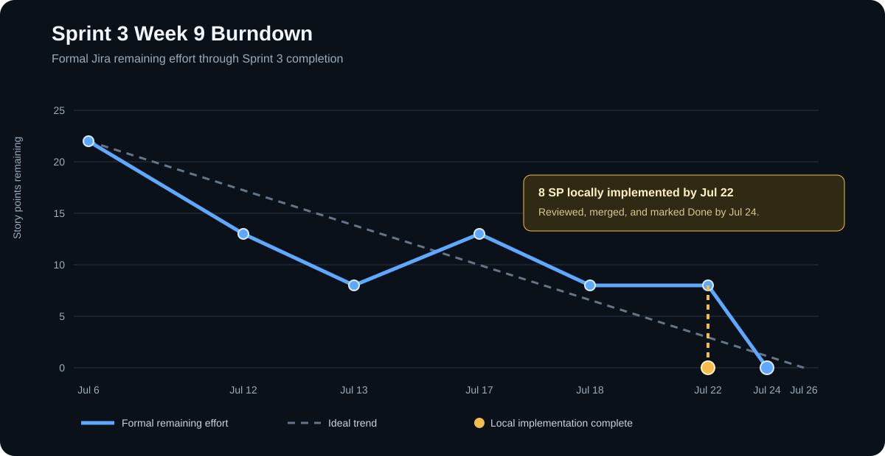

# SentinelOps Weekly Progress Report

# 1. Report Metadata

| Field | Value |
|---|---|
| Course | SWENG 894 - Software Engineering Capstone Experience |
| Project | SentinelOps |
| Student | Eli Vazquez |
| Sprint | Sprint 3 |
| Reporting Week | Week 9 |
| Reporting Period | 2026-07-20 to 2026-07-26 |
| Report Date | 2026-07-24 |
| Report Status | Final Sprint 3 closeout report current through 2026-07-24 |
| Git Repository | <https://github.com/swevazquez/SentinelOpsProject> |
| Jira Board | <https://psu-capstone-sentinelops.atlassian.net/jira/software/projects/SCRUM/boards/1/backlog> |

---

# 2. Sprint Goal and Current Status

Sprint 3 extends the predictive-maintenance MVP with controlled user interaction. The sprint goal is to support manual workflow execution, grounded operational queries, restricted agent tools, auditable tool usage, and explicit approval before an AI-assisted action can start a workflow. The sprint also established the approved C-MAPSS FD001 data contract needed for later Remaining Useful Life model development.

The three remaining security stories were implemented, tested, reviewed, and merged during Week 9. `SCRUM-22`, `SCRUM-23`, and `SCRUM-14` are now Done in Jira, and their individual pull requests passed GitHub CI before merge. Sprint 3 therefore completed all 32 planned story points and satisfied the reviewer-visible Definition of Done.

## Sprint Backlog

| Jira / Requirement | Backlog Item | Priority | Estimate | Jira Status | Week 9 Evidence |
|---|---|---:|---:|---|---|
| SCRUM-11 / FR-11 | Manual Workflow Execution | Medium | 3 SP | Done | Merged through PR #20; regression coverage remains passing. |
| SCRUM-12 / FR-12 | AI-Assisted Operational Queries | Low | 5 SP | Done | Merged through PR #23; query and API regression coverage remains passing. |
| SCRUM-13 / FR-13 | Controlled Agent Tool Access | Low | 3 SP | Done | Merged through PR #21; tool-policy regression coverage remains passing. |
| SCRUM-14 / FR-14 | Approval-Gated Operational Actions | Low | 3 SP | Done | Merged through PR #27; exact single-use approval, inline Assistant review, workflow traceability, and desktop/tablet UAT passed. |
| SCRUM-22 / NFR-06 | Restricted AI-Assisted Workflow Actions | High | 3 SP | Done | Merged through PR #25; approved-action policy and security tests passed. |
| SCRUM-23 / NFR-07 | Agent Tool Usage Logging | Medium | 2 SP | Done | Merged through PR #26; audit outcome, correlation, and sanitization tests passed. |
| SCRUM-28 / SAC | ML-Based RUL Algorithm Specification | High | 3 SP | Done | Instructor-approved specification remains the implementation baseline. |
| SCRUM-29 / UI | Operational Dashboard Modernization | Medium | 5 SP | Done | Merged through PR #22; responsive UI regression remains passing. |
| SCRUM-30 / SAC | C-MAPSS FD001 Data and RUL Contract | High | 5 SP | Done | Merged through PR #24; parser, label, partition, and metadata tests remain passing. |

## Definition of Done

| Area | Criteria Applied to Every Sprint Item |
|---|---|
| Requirements | Scope and acceptance criteria are traceable to Jira and the source requirements. |
| Design | Affected API, security, agent, data, workflow, or UI behavior is documented. |
| Development | The implementation stays within the existing component boundaries and introduces no uncontrolled operational writes. |
| Testing | Success, validation, failure, security, and replay paths are implemented and executed. |
| Integration | Behavior is exercised through its real API, workflow, persistence, model-tool, or dashboard boundary. |
| Documentation | Reviewer-facing interfaces, rationale, test evidence, and traceability are current. |
| Review | Each story uses its own branch and pull request and is reviewed before merge. |
| Validation | Focused tests, full CI, and required desktop/tablet inspection pass. |

## Acceptance Criteria

| Requirement | Acceptance Criteria |
|---|---|
| FR-11 | A supported workflow can be started and observed through running, completed, or failed status; malformed requests cause no execution. |
| FR-12 | Supported questions return grounded asset, prediction, or workflow answers through approved tools without fabricated data. |
| FR-13 | Only registered read-only tools with closed schemas and exact validated arguments can execute. |
| FR-14 | No AI-assisted action executes before explicit approval; one approval authorizes only the exact reviewed request once. |
| NFR-06 | Undefined, malformed, modified, denied, expired, or replayed AI-assisted actions are rejected before operational writes. |
| NFR-07 | Every agent operation attempt records a timestamp, correlation context, outcome, duration, and sanitized error category without raw arguments or secrets. |
| SAC Specification | The approved proposal defines the Random Forest RUL approach, evaluation, limitations, and implementation sequence. |
| UI Modernization | Overview, Assets, Workflows, and Assistant preserve live behavior and consistent desktop/tablet interactions. |
| SAC Data Contract | FD001 parsing, capped RUL labels, engine-level partitions, source identity, and versioned metadata are reproducible and validated. |

---

# 3. Backlog Grooming

## Sprint Backlog Changes

| Change | Item | Description | Rationale | Impact |
|---|---|---|---|---|
| Status completed | SCRUM-22 / NFR-06 | Moved from To Do through In Progress to Done after PR #25 was reviewed and merged. | Restriction policy had to exist before audit and approval behavior could safely use a write-capable action. | Establishes the closed action schema and immutable request fingerprint used by the remaining controls. |
| Status completed | SCRUM-23 / NFR-07 | Moved from To Do through In Progress to Done after PR #26 was reviewed and merged. | Audit logging needed to observe read tools, rejected operations, approval requests, decisions, executions, and replays. | Adds sanitized JSON Lines evidence and raises the full regression suite from 103 to 107 tests at this branch point. |
| Status completed | SCRUM-14 / FR-14 | Moved from To Do through In Progress to Done after PR #27 was reviewed and merged. | Approval execution depends on the action fingerprint and audit event contracts. | Adds exact, expiring, single-use approval, inline review, API and workflow traceability, and raises the final suite to 117 tests. |

No Sprint 3 scope, priority, or estimate changed during this reporting period. The only sprint-backlog changes were the expected status transitions for the three completed stories. Jira now records every Sprint 3 story as Done.

## Product Backlog Changes

No significant product backlog changes occurred during this reporting period. `SCRUM-31`, `SCRUM-32`, and `SCRUM-33` remain To Do in the product backlog and preserve the approved sequence for Random Forest training, RUL workflow integration, and user-facing RUL explanations. No item was added, removed, reprioritized, or re-estimated in Week 9.

---

# 4. Source Code Development

## Summary of Recent Contributions

Week 9 completed the security and observability boundary required by the Sprint 3 goal:

- Added one closed-schema AI-assisted action with exact workflow validation, immutable arguments, and a stable request fingerprint.
- Added sanitized, correlated audit events for every agent operation outcome.
- Added ten-minute, exact-match, single-use approvals that block modified, replayed, denied, expired, or unapproved requests and preserve the approval ID on the workflow.
- Added inline Assistant approval controls and a completed-workflow link that preserves the conversation when result details close.
- Added unit, integration, security, API, workflow, and UI contract tests and increased the full suite from 98 tests at the end of Week 8 to 117 tests.

## Repository Information

| Resource | Link |
|---|---|
| Git Repository | <https://github.com/swevazquez/SentinelOpsProject> |
| Jira Board | <https://psu-capstone-sentinelops.atlassian.net/jira/software/projects/SCRUM/boards/1/backlog> |

## Important Commits

Each Week 9 story was reviewed through its own pull request and merged after CI passed.

| Commit | Contribution | Requirement | Review Evidence |
|---|---|---|---|
| [`6f7cba1`](https://github.com/swevazquez/SentinelOpsProject/commit/6f7cba12003487cf196567fe8e88b31552fef0de) | Restrict AI-assisted workflow actions | SCRUM-22 / NFR-06 | [PR #25](https://github.com/swevazquez/SentinelOpsProject/pull/25), merged as [`871c11e`](https://github.com/swevazquez/SentinelOpsProject/commit/871c11e6e8c0733bfe307979605aa5f26a8d417c). |
| [`17a9391`](https://github.com/swevazquez/SentinelOpsProject/commit/17a939187b2e3af53a2bb131eb68fc72b244fdbe) | Add agent operation audit logging | SCRUM-23 / NFR-07 | [PR #26](https://github.com/swevazquez/SentinelOpsProject/pull/26), merged as [`059f14d`](https://github.com/swevazquez/SentinelOpsProject/commit/059f14de660bd3673b92a6d773215e43458b91c1). |
| [`03a29e7`](https://github.com/swevazquez/SentinelOpsProject/commit/03a29e7bc323cb8553c0a335578214385edb430f) | Add approval-gated operational actions | SCRUM-14 / FR-14 | [PR #27](https://github.com/swevazquez/SentinelOpsProject/pull/27), merged as [`9f145c6`](https://github.com/swevazquez/SentinelOpsProject/commit/9f145c6f47856f1e73d56619dd4efb419fbbc27b). |
| [`ee1a117`](https://github.com/swevazquez/SentinelOpsProject/commit/ee1a117964f3c0c04a9d1ac4a028da684224bd57), [`23fdbbd`](https://github.com/swevazquez/SentinelOpsProject/commit/23fdbbd42b7291df37d3b28da60761e8c87cc13c), [`7883ad2`](https://github.com/swevazquez/SentinelOpsProject/commit/7883ad21859c70ab41240d79ce58c4bd56e4cf89) | Refine inline approval, preserve the Assistant after result review, and keep result state out of refreshes | SCRUM-14 / FR-14 | Reviewed and merged through PR #27. |

## Burndown Summary

| Metric | Value |
|---|---:|
| Initial Sprint Scope | 22 story points |
| Current Sprint Scope | 32 story points |
| Jira Done | 32 story points |
| Formal Remaining Effort | 0 story points |
| Implemented, Reviewed, and Merged | 32 story points |
| Remaining Engineering Implementation | 0 story points |
| Remaining Definition-of-Done Work | None |
| Sprint Status | Complete before the July 26 close |

The formal burndown reached zero on July 24 after PRs #25, #26, and #27 were reviewed, merged, and reflected as Done in Jira. The chart preserves the July 22 local-implementation milestone while distinguishing it from the later formal completion point.



---

# 5. Software Testing

## Test Result Summary

All automated test groups passed on 2026-07-24 from the merged Sprint 3 baseline.

| Test Level | Command | Result | Coverage |
|---|---|---|---|
| Unit | `uv run pytest -q tests/unit` | 94 tests and 24 parameterized subtests passed | Actions, approvals, audit records, assistant coordination, tools, dashboard interaction contracts, API operations, ML, simulator, features, storage, and workflow status. |
| Integration | `uv run pytest -q tests/integration` | 16 tests passed | Assistant queries/actions, approval API, manual workflow API, scoring persistence, and the telemetry-to-features workflow. |
| System and Architecture | `uv run pytest -q tests/system tests/architecture` | 7 tests passed | Clean checkout, repeated demo performance, and component dependency boundaries. |
| Full Regression | `uv run ./scripts/check-ci.sh` | 117 tests passed; workflow smoke, DAG syntax, generated-data safeguards, JavaScript syntax, and Markdown checks passed | Entire merged Sprint 1-3 baseline. |
| User Acceptance | Desktop at 1248x720 and tablet at 900x1000 | Passed | Inline Assistant action proposal, visible impact/fingerprint/expiration, Reject behavior, approval and completion, completed-workflow link, return to the Assistant, clean refresh, responsive layout, and clean browser console. |

The only observed warning is a Starlette deprecation notice for the current TestClient HTTPX integration. It does not fail tests or change behavior, but it should be addressed during dependency maintenance.

## Requirement-to-Test Traceability Matrix

| Requirement | Test Case | Type | Objective | Implementation Evidence | Status |
|---|---|---|---|---|---|
| SCRUM-11 / FR-11 | TC-FR11-01 | Integration / System | Start the supported workflow, observe completion/failure, and reject invalid requests. | [`test_manual_workflow_api.py`](../../tests/integration/test_manual_workflow_api.py), [`test_workflow_status.py`](../../tests/unit/test_workflow_status.py), [commit `b49b145`](https://github.com/swevazquez/SentinelOpsProject/commit/b49b1456f3cea66179ccdfd4c881f83cf0129f8b) | Passed |
| SCRUM-12 / FR-12 | TC-FR12-01 | Unit / Integration | Return grounded operational answers through selected approved tools without an API key in CI. | [`test_agent_assistant.py`](../../tests/unit/test_agent_assistant.py), [`test_assistant_query_api.py`](../../tests/integration/test_assistant_query_api.py), [commit `d24662b`](https://github.com/swevazquez/SentinelOpsProject/commit/d24662b3bb34551c3bcc0fafec5b844a780d9000) | Passed |
| SCRUM-13 / FR-13 | TC-FR13-01 | Unit / Security | Enforce the read-only registry, closed schemas, and exact argument validation. | [`test_agent_tools.py`](../../tests/unit/test_agent_tools.py), [commit `7c18d61`](https://github.com/swevazquez/SentinelOpsProject/commit/7c18d6165d8c6ab7afc9c1fdcb250edaa42d46b7) | Passed |
| SCRUM-14 / FR-14 | TC-FR14-01 | Integration / UAT | Require explicit approval and permit one exact request once. | [`test_agent_approvals.py`](../../tests/unit/test_agent_approvals.py), [`test_assistant_action_api.py`](../../tests/integration/test_assistant_action_api.py), [PR #27](https://github.com/swevazquez/SentinelOpsProject/pull/27) | Passed |
| SCRUM-22 / NFR-06 | TC-NFR06-01 | Unit / Security | Reject undefined, malformed, modified, non-approved, and replayed action requests before writes. | [`test_agent_actions.py`](../../tests/unit/test_agent_actions.py), [`test_assistant_action_api.py`](../../tests/integration/test_assistant_action_api.py), [PR #25](https://github.com/swevazquez/SentinelOpsProject/pull/25) | Passed |
| SCRUM-23 / NFR-07 | TC-NFR07-01 | Unit / Security | Record one sanitized, correlated event for every agent operation attempt. | [`test_agent_audit.py`](../../tests/unit/test_agent_audit.py), [`test_agent_assistant.py`](../../tests/unit/test_agent_assistant.py), [PR #26](https://github.com/swevazquez/SentinelOpsProject/pull/26) | Passed |
| SCRUM-28 / SAC | TC-SAC-01 | Document Review | Verify algorithm, evaluation, feasibility, visual flow, limitations, and page limit. | [`algorithmic-component.md`](../algorithmic-component.md), [commit `96aa1b1`](https://github.com/swevazquez/SentinelOpsProject/commit/96aa1b173ed96b74ece4d937b201fb318279d47f) | Passed; instructor approved |
| SCRUM-29 / UI | TC-UI-01 | Unit / UAT | Verify API-backed cross-view behavior and responsive interaction consistency. | [`test_dashboard_ui.py`](../../tests/unit/test_dashboard_ui.py), [commit `2e571bb`](https://github.com/swevazquez/SentinelOpsProject/commit/2e571bbe92f9afdfdc960c07729221c9b1141256) | Passed |
| SCRUM-30 / SAC | TC-RUL-DATA-01 | Unit / Integration | Validate parsing, RUL labels, engine partitions, checksum, metadata, and failure behavior. | [`test_cmapss.py`](../../tests/unit/test_cmapss.py), [commit `4ef4706`](https://github.com/swevazquez/SentinelOpsProject/commit/4ef47067d0d08eacd717159f4022f948d7a78853) | Passed |
| Sprint 3 baseline | TC-SPRINT3-01 | Regression / System | Verify all implemented behavior, smoke workflow, DAG, syntax, data safeguards, and documentation together. | [`check-ci.sh`](../../scripts/check-ci.sh) | Passed; 117 tests |

## Reproducible Test Procedures

Run commands from the repository root after `uv sync --extra dev`. The traceability matrix links each procedure to its implementation.

| Test Case | Command or Review | Expected and Observed Result |
|---|---|---|
| TC-FR11-01 | `uv run pytest -q tests/integration/test_manual_workflow_api.py tests/unit/test_workflow_status.py` | Valid workflow execution and completion pass; malformed or unsupported requests cause no workflow. |
| TC-FR12-01 | `uv run pytest -q tests/unit/test_agent_assistant.py tests/integration/test_assistant_query_api.py` | Supported questions use approved tools and sanitized evidence; unsupported scope uses no tool. |
| TC-FR13-01 | `uv run pytest -q tests/unit/test_agent_tools.py` | Registered read tools accept exact schemas; unknown or malformed calls fail before execution. |
| TC-NFR06-01 | `uv run pytest -q tests/unit/test_agent_actions.py tests/integration/test_assistant_action_api.py` | Undefined, modified, denied, and replayed actions cannot create an operational write. |
| TC-NFR07-01 | `uv run pytest -q tests/unit/test_agent_audit.py tests/unit/test_agent_assistant.py` | Agent attempts record sanitized outcomes and correlation data without arguments, prompts, exceptions, or secrets. |
| TC-FR14-01 | `uv run pytest -q tests/unit/test_agent_approvals.py tests/integration/test_assistant_action_api.py` | Only one current, exact, explicitly approved request starts one workflow and retains its approval ID. |
| TC-SAC-01 | Review `docs/algorithmic-component.md` and its flow diagram against the instructor rubric. | The approved specification covers the algorithm, evaluation, feasibility, limitations, and implementation order. |
| TC-UI-01 | `uv run pytest -q tests/unit/test_dashboard_ui.py`, followed by the UAT procedure below. | Fifteen tests and four subtests pass; desktop and tablet interactions remain usable. |
| TC-RUL-DATA-01 | `uv run pytest -q tests/unit/test_cmapss.py` | Parsing, validation, capped labels, disjoint engine partitions, checksums, metadata, and failure paths pass. |
| TC-SPRINT3-01 | `uv run ./scripts/check-ci.sh` | All 117 tests, workflow smoke, DAG syntax, generated-data, JavaScript, and Markdown checks pass. |

### User Acceptance Procedure

1. Start `uv run uvicorn services.api.app:app --reload` and review Overview, Assets, Workflows, and Assistant at 1248x720 and 900x1000.
2. In Assistant, request `Run predictive maintenance` and verify that the inline card shows impact, expiration, and fingerprint without starting a workflow.
3. Reject the request and confirm the workflow count does not change.
4. Submit the request again, select Approve and run, and confirm exactly one workflow starts with the approval ID.
5. Open the completed-workflow link, close its details, and verify the Assistant remains visible. Refresh and confirm the details do not reopen.
6. Confirm there is no overlap, overflow, browser warning, or console error.

All UAT steps passed at both viewport sizes.

## Code Coverage Analysis

Coverage was measured with Python's standard-library `trace` module so the analysis does not add a project dependency:

```bash
mkdir -p /tmp/sentinelops-week9-trace
uv run python -m trace --count --missing --summary \
  --coverdir /tmp/sentinelops-week9-trace \
  --ignore-dir .venv \
  --module unittest discover -s tests
```

Observed coverage on 2026-07-24:

| Scope / Module | Executable Lines | Covered | Missing | Coverage |
|---|---:|---:|---:|---:|
| Service modules reported by `trace` | 1,771 | 1,530 | 241 | 86.4% |
| Week 9 security modules combined | 416 | 394 | 22 | 94.7% |
| `services.agent.actions` | 80 | - | - | 93% |
| `services.agent.approvals` | 150 | - | - | 94% |
| `services.agent.audit` | 54 | - | - | 98% |
| `services.agent.tools` | 132 | - | - | 94% |
| `services.api.app` | 228 | - | - | 89% |

The highest-value Week 9 security paths are covered: allowlisting, schema rejection, immutable fingerprints, pending/approved/denied/expired/consumed approvals, mismatch and replay rejection, audit sanitization, API execution, workflow traceability, and UI contracts. Remaining uncovered lines are mainly defensive branches for malformed persisted approval files, invalid internal clock configuration, duplicate decisions, storage failures, and less common API error mappings.

Broader service coverage is reduced by CLI-only branches and lower-exercised paths in C-MAPSS processing (73%), telemetry simulation (74%), and Spark-compatible feature processing (79%). These are known test-expansion opportunities rather than open acceptance failures. Frontend JavaScript statement coverage is not included in the Python percentage; dashboard behavior is instead covered by contract tests and manual desktop/tablet UAT.

Recommended coverage improvements:

- Add explicit corrupt-approval-file and storage-failure tests.
- Add direct tests for duplicate decisions, unknown approval identifiers, and naive-clock rejection.
- Add CLI invocation tests for C-MAPSS and scoring entry points.
- Add JavaScript coverage instrumentation when a frontend test runner is introduced.
- Add a maintained coverage tool and threshold to CI after selecting a dependency compatible with the project environment.

## Testing Assessment

The Sprint 3 test suite is consistent with the source requirements and acceptance criteria. Every sprint backlog item maps to at least one implemented test case, implementation artifact, and reproducible execution procedure. Unit, integration, system, architecture, document-review, and user-acceptance evidence are represented. No failed or blocked acceptance test remains. All Sprint 3 story branches completed review, merge, and Jira Definition-of-Done transitions.

---

# 6. Sprint Retrospective

## What Went Well

- Implementing the restriction, audit, and approval stories in dependency order produced a clear security boundary. The approved-action fingerprint became the shared contract between the action policy and approval store.
- Separate story branches and commits preserved traceability while still allowing the dependent work to be validated as one stacked Sprint 3 baseline.
- Focused tests caught security-path behavior early, while the full CI suite verified that manual workflows, read-only queries, scoring, data preparation, and documentation remained stable.
- The audit design records useful operational evidence without persisting tool arguments, prompts, exception messages, or secret values.
- Browser-based desktop and tablet review found a real responsive defect before review. Correcting the tablet layout moved the Assistant console to full width and kept the context panels readable below it.
- Iterative acceptance review improved the approval experience from a separate popup to an inline Assistant card, added a completed-workflow link, preserved the Assistant when result details close, and prevented stale result overlays after refresh.
- The standard-library coverage run provided measurable evidence without expanding the dependency footprint late in the sprint.

## What Did Not Go as Well

- The three remaining stories were tightly coupled. Keeping each change reviewable required stacked branches and careful parent-to-child diff review rather than three fully independent implementations.
- The first audit pass covered dispatched tools but missed malformed model arguments rejected before dispatch. Self-review identified the gap and moved that rejection into the audit trail.
- The first tablet layout kept a three-column action card inside a narrow Assistant console. The Review action control overlapped content until the responsive grid was corrected.
- The initial approval experience used a separate popup, which interrupted the conversation. Moving approval inline required follow-up navigation and refresh-state corrections.
- The approval flow added several defensive states at once. Expiration, mismatch, replay, denial, persistence, workflow traceability, and audit outcomes required more cross-boundary tests than the original single acceptance criterion implied.
- The existing Starlette/TestClient deprecation warning adds noise to otherwise clean results and should not remain indefinitely.

## Improvements for the Next Sprint

- Define shared security contracts and failure-state tables during story refinement when several stories cross the same execution boundary.
- Add coverage measurement to the normal CI workflow instead of generating it only during report preparation.
- Add frontend interaction tests with JavaScript statement coverage while retaining browser-based UAT for visual quality.
- Resolve the TestClient dependency warning before the next major framework upgrade.
- Merge dependent stories earlier in the sprint after review so formal burndown more closely reflects completed engineering work.
- Continue focused-test-first implementation, but add explicit persistence-corruption and infrastructure-failure cases during the initial test design rather than during final self-review.

---

# 7. Risks and Roadblocks

| Risk / Roadblock | Impact | Mitigation / Next Step |
|---|---|---|
| Audit and approval data use local JSON/JSONL persistence. | Concurrent multi-process deployment is outside the current consistency guarantees. | Retain the simple file-backed MVP for the capstone; document database-backed coordination as future production work. |
| Starlette TestClient emits a deprecation warning. | Future dependency upgrades may require test-client changes. | Schedule a focused compatibility update without mixing it into Sprint 3 closeout. |
| Coverage measurement is report-time rather than enforced in CI. | Coverage could regress without making the normal validation command fail. | Add a compatible maintained coverage tool and threshold in a future testing story. |

---

# 8. Plan for Next Week

- Confirm the administrative Sprint 3 close after the July 26 sprint boundary.
- Groom `SCRUM-31` for the next sprint and begin Random Forest RUL training on the completed security baseline.
- Carry the coverage automation and TestClient compatibility improvements into future testing work.

---

# 9. Overall Sprint Assessment

Sprint 3 reached its planned goal before the July 26 close. All 32 planned story points are Done in Jira, and PRs #25, #26, and #27 are merged into `main`. The merged baseline passes 117 automated tests, system validation, coverage analysis, and desktop/tablet user acceptance review. The completed increment now combines restricted agent actions, sanitized audit evidence, exact single-use approvals, and a conversational inline approval experience. The next engineering priority is `SCRUM-31`, which begins Random Forest RUL training on this completed security baseline.
