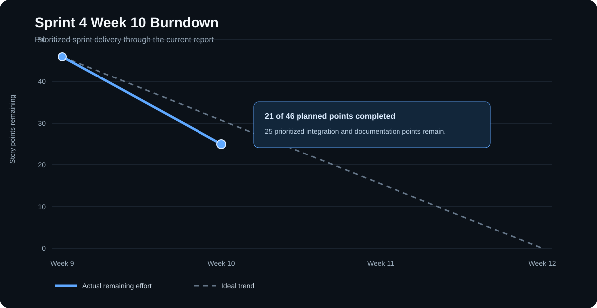

# SentinelOps Weekly Progress Report

# 1. Report Metadata

| Field | Value |
|---|---|
| Course | SWENG 894 - Software Engineering Capstone Experience |
| Project | SentinelOps |
| Student | Eli Vazquez |
| Sprint | Sprint 4 |
| Reporting Week | Week 10 |
| Reporting Period | 2026-07-27 to 2026-08-02 |
| Report Date | 2026-07-31 |
| Report Status | Current through 2026-07-31 |
| Git Repository | <https://github.com/swevazquez/SentinelOpsProject> |
| Jira Board | <https://psu-capstone-sentinelops.atlassian.net/jira/software/projects/SCRUM/boards/1/backlog> |

---

# 2. Sprint Goal and Planning

Sprint 4 completes the predictive-maintenance MVP. The goal is to train and integrate the Random Forest Remaining Useful Life (RUL) model, expose its results to users, connect the workflow to PostgreSQL, Spark, Airflow, and Docker Compose, and reconcile the final documentation with the delivered system.

## Groomed Product Backlog

During sprint planning, the product backlog was reviewed for priority, dependencies, effort, and realistic solo-developer capacity. Eight stories totaling 46 points were selected. The backlog first delivers the RUL implementation , then completes the highest-priority integration path and final documentation. All committed stories are estimated.

| Jira | Product Backlog Item | Priority | Estimate | Status |
|---|---|---:|---:|---|
| SCRUM-31 | Random Forest RUL Training and Evaluation | Highest | 8 SP | Done |
| SCRUM-32 | RUL Workflow Integration | Highest | 8 SP | Done |
| SCRUM-33 | RUL Results and Explanation | Highest | 5 SP | Done |
| SCRUM-36 | PostgreSQL Persistence | High | 5 SP | To Do |
| SCRUM-37 | Spark Batch Processing | High | 5 SP | To Do |
| SCRUM-35 | Final Airflow Orchestration | High | 5 SP | To Do |
| SCRUM-34 | Integrated Docker Compose Deployment | High | 5 SP | To Do |
| SCRUM-26 | Final Readable Project Documentation | Medium | 5 SP | To Do |

The planned sequence is `SCRUM-31 -> SCRUM-32 -> SCRUM-33 -> SCRUM-36 -> SCRUM-37 -> SCRUM-35 -> SCRUM-34 -> SCRUM-26`. The first three stories establish the model and user-facing workflow. PostgreSQL then establishes persistence, Spark provides batch processing, Airflow coordinates the workflow, Docker Compose packages the system, and documentation is finalized from verified behavior. With 21 points complete, the remaining commitment is 25 points.

## Sprint Backlog

| Order | Jira | Sprint Outcome | Estimate | Status |
|---:|---|---|---:|---|
| 1 | SCRUM-31 | Train and evaluate the Random Forest RUL model. | 8 SP | Done |
| 2 | SCRUM-32 | Integrate versioned RUL inference with workflows and APIs. | 8 SP | Done |
| 3 | SCRUM-33 | Present and explain RUL results through the dashboard and Assistant. | 5 SP | Done |
| 4 | SCRUM-36 | Store predictions and workflow state in PostgreSQL. | 5 SP | To Do |
| 5 | SCRUM-37 | Run feature preparation and batch RUL scoring through local Spark. | 5 SP | To Do |
| 6 | SCRUM-35 | Coordinate the final predictive-maintenance workflow through Airflow. | 5 SP | To Do |
| 7 | SCRUM-34 | Start the integrated application through Docker Compose. | 5 SP | To Do |
| 8 | SCRUM-26 | Complete readable setup, usage, architecture, testing, and demonstration documentation. | 5 SP | To Do |

## Definition of Done

| Area | Criteria Applied to Every Sprint Item |
|---|---|
| Requirements | Scope and acceptance criteria are traceable to Jira and the implemented requirement. |
| Design | Affected persistence, processing, orchestration, deployment, or documentation decisions are current. |
| Development | The implementation follows existing component boundaries and avoids duplicated business logic. |
| Testing | Success, failure, traceability, and regression behavior are tested at the appropriate level. |
| Integration | The change is exercised through its real repository, Spark, Airflow, API, or container boundary. |
| Documentation | Setup, architecture, testing, and user instructions are updated when affected. |
| Review | The story uses a dedicated branch and pull request and passes CI before merge. |
| Validation | Acceptance criteria are supported by reproducible commands or observable review evidence. |

## Acceptance Criteria

| Jira | Acceptance Criteria |
|---|---|
| SCRUM-31 | Training produces a repeatable Random Forest RUL model, reports model and baseline metrics, stores versioned metadata, and rejects incompatible data. |
| SCRUM-32 | Compatible trajectories produce nonnegative, traceable RUL results with documented maintenance classifications. Invalid artifacts fail without damaging stored results. |
| SCRUM-33 | The dashboard and Assistant present grounded RUL results, supporting metadata, recommendations, and clear unavailable states without confusing RUL with risk. |
| SCRUM-36 | Predictions and workflow state persist in PostgreSQL, remain available after restart, preserve traceability, and fail safely when the database is unavailable. The existing file-backed option remains functional. |
| SCRUM-37 | A local Spark job processes compatible input, produces traceable RUL results, writes through the shared persistence interface, and fails safely for invalid input or artifacts. |
| SCRUM-35 | The final Airflow DAG loads successfully, executes the Spark-based workflow in the correct order, records success or failure, and exposes completed results through FastAPI. |
| SCRUM-34 | `docker compose up --build` starts the real FastAPI application, PostgreSQL, and Airflow with observable health checks. Documented startup and shutdown work from a clean checkout without hidden configuration. |
| SCRUM-26 | Setup, usage, architecture, testing, and demonstration documentation is readable, consistent with the final implementation, and sufficient for reviewer and end-user evaluation. |

---

# 3. Source Code Development

## Summary of Recent Contributions

Recent development completed the RUL implementation that the remaining integration stories will support:

- Trained and evaluated a seeded Random Forest model using NASA C-MAPSS FD001, engine-isolated partitions, causal temporal features, and training-only preprocessing.
- Persisted a versioned model artifact with feature metadata, importance, MAE, RMSE, and median-baseline comparison.
- Integrated RUL inference with the predictive workflow, maintenance classifications, prediction persistence, failure reporting, and FastAPI retrieval.
- Made RUL the default workflow while preserving the deterministic path for explicit development and test use.
- Added a repeatable four-engine, four-checkpoint demonstration.
- Added dashboard and Assistant explanations, workflow summaries, cumulative notifications, notification acknowledgment, Clear all, and repeatable reset behavior.
- Updated requirements, architecture, algorithm, service, dashboard, and setup documentation for the implemented RUL workflow.

## Repository Information

| Resource | Link |
|---|---|
| Git Repository | <https://github.com/swevazquez/SentinelOpsProject> |
| Jira Board | <https://psu-capstone-sentinelops.atlassian.net/jira/software/projects/SCRUM/boards/1/backlog> |

## Important Commits

| Commit | Contribution | Review Evidence |
|---|---|---|
| [`0c08a7a`](https://github.com/swevazquez/SentinelOpsProject/commit/0c08a7a06f3004bbad20289d60b06519a132f426) | Train and evaluate the Random Forest RUL model. | [PR #28](https://github.com/swevazquez/SentinelOpsProject/pull/28) |
| [`dbf8472`](https://github.com/swevazquez/SentinelOpsProject/commit/dbf847204cadac1218c0179b09cefc4454dd2a59) | Integrate versioned RUL inference with workflows, persistence, and APIs. | [PR #29](https://github.com/swevazquez/SentinelOpsProject/pull/29) |
| [`750c462`](https://github.com/swevazquez/SentinelOpsProject/commit/750c462507514374ae6eb5eb84fd783fd3347ea1) | Expose and explain RUL through the dashboard, Assistant, API, and documentation. | [PR #30](https://github.com/swevazquez/SentinelOpsProject/pull/30) |
| [`dc74549`](https://github.com/swevazquez/SentinelOpsProject/commit/dc745492688be0fecbe5e759dc0efe6b571a2a26) | Make RUL the repeatable default workflow. | [PR #30](https://github.com/swevazquez/SentinelOpsProject/pull/30) |
| [`5cdb755`](https://github.com/swevazquez/SentinelOpsProject/commit/5cdb7555c03011c202ed3da4ebdd5ae734763669), [`64e4528`](https://github.com/swevazquez/SentinelOpsProject/commit/64e45289f9b9445769cea4d8a1a59eef48cadfda) | Accumulate, acknowledge, and clear operational notifications. | [PR #30](https://github.com/swevazquez/SentinelOpsProject/pull/30) |

## Burndown Summary

| Metric | Value |
|---|---:|
| Planned Sprint Delivery | 46 story points |
| Completed RUL Delivery | 21 story points |
| Committed Remaining Scope | 25 story points |
| Percent Complete | 45.7% |
| Sprint Status | On track for the prioritized commitment |

The burndown tracks the 21 completed RUL points and the 25 points planned for the remaining integration and documentation work. The trend shows progress from the prior report through the current status and ends with Week 12.



---

# 4. Software Testing

## Testing Overview

As of this report, the project has a validated baseline of 141 automated tests. The full validation command also checks the workflow smoke path, Airflow DAG syntax, generated-data safeguards, and Markdown readability. Expected failure messages in the test output verify controlled error paths and do not represent failed tests.

```bash
UV_CACHE_DIR=/tmp/sentinelops-uv-cache uv run ./scripts/check-ci.sh
```

One non-blocking Starlette TestClient deprecation warning remains.

## Requirement-to-Test Traceability Matrix

| Jira | Test Case | Type | Objective | Status |
|---|---|---|---|---|
| SCRUM-31 | TC-S4-31 | Unit | Verify feature preparation, repeatable training, evaluation, artifact metadata, and invalid-input handling. | Passed |
| SCRUM-32 | TC-S4-32 | Unit / Integration | Verify RUL inference, classifications, persistence, API traceability, and safe failure. | Passed |
| SCRUM-33 | TC-S4-33 | Unit / E2E / UAT | Verify RUL presentation, Assistant grounding, unavailable states, and repeatable demonstration behavior. | Passed |
| SCRUM-36 | TC-S4-36 | Contract / Integration | Verify PostgreSQL persistence, restart recovery, traceability, fallback behavior, and safe failure. | Planned |
| SCRUM-37 | TC-S4-37 | Unit / Integration | Verify local Spark processing, RUL output, traceability, shared persistence, and safe failure. | Planned |
| SCRUM-35 | TC-S4-35 | Unit / Integration | Verify DAG loading, task order, shared-service execution, status reporting, and API retrieval. | Planned |
| SCRUM-34 | TC-S4-34 | Integration / System | Verify clean Compose startup, service health, configuration failure, dashboard access, and shutdown. | Planned |
| SCRUM-26 | TC-S4-26 | Document Review / UAT | Verify final instructions and documents against the implemented application. | Planned |

## Test Case Specifications

Commands are run from the repository root. Planned test filenames may be refined in each story branch, but the observable results must remain consistent with these specifications.

### TC-S4-31 - Random Forest RUL Training

| Field | Specification |
|---|---|
| Preconditions | Development dependencies and the approved FD001 fixture or prepared partitions are available. |
| Command | `uv run pytest -q tests/unit/test_rul_training.py` |
| Expected Result | Training is repeatable, validation remains engine-isolated, metrics and complete versioned metadata are stored, and invalid partitions create no artifact. |
| Evidence | [`test_rul_training.py`](../../tests/unit/test_rul_training.py) and [PR #28](https://github.com/swevazquez/SentinelOpsProject/pull/28). |
| Cleanup | Temporary artifacts are removed by the test fixtures. |
| Status | Passed |

Procedure: run the focused command, confirm all training cases pass, inspect the generated metadata assertions, and run the full CI suite.

### TC-S4-32 - RUL Workflow Integration

| Field | Specification |
|---|---|
| Preconditions | Tests can create an isolated model artifact, workflow store, and prediction store. |
| Command | `uv run pytest -q tests/unit/test_rul_inference.py tests/integration/test_manual_workflow_api.py` |
| Expected Result | Valid input produces nonnegative traceable RUL and maintenance terms; APIs return stored results; corrupt input records failure without changing prior predictions. |
| Evidence | [`test_rul_inference.py`](../../tests/unit/test_rul_inference.py), [`test_manual_workflow_api.py`](../../tests/integration/test_manual_workflow_api.py), and [PR #29](https://github.com/swevazquez/SentinelOpsProject/pull/29). |
| Cleanup | Temporary repositories and artifacts are removed by the fixtures. |
| Status | Passed |

Procedure: run the focused command, verify success and safe-failure cases, confirm API traceability, and run the full CI suite.

### TC-S4-33 - RUL Results and Explanation

| Field | Specification |
|---|---|
| Preconditions | Automated tests use isolated application state; manual review uses a prepared model and running FastAPI application. |
| Command | `uv run pytest -q tests/e2e/test_rul_experience.py tests/unit/test_rul_demo.py tests/unit/test_dashboard_ui.py tests/unit/test_agent_assistant.py` |
| Expected Result | RUL reaches the API, dashboard, and Assistant; responses remain grounded; unavailable values are not fabricated; reset supports a repeatable four-checkpoint demonstration. |
| Evidence | [`test_rul_experience.py`](../../tests/e2e/test_rul_experience.py), [`test_rul_demo.py`](../../tests/unit/test_rul_demo.py), and [PR #30](https://github.com/swevazquez/SentinelOpsProject/pull/30). |
| Cleanup | Reset the demo and stop Uvicorn after manual review. |
| Status | Passed |

Procedure: run the focused command; start the application; execute all four lifecycle checkpoints; verify details, Assistant evidence, notifications, and reset; then run the full CI suite.

### TC-S4-36 - PostgreSQL Persistence

| Field | Specification |
|---|---|
| Preconditions | PostgreSQL is available with an isolated test database and documented environment configuration. |
| Test Data | One traceable RUL prediction, one workflow record, an unavailable-database case, and an interrupted-write case. |
| Command | `uv run pytest -q tests/unit/test_repository_contract.py tests/integration/test_postgresql_persistence.py` |
| Expected Result | File and PostgreSQL repositories satisfy the same interface; committed records survive an API restart; traceability is preserved; failed writes do not report success or damage the last valid record. |
| Evidence | Repository contract tests, integration tests, schema initialization, and the SCRUM-36 pull request. |
| Cleanup | Remove the isolated test schema and stop the test database. |
| Status | Planned |

Procedure:

1. Initialize the isolated schema and run the repository contract against both persistence implementations.
2. Store a workflow record and RUL prediction, restart the API, and retrieve both records.
3. Disable the database and interrupt a write to confirm safe failure and preservation of the last commit.
4. Run the complete CI suite in file-backed mode to verify existing behavior remains functional.

### TC-S4-37 - Spark Batch Processing

| Field | Specification |
|---|---|
| Preconditions | Java and local PySpark are available with a compatible input, model artifact, and persistence repository. |
| Test Data | Demonstration-scale trajectories plus malformed input, missing artifact, and incompatible feature-contract cases. |
| Command | `uv run pytest -q tests/unit/test_spark_rul_job.py tests/integration/test_spark_rul_pipeline.py` |
| Expected Result | Local Spark produces nonnegative RUL results with complete traceability, writes through the shared repository, and fails safely without an external Spark cluster. |
| Evidence | Spark unit and integration tests, local execution output, API retrieval, and the SCRUM-37 pull request. |
| Cleanup | Stop the local Spark context and remove temporary input and output data. |
| Status | Planned |

Procedure:

1. Run the Spark configuration and transformation tests.
2. Execute the documented local Spark job with compatible demonstration data.
3. Verify the expected results and traceability fields through the persistence interface and FastAPI.
4. Run invalid-input and incompatible-artifact cases and confirm that no false success is recorded.

### TC-S4-35 - Final Airflow Orchestration

| Field | Specification |
|---|---|
| Preconditions | The final DAG, valid RUL artifact, Spark entry point, and persistence repository are available. |
| Test Data | One compatible workflow input and one controlled task-failure input. |
| Command | `uv run pytest -q tests/unit/test_final_airflow_dag.py tests/integration/test_airflow_rul_workflow.py` |
| Expected Result | The DAG imports cleanly, preserves task order, delegates to shared services, records success or sanitized failure, and exposes completed results through FastAPI. |
| Evidence | DAG tests, workflow records, API responses, Airflow run evidence, and the SCRUM-35 pull request. |
| Cleanup | Remove isolated workflow records and stop local Airflow services. |
| Status | Planned |

Procedure:

1. Run DAG import and task-structure tests without the full Airflow service.
2. Start Airflow and trigger the final DAG with valid input.
3. Verify dependency order, completed workflow status, and prediction retrieval through FastAPI.
4. Trigger the controlled failure and verify the failed step, run identifier, and sanitized error.

### TC-S4-34 - Integrated Docker Compose Deployment

| Field | Specification |
|---|---|
| Preconditions | Docker with Compose is available from a clean checkout with documented configuration. |
| Test Data | Valid configuration and one run with required configuration removed. |
| Command | `docker compose config && docker compose up --build --wait` followed by `curl --fail http://127.0.0.1:8000/api/health`. |
| Expected Result | FastAPI, PostgreSQL, and Airflow become healthy in dependency order; the dashboard loads on port 8000; invalid configuration fails clearly; shutdown preserves documented data. |
| Evidence | Compose configuration, health output, clean-checkout execution log, and the SCRUM-34 pull request. |
| Cleanup | `docker compose down` |
| Status | Planned |

Procedure:

1. Validate the resolved Compose configuration.
2. Build and start the stack while waiting for service health.
3. Open the dashboard and query the readiness endpoint.
4. Stop and restart the stack to confirm the documented persistence behavior.
5. Repeat with missing configuration and confirm clear failure without exposed credentials.

### TC-S4-26 - Final Documentation Review

| Field | Specification |
|---|---|
| Preconditions | The final implementation and SRS, SADD, STR, end-user manual, README, and component documentation are available. |
| Test Data | Final setup instructions, maintenance-manager workflows, requirements, architecture views, and test traceability. |
| Review | Execute the documented setup and user workflows, run `uv run ./scripts/check-ci.sh`, and inspect Markdown and PDF outputs for accuracy and readability. |
| Expected Result | A reviewer can deploy the application, and a maintenance manager can execute supported features without undocumented knowledge. All documents describe only implemented behavior. |
| Evidence | Completed review checklist, screenshots, corrected links, passing validation, and the SCRUM-26 pull request. |
| Cleanup | Stop services used during instruction validation. |
| Status | Planned |

Procedure:

1. Compare every documented feature and requirement with the merged application.
2. Follow setup and deployment instructions from a clean environment.
3. Execute each maintenance-manager workflow exactly as documented.
4. Verify screenshots, links, terminology, architecture, and test traceability.
5. Remove unfinished scope and confirm the final Markdown and PDF files are readable.

## Testing Assessment

Every committed Sprint 4 story maps to a test specification. Completed RUL stories have passing evidence, while planned integration and documentation stories define their setup, execution, expected results, failure behavior, evidence, and cleanup. The 141-test baseline remains the regression requirement for each story branch.

---

# 5. Risks and Mitigation

| Risk | Impact | Mitigation |
|---|---|---|
| PostgreSQL, Spark, Airflow, and Compose depend on shared interfaces. | An upstream delay can block final integration. | Complete and validate each story in dependency order. |
| C-MAPSS FD001 is a controlled turbofan dataset. | The demonstration does not establish production validity for vehicle assets. | Keep dataset and model identity visible and document the limitation. |
| Final-documentation drafts precede final infrastructure work. | Documents may become inconsistent with the delivered system. | Finalize documentation only after the integration stories are verified. |
| Starlette TestClient emits a deprecation warning. | A future dependency update may require test changes. | Address it through focused maintenance without expanding current story scope. |

No blocker currently prevents work on the prioritized sprint backlog.

---

# 6. Plan for Next Week

- Implement `SCRUM-36` PostgreSQL persistence while retaining the file-backed option.
- Implement `SCRUM-37` through a local Spark job that uses the existing RUL and persistence contracts.
- Begin `SCRUM-35` after the Spark interface is stable.
- Keep final documentation aligned with merged behavior.

---

# 7. Overall Sprint Assessment

Sprint 4 planned 46 points across the RUL delivery, final integration path, and documentation. The first 21 points are complete, leaving 25 points for PostgreSQL, Spark, Airflow, Docker Compose, and final documentation. The current plan remains achievable if these stories are completed in dependency order and documentation is finalized from verified behavior.
