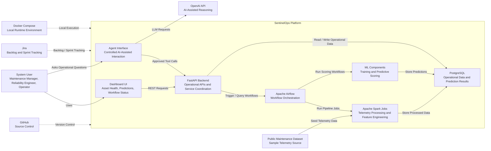
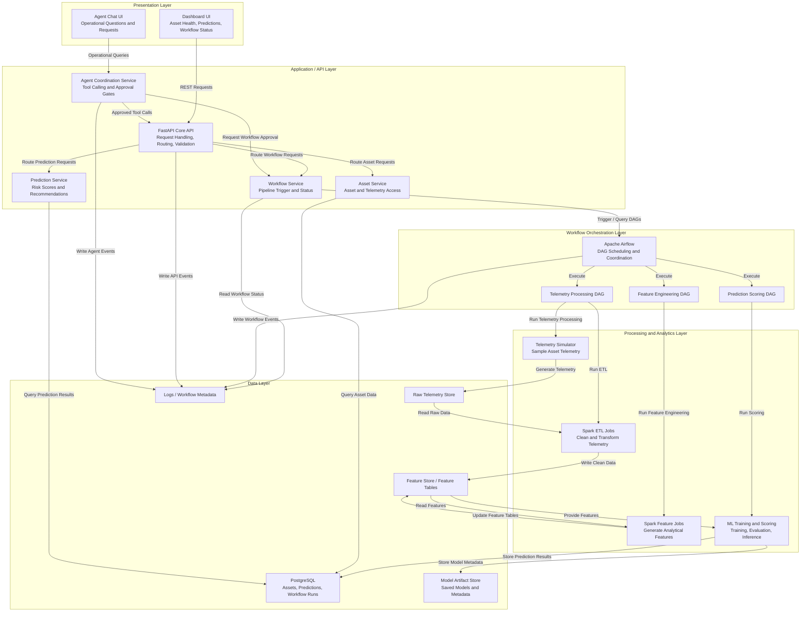
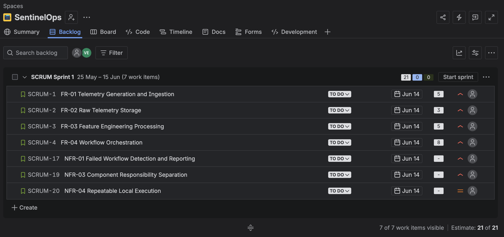

<!-- ========================================================= -->
<!-- STYLING -->
<!-- ========================================================= -->

<!-- ========================================================= -->
<!-- TITLE PAGE -->
<!-- ========================================================= -->

SWENG 894: Software Engineering Capstone Experience

# SentinelOps Requirements & Architecture

Prepared by:

Eli Vazquez

 

Date:

May 22, 2026

<!-- ========================================================= -->
<!-- TABLE OF CONTENTS -->
<!-- ========================================================= -->

Table of Contents

- Business Goals and Technical Objectives
  - Business Goals
  - Technical Objectives

- Quality Attributes
  - Quality Attribute Prioritization Rationale

- Stakeholders
  - Stakeholder Considerations

- Requirements
  - Functional Requirements
  - Non-Functional Requirements

- User Stories
  - Functional Requirements Backlog
  - Non-Functional Requirements Backlog

- Architectural Requirements and Design
  - Architectural Requirements
  - Architecture Design
  - System Context Diagram
  - Internal Layered Architecture Diagram
  - Predictive Maintenance Workflow Diagram
  - Component Responsibilities
  - Architecture Rationale

- Agile Board
  - Agile Board Snapshot

<!-- ========================================================= -->
<!-- MAIN CONTENT -->
<!-- ========================================================= -->

# Business Goals and Technical Objectives

The SentinelOps project is intended to demonstrate how modern software engineering practices, data engineering workflows, predictive analytics, and AI-assisted operational interactions can support predictive maintenance environments. The business goals establish the high-level operational outcomes the system is intended to support, while the technical objectives define the engineering capabilities required to achieve those goals.

The relationship between business goals and technical objectives provides traceability between operational needs, architectural decisions, and future implementation activities. These objectives will guide requirements development, sprint planning, architecture evolution, and quality attribute identification throughout the capstone lifecycle.

## Business Goals

| ID | Business Goal | Description |
|---|---|---|
| BG-01 | Improve operational visibility into asset health and maintenance risk | Provide users with centralized visibility into telemetry, predictions, workflow execution, and maintenance recommendations. |
| BG-02 | Reduce the effort required to analyze telemetry and maintenance indicators | Simplify the process of interpreting telemetry data and identifying maintenance priorities. |
| BG-03 | Centralize predictive maintenance workflows into a coordinated platform | Integrate telemetry ingestion, processing, orchestration, scoring, and reporting into a unified operational workflow. |
| BG-04 | Demonstrate practical integration of orchestration, machine learning, and AI-assisted operational tooling | Explore how modern operational analytics systems can combine workflow automation, predictive analysis, and controlled AI interactions. |
| BG-05 | Maintain a modular and maintainable software architecture | Ensure the system remains understandable, extensible, and manageable throughout development and future evolution. |

## Technical Objectives

The following technical objectives define the primary engineering capabilities that SentinelOps will prioritize during development.

| ID | Technical Objective | Description | Related Business Goals |
|---|---|---|---|
| TO-01 | Implement telemetry ingestion and processing workflows | Develop workflows capable of generating, ingesting, transforming, and processing telemetry data into structured analytical features. | BG-01, BG-02, BG-03 |
| TO-02 | Implement workflow orchestration capabilities | Coordinate telemetry processing, ETL execution, predictive scoring, and reporting activities through scheduled and repeatable workflows. | BG-03, BG-04 |
| TO-03 | Implement predictive maintenance analytics | Develop machine learning components capable of generating predictive maintenance indicators and operational risk summaries. | BG-01, BG-02 |
| TO-04 | Provide operational APIs and dashboard visibility | Expose asset status, workflow execution, prediction results, and operational metrics through APIs and dashboard interfaces. | BG-01, BG-03 |
| TO-05 | Implement controlled AI-assisted operational interactions | Provide AI-assisted operational visibility and system interaction through approval-gated and auditable tool access. | BG-02, BG-04 |
| TO-06 | Maintain a modular layered architecture | Separate responsibilities across presentation, orchestration, processing, analytics, and persistence layers to improve maintainability and extensibility. | BG-05 |

# Quality Attributes

The following quality attributes are prioritized based on their importance to SentinelOps as a predictive maintenance platform. Because the system is intended to support maintenance decision-making, the highest priority is ensuring that data processing, workflow execution, and prediction outputs are reliable enough to support user trust.

| Rank | ID | Quality Attribute | Description | Related Technical Objectives |
|---|---|---|---|---|
| 1 | QA-01 | Reliability | Workflow execution, telemetry processing, and predictive outputs should behave consistently enough to support maintenance decision-making. Failures, incomplete data, and processing issues should be detectable and recoverable. | TO-01, TO-02, TO-03, TO-04 |
| 2 | QA-02 | Observability | Users and developers should be able to monitor workflow execution, telemetry processing status, prediction outputs, and operational system health. | TO-02, TO-04, TO-05 |
| 3 | QA-03 | Maintainability | The system should remain understandable, modular, and easy to modify as the platform evolves. Components should be isolated by responsibility and support incremental enhancement without large-scale redesign. | TO-01, TO-02, TO-04, TO-06 |
| 4 | QA-04 | Testability | Core workflows, APIs, orchestration logic, predictive analytics components, and agent tool interactions should support meaningful unit, integration, and workflow testing. | TO-01, TO-02, TO-03, TO-04, TO-05 |
| 5 | QA-05 | Security | AI-assisted operational interactions and system APIs should remain controlled, auditable, and limited to authorized operational behavior. | TO-04, TO-05 |

## Quality Attribute Prioritization Rationale

Reliability is the highest priority quality attribute because SentinelOps is intended to support predictive maintenance analysis and operational decision-making. The value of the platform depends on users being able to trust that telemetry processing, workflow execution, and predictive outputs behave consistently and produce dependable results. Observability is the second highest priority because users and developers need visibility into workflow execution, telemetry processing status, prediction outputs, and overall system health in order to understand and validate operational behavior. Maintainability is prioritized next due to the architectural complexity introduced by orchestration workflows, APIs, data processing pipelines, machine learning components, dashboards, and AI-assisted interactions. The system must remain modular and understandable throughout development and future enhancement efforts. Testability is also critical because the capstone requires evidence of software quality and system validation across APIs, workflows, predictive analytics, and AI-assisted operational interactions. Finally, security remains important because the platform includes an AI-assisted operational layer capable of interacting with workflows and operational data, requiring actions to remain controlled, auditable, and appropriately restricted.

# Stakeholders

The SentinelOps platform supports multiple stakeholders involved in predictive maintenance workflows, operational visibility, workflow orchestration, and system management. Identifying stakeholders early in the project helps establish the operational context of the system and provides traceability between business goals, user needs, functional requirements, and quality attributes.

The following stakeholders represent the primary users, technical participants, and evaluators associated with the SentinelOps platform.

| ID | Stakeholder | Description | Primary Interests |
|---|---|---|---|
| SH-01 | Maintenance Manager | Responsible for monitoring asset health, maintenance priorities, and operational risk indicators. | Asset visibility, maintenance recommendations, operational summaries, workflow status |
| SH-02 | Reliability Engineer | Evaluates telemetry trends, prediction outputs, and maintenance risk indicators to support operational analysis. | Predictive analytics, telemetry analysis, feature data, model outputs |
| SH-03 | Operations Analyst | Monitors operational workflows, pipeline execution, and reporting activities across the platform. | Workflow visibility, orchestration status, reporting accuracy, operational metrics |
| SH-04 | System Administrator | Maintains operational infrastructure, workflow coordination services, and system availability. | System health, orchestration monitoring, logging, operational reliability |
| SH-05 | Software Developer | Develops and maintains APIs, orchestration workflows, processing pipelines, dashboards, and AI-assisted functionality. | Maintainability, modularity, testability, architecture clarity |
| SH-06 | End User / Operator | Interacts with dashboards and operational views to review asset conditions and predictive maintenance information. | Usability, operational visibility, understandable system outputs |
| SH-07 | AI/ML Engineer | Develops, evaluates, and maintains predictive analytics workflows and machine learning components. | Model performance, scoring workflows, feature engineering, prediction quality |
| SH-08 | Capstone Evaluators | Review the project architecture, implementation quality, engineering process, testing, and documentation throughout the capstone lifecycle. | Engineering rigor, architecture rationale, documentation quality, project execution |

## Stakeholder Considerations

The identified stakeholders influence both the functional and non-functional requirements of SentinelOps. Operational stakeholders such as maintenance managers, reliability engineers, and operations analysts drive requirements related to asset visibility, telemetry analysis, workflow coordination, and predictive reporting. Technical stakeholders such as developers, administrators, and AI/ML engineers influence architecture decisions related to maintainability, observability, reliability, and testability. Capstone evaluators represent an academic stakeholder group focused on the quality of engineering practices, technical decision-making, system implementation, and supporting documentation.

These stakeholder perspectives will guide the development of user stories, system requirements, quality attributes, and architectural decisions throughout the remainder of the project lifecycle.

# Requirements

The following requirements define the initial functional and non-functional expectations for the SentinelOps platform. These requirements are derived from the previously identified business goals, technical objectives, stakeholder needs, and prioritized quality attributes. Together, they establish the foundational capabilities, operational behaviors, and architectural constraints that will guide implementation throughout the capstone lifecycle.

The requirements are intended to represent an initial baseline rather than a finalized specification. As development progresses, requirements may evolve based on implementation discoveries, architecture refinement, testing results, and sprint planning activities. Functional requirements focus on the observable system behaviors and operational capabilities that SentinelOps must provide, while non-functional requirements define the quality characteristics and engineering expectations that influence the overall system architecture and implementation approach.

## Functional Requirements

| ID | Requirement | Related Stakeholders | Related Technical Objectives |
|---|---|---|---|
| FR-01 | The system shall generate or ingest sample telemetry data for representative assets. | SH-02, SH-05, SH-07 | TO-01 |
| FR-02 | The system shall store raw telemetry data for later processing and analysis. | SH-02, SH-05, SH-07 | TO-01 |
| FR-03 | The system shall process telemetry data into structured feature sets suitable for predictive analysis. | SH-02, SH-07 | TO-01 |
| FR-04 | The system shall orchestrate telemetry processing, feature engineering, predictive scoring, and reporting workflows. | SH-03, SH-04, SH-05 | TO-02 |
| FR-05 | The system shall provide workflow execution status, including success, failure, and currently running states. | SH-03, SH-04, SH-05 | TO-02, TO-04 |
| FR-06 | The system shall execute predictive maintenance scoring against processed asset data. | SH-01, SH-02, SH-07 | TO-03 |
| FR-07 | The system shall produce predictive maintenance outputs such as asset risk score, status, or maintenance priority. | SH-01, SH-02, SH-06 | TO-03 |
| FR-08 | The system shall store prediction results and make them available for dashboard and API access. | SH-01, SH-02, SH-06 | TO-03, TO-04 |
| FR-09 | The system shall expose REST API endpoints for asset data, prediction results, workflow status, and system health. | SH-05, SH-06, SH-08 | TO-04 |
| FR-10 | The system shall provide a dashboard that displays asset health, prediction summaries, and workflow status. | SH-01, SH-02, SH-03, SH-06 | TO-04 |
| FR-11 | The system shall allow a user to manually request supported workflow actions, such as running a scoring workflow or refreshing asset status. | SH-03, SH-04, SH-06 | TO-02, TO-04 |
| FR-12 | The system shall provide an AI-assisted operational interface for querying asset status, prediction results, and workflow status. | SH-01, SH-02, SH-03, SH-06 | TO-05 |
| FR-13 | The AI assistant shall use controlled tool/function calls to retrieve operational data from approved system APIs. | SH-04, SH-05, SH-08 | TO-05 |
| FR-14 | The AI assistant shall require approval before triggering supported operational workflow actions. | SH-04, SH-05, SH-08 | TO-05 |
| FR-15 | The system shall log meaningful operational events for API requests, workflow execution, telemetry processing, prediction generation, and agent tool usage. | SH-04, SH-05, SH-08 | TO-04, TO-05 |
| FR-16 | The system shall include automated tests for key APIs, data processing behavior, prediction logic, and agent tool interactions. | SH-05, SH-08 | TO-06 |

## Non-Functional Requirements

| ID | Requirement | Quality Attribute | Related Technical Objectives |
|---|---|---|---|
| NFR-01 | The system shall detect and report failed workflow executions through workflow status data and logs. | Reliability, Observability | TO-02, TO-04 |
| NFR-02 | The system shall make prediction results traceable to the processed input data or workflow run that generated them. | Reliability, Observability | TO-01, TO-02, TO-03 |
| NFR-03 | The system shall separate responsibilities across API, orchestration, processing, analytics, dashboard, and agent components. | Maintainability | TO-06 |
| NFR-04 | The system shall support local execution using a repeatable setup process. | Maintainability, Testability | TO-06 |
| NFR-05 | The system shall provide clear API responses for normal, error, and unavailable system states. | Reliability, Testability | TO-04 |
| NFR-06 | The system shall restrict AI-assisted workflow actions to predefined approved operations. | Security | TO-05 |
| NFR-07 | The system shall record agent tool usage for review and debugging. | Security, Observability | TO-05 |
| NFR-08 | The system shall complete demonstration-scale telemetry processing and scoring workflows within a reasonable time for sprint demos. | Performance | TO-01, TO-02, TO-03 |
| NFR-09 | The system shall include tests that can be executed locally to validate major system behavior. | Testability | TO-01, TO-03, TO-04, TO-05 |
| NFR-10 | The system shall maintain readable documentation for setup, usage, architecture, testing, and final demonstration. | Maintainability | TO-06 |

# User Stories

Requirements are prioritized to support incremental delivery and controlled scope management throughout the capstone lifecycle. High-priority requirements represent the minimum viable product (MVP) necessary to demonstrate end-to-end predictive maintenance workflows. Medium- and low-priority requirements represent enhancement capabilities that may be adjusted based on implementation progress, technical complexity, and sprint capacity.

## Functional Requirements Backlog

| ID | Title | Priority | Estimation | Sprint | Status | User Story | Acceptance Criteria |
|---|---|---|---|---|---|---|---|
| FR-01 | Telemetry Generation and Ingestion | High | 5 SP | Sprint 1 | Planned | As a reliability engineer, I want the system to generate or ingest telemetry data for representative assets so that predictive maintenance workflows can be evaluated and demonstrated. | Given the telemetry simulator is configured, when a telemetry generation workflow is executed, then representative telemetry data shall be produced and made available for processing. |
| FR-02 | Raw Telemetry Storage | High | 3 SP | Sprint 1 | Planned | As a data engineer, I want raw telemetry data to be stored after ingestion so that it can be processed and analyzed later. | Given telemetry data is generated or ingested, when the ingestion workflow completes, then the telemetry data shall be persisted in the configured storage location. |
| FR-03 | Feature Engineering Processing | High | 5 SP | Sprint 1 | Planned | As a reliability engineer, I want telemetry data transformed into structured feature sets so that predictive analysis can be performed consistently. | Given raw telemetry data exists, when the feature engineering workflow executes, then processed feature sets shall be generated and stored for predictive scoring. |
| FR-04 | Workflow Orchestration | High | 8 SP | Sprint 1 | Planned | As an operations analyst, I want telemetry processing and predictive workflows to be orchestrated automatically so that operational workflows can execute consistently. | Given workflow definitions are configured, when a workflow is triggered, then telemetry ingestion, processing, scoring, and reporting tasks shall execute in the defined sequence. |
| FR-05 | Workflow Execution Visibility | High | 3 SP | Sprint 2 | Planned | As a system administrator, I want visibility into workflow execution status so that failed or incomplete workflows can be identified. | Given a workflow has executed, when a user views workflow status information, then the workflow state shall display execution status such as running, completed, or failed. |
| FR-06 | Predictive Maintenance Scoring | High | 5 SP | Sprint 2 | Planned | As a reliability engineer, I want the system to execute predictive maintenance scoring against processed telemetry data so that maintenance risk indicators can be generated. | Given processed feature data exists, when the predictive scoring workflow executes, then prediction results shall be generated for the associated assets. |
| FR-07 | Maintenance Risk Indicators | High | 3 SP | Sprint 2 | Planned | As a maintenance manager, I want predictive maintenance outputs such as asset risk scores and maintenance priorities so that maintenance activities can be prioritized. | Given predictive scoring has completed, when prediction results are retrieved, then the system shall provide maintenance indicators associated with each asset. |
| FR-08 | Prediction Result Storage | Medium | 3 SP | Sprint 2 | Planned | As an operations analyst, I want prediction results stored and retrievable so that operational dashboards and APIs can access them. | Given prediction results are generated, when storage operations complete, then prediction results shall be persisted and available through supported interfaces. |
| FR-09 | Operational APIs | High | 5 SP | Sprint 2 | Planned | As a developer, I want REST API endpoints for assets, workflows, and prediction data so that operational information can be accessed programmatically. | Given the API service is running, when a valid request is submitted, then the system shall return the requested operational data or status response. |
| FR-10 | Operational Dashboard | High | 5 SP | Sprint 2 | Planned | As a maintenance manager, I want a dashboard that displays asset health and workflow status so that operational conditions can be monitored visually. | Given operational data exists, when a user accesses the dashboard, then asset status, workflow execution information, and prediction summaries shall be displayed. |
| FR-11 | Manual Workflow Execution | Medium | 3 SP | Sprint 3 | Planned | As an operations analyst, I want to manually trigger supported workflows so that operational processing can be executed on demand. | Given a supported workflow is available, when a user submits a manual execution request, then the workflow shall begin execution and provide status updates. |
| FR-12 | AI-Assisted Operational Queries | Low | 5 SP | Sprint 3 | Planned | As a system user, I want to query operational system information through an AI-assisted interface so that information can be retrieved more efficiently. | Given the AI assistant is available, when a user submits a supported operational query, then the assistant shall return information retrieved through approved system interfaces. |
| FR-13 | Controlled Agent Tool Access | Low | 3 SP | Sprint 3 | Planned | As a system administrator, I want the AI assistant to use controlled tool access so that operational interactions remain auditable and restricted. | Given the AI assistant processes a supported request, when operational data is retrieved, then only approved APIs and tools shall be used. |
| FR-14 | Approval-Gated Operational Actions | Low | 3 SP | Sprint 3 | Planned | As a system administrator, I want operational workflow actions to require approval before execution so that unintended actions can be prevented. | Given an operational action request is submitted through the AI assistant, when approval has not been granted, then the requested workflow action shall not execute. |
| FR-15 | Operational Logging | Medium | 3 SP | Sprint 4 | Planned | As a developer, I want operational events logged across workflows and APIs so that failures and system behavior can be analyzed. | Given operational workflows or APIs are executed, when events occur, then relevant operational events shall be recorded in system logs. |
| FR-16 | Automated Testing Support | Medium | 5 SP | Sprint 4 | Planned | As a software developer, I want automated tests for APIs, workflows, and prediction logic so that major system behavior can be validated consistently. | Given automated tests are executed, when the test suite completes, then results shall indicate whether the targeted system behaviors passed or failed validation. |

## Non-Functional Requirements Backlog

| ID | Requirement | Related Quality Attributes | Priority | Sprint | Status |
|---|---|---|---|---|---|
| NFR-01 | The system shall detect and report failed workflow executions through workflow status data and logs. | Reliability, Observability | High | Sprint 1 | Planned |
| NFR-02 | The system shall make prediction results traceable to the processed input data or workflow run that generated them. | Reliability, Observability | High | Sprint 2 | Planned |
| NFR-03 | The system shall separate responsibilities across API, orchestration, processing, analytics, dashboard, and agent components. | Maintainability | High | Sprint 1 | Planned |
| NFR-04 | The system shall support local execution using a repeatable setup process. | Maintainability, Testability | Medium | Sprint 1 | Planned |
| NFR-05 | The system shall provide clear API responses for normal, error, and unavailable system states. | Reliability, Testability | High | Sprint 2 | Planned |
| NFR-06 | The system shall restrict AI-assisted workflow actions to predefined approved operations. | Security | High | Sprint 3 | Planned |
| NFR-07 | The system shall record agent tool usage for review and debugging. | Security, Observability | Medium | Sprint 3 | Planned |
| NFR-08 | The system shall complete demonstration-scale telemetry processing and scoring workflows within a reasonable operational timeframe. | Reliability | Medium | Sprint 2 | Planned |
| NFR-09 | The system shall include tests that can be executed locally to validate major system behavior. | Testability | Medium | Sprint 4 | Planned |
| NFR-10 | The system shall maintain readable documentation for setup, usage, architecture, testing, and demonstration activities. | Maintainability | Medium | Sprint 4 | Planned |

# Architectural Requirements and Design

The SentinelOps architecture is driven by the project business goals, technical objectives, and prioritized quality attributes. The primary architectural concern is to support a reliable predictive maintenance workflow that can ingest telemetry, process data, generate predictive outputs, expose operational visibility, and support controlled AI-assisted interaction. The architecture must remain understandable and maintainable while still demonstrating meaningful integration of data engineering, orchestration, machine learning, APIs, and dashboard capabilities.

## Architectural Requirements

| ID | Architectural Requirement | Rationale | Related Quality Attributes |
|---|---|---|---|
| AR-01 | The system shall separate presentation, application/API, workflow orchestration, analytics, and data responsibilities into distinct logical layers. | Separation of concerns supports maintainability and reduces coupling between major system responsibilities. | Maintainability, Testability |
| AR-02 | The system shall use workflow orchestration to coordinate telemetry processing, feature engineering, scoring, and reporting activities. | Predictive maintenance workflows require repeatable and observable execution across multiple processing steps. | Reliability, Observability |
| AR-03 | The system shall provide operational APIs for asset data, prediction results, workflow status, and system health. | APIs create a stable integration point between the dashboard, agent service, data layer, and workflow operations. | Reliability, Maintainability, Testability |
| AR-04 | The system shall persist telemetry, features, prediction results, workflow metadata, and model artifacts in defined storage locations. | Reliable decision-making requires traceable data products and repeatable access to operational results. | Reliability, Observability |
| AR-05 | The system shall isolate AI-assisted interactions behind controlled service boundaries and approved tool access. | Agentic AI actions must remain auditable and restricted to prevent uncontrolled workflow execution. | Security, Reliability |
| AR-06 | The system shall include logging and status reporting across APIs, workflows, processing jobs, and agent interactions. | Operational visibility is necessary to detect failures, troubleshoot issues, and support demonstration of system behavior. | Observability, Reliability |
| AR-07 | The system shall support local execution and incremental development through modular components. | The capstone timeline requires a design that can be built, tested, and demonstrated progressively. | Maintainability, Testability |

## Architecture Design

The proposed architecture follows a layered modular design. The client and presentation layers provide access through a dashboard and AI-assisted chat interface. The application layer exposes system behavior through FastAPI services. The workflow layer uses Airflow to coordinate repeatable pipeline execution. The processing and analytics layers use Spark and machine learning components to transform telemetry and generate predictive maintenance outputs. The data layer stores raw telemetry, engineered features, predictions, workflow metadata, and model artifacts. Cross-cutting concerns such as logging, configuration, testing, security controls, and observability apply across the system.

## System Context Diagram

The system context diagram provides a high-level view of SentinelOps and its external interactions. This view focuses on who uses the system, what external tools or data sources support it, and how the major runtime components relate to one another. The purpose of this diagram is to communicate the overall architecture without exposing lower-level implementation details.

The SentinelOps platform is designed as a workflow-oriented predictive maintenance system. Users interact with the system through a dashboard and optional AI-assisted interface. The dashboard retrieves operational data through FastAPI, while the AI interface uses controlled tool access through the same application boundary. Airflow coordinates data processing and scoring workflows, Spark performs telemetry transformation and feature engineering, and machine learning components generate prediction results. PostgreSQL stores operational data, workflow outputs, and predictions. External tools such as GitHub, Jira, Docker Compose, public datasets, and the OpenAI API support development, project tracking, local execution, data input, and AI-assisted interaction.

## Internal Layered Architecture Diagram

The internal layered architecture diagram expands the SentinelOps platform boundary and identifies the major responsibilities inside the system. This view separates user interaction, application services, workflow coordination, data processing, analytics, and persistence into logical layers. The goal is to show how responsibilities are allocated across components while keeping the architecture understandable and maintainable.

This layered architecture supports separation of concerns across the major parts of SentinelOps. The presentation layer focuses on user visibility and interaction. The application layer provides a stable service boundary through FastAPI and separates asset, prediction, workflow, and agent coordination responsibilities. The workflow orchestration layer uses Airflow to coordinate repeatable pipeline execution. The processing and analytics layer contains the simulator, Spark jobs, and machine learning capabilities needed to transform telemetry and generate predictive maintenance outputs. The data layer stores raw telemetry, engineered features, prediction results, workflow metadata, model artifacts, and logs. This structure supports reliability, observability, and maintainability by keeping responsibilities clear and limiting unnecessary coupling between components.

## Predictive Maintenance Workflow Diagram

The predictive maintenance workflow diagram shows the runtime behavior of the core SentinelOps data pipeline. This view focuses on how telemetry moves through the system, how it is transformed into features, how predictions are generated, and how results become available to users and AI-assisted interactions.

```mermaid
flowchart LR

    START["Workflow Trigger<br/>Scheduled, Manual, or Agent-Approved"]

    SIM["Telemetry Simulator<br/>Generate Sample Asset Data"]
    RAW["Raw Telemetry Store"]
    ETL["Spark ETL<br/>Clean and Normalize Telemetry"]
    FEAT["Feature Engineering<br/>Create Analytical Features"]
    MODEL["Predictive Model<br/>Score Asset Risk"]
    RESULTS["Prediction Results<br/>Risk Score, Status, Priority"]
    DB["PostgreSQL<br/>Store Results and Metadata"]
    DASH["Dashboard<br/>Display Asset Health"]
    AGENT["Agent Interface<br/>Explain Results and Query Status"]

    START -->|Starts Pipeline| SIM
    SIM -->|Writes Telemetry| RAW
    RAW -->|Input Data| ETL
    ETL -->|Clean Data| FEAT
    FEAT -->|Model Features| MODEL
    MODEL -->|Generate Outputs| RESULTS
    RESULTS -->|Persist Results| DB
    DB -->|Read Predictions| DASH
    DB -->|Read Context| AGENT
```

The predictive maintenance workflow begins when a pipeline is triggered by a schedule, a manual request, or an approved agent action. The telemetry simulator generates representative asset telemetry, which is stored as raw data. Spark-based ETL jobs clean and normalize the telemetry before feature engineering jobs produce analytical features for scoring. The predictive model uses those features to generate maintenance indicators such as risk score, asset status, or maintenance priority. Prediction results and related metadata are stored in PostgreSQL so they can be retrieved by the dashboard and queried through the agent interface. This workflow supports the core SentinelOps objective of turning telemetry into operational maintenance insight through a repeatable and observable process.

## Component Responsibilities

| Component | Responsibility |
|---|---|
| Dashboard UI | Presents asset health, workflow status, and prediction summaries |
| Agent Chat UI | Provides controlled AI-assisted interaction with system data |
| FastAPI Core API | Routes requests, validates inputs, and coordinates application services |
| Asset Service | Provides access to asset and telemetry information |
| Prediction Service | Provides access to risk scores, prediction outputs, and recommendations |
| Workflow Service | Triggers Airflow workflows and retrieves workflow execution status |
| Agent Coordination Service | Manages approved agent tool calls and approval-gated actions |
| Apache Airflow | Coordinates repeatable telemetry, feature engineering, and scoring workflows |
| Spark ETL Jobs | Clean, transform, and prepare telemetry data |
| Feature Engineering Jobs | Generate analytical features for predictive scoring |
| ML Scoring Engine | Executes predictive maintenance scoring |
| PostgreSQL | Stores assets, workflow runs, predictions, and operational metadata |
| Model Artifact Store | Stores trained model files and model metadata |
| Logging / Observability | Supports troubleshooting, workflow visibility, and reliability analysis |

## Architecture Rationale

A layered architecture was selected because SentinelOps combines several different responsibilities that should remain loosely coupled: user interaction, API coordination, workflow orchestration, data processing, predictive analytics, and persistence. Separating these concerns makes the system easier to understand, test, and evolve during the capstone lifecycle.

Airflow is used as the orchestration layer because the core predictive maintenance workflow is pipeline-oriented. Telemetry processing, feature engineering, scoring, and reporting must run in a predictable sequence and provide visible execution status. Spark is used for batch-oriented telemetry processing and feature engineering because predictive maintenance data is naturally time-series and transformation-heavy. FastAPI provides a lightweight API boundary for dashboard access, workflow control, and system status queries.

The AI-assisted component is intentionally separated from the core API and workflow execution paths. This supports controlled tool access and approval-gated operational actions while still allowing the agent to query system status and explain prediction outputs. This design supports the security and reliability goals of the system without requiring a complex multi-agent architecture.

Overall, the architecture prioritizes reliability, observability, and maintainability. It provides enough structure to demonstrate a realistic predictive maintenance platform while remaining practical for incremental solo development.

# Agile Board

The SentinelOps project backlog and sprint planning activities are managed using Jira. The agile board contains the product backlog, sprint backlog organization, requirement prioritization, status tracking, and sprint allocation used throughout the capstone lifecycle.

The board currently includes:
- Functional requirements
- Non-functional requirements
- Sprint assignments
- Story point estimations
- Requirement prioritization
- Workflow status tracking

Jira Board Link:
[Jira Backlog](https://psu-capstone-sentinelops.atlassian.net/jira/software/projects/SCRUM/boards/1/backlog)

## Agile Board Snapshot

